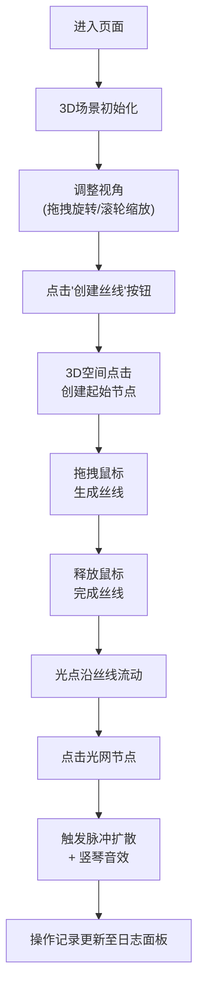

## 1. 产品概述

"星织·光之经纬"是一款沉浸式3D交互可视化艺术项目，用户化身星光编织者，在三维深空场景中通过点击和拖拽创造由发光丝线交织而成的动态光网。

- **核心价值**：提供具有艺术感的创作体验，让用户在深空背景下编织专属的光之几何
- **目标用户**：艺术爱好者、创意工作者、3D交互体验探索者
- **产品定位**：网页端轻量级3D交互艺术创作工具

## 2. 核心功能

### 2.1 用户角色

| 角色 | 注册方式 | 核心权限 |
|------|----------|----------|
| 访客用户 | 无需注册 | 完整使用所有编织功能、调整参数、保存作品截图 |

### 2.2 功能模块

1. **3D场景模块**：全屏Three.js场景，视角旋转、缩放控制，深空极光背景
2. **丝线编织模块**：点击创建节点，拖拽生成发光丝线，自动连接形成光网
3. **光点流动模块**：半透明光点沿丝线流动，速度可调节
4. **脉冲特效模块**：点击节点触发彩色脉冲扩散，伴随竖琴音效
5. **控制面板模块**：丝线创建、速度调节、视角重置、全屏切换
6. **操作日志模块**：记录最近5次编织操作的详细信息

### 2.3 页面详情

| 页面名称 | 模块名称 | 功能描述 |
|----------|----------|----------|
| 主页面 | 3D场景区域 | 全屏Three.js渲染，支持鼠标拖拽旋转、滚轮缩放 |
| 主页面 | 控制面板 | 左下角半透明毛玻璃面板，包含功能按钮和滑块 |
| 主页面 | 日志面板 | 右下角显示最近5次操作记录 |

## 3. 核心流程

用户进入页面后，首先看到深空背景的3D场景，通过左下角控制面板开启编织模式：

## 4. 用户界面设计

### 4.1 设计风格

- **主色调**：霓虹紫 `#b300ff`、冰蓝 `#00e5ff`
- **背景色**：深黑到深蓝径向渐变，营造深空氛围
- **按钮风格**：磨砂玻璃效果（backdrop-filter: blur），柔和发光边框（box-shadow glow），圆角12px
- **字体**：显示字体使用 'Orbitron' 或 'Space Grotesk' 科幻风格，正文字体使用 'Inter' 确保可读性
- **图标**：线性简约风格，使用霓虹紫/冰蓝渐变发光
- **动效**：所有交互元素带淡入淡出和微光呼吸动画，节点脉冲使用缓动曲线

### 4.2 页面设计概述

| 页面名称 | 模块名称 | UI元素 |
|----------|----------|--------|
| 主页面 | 3D场景 | 全屏WebGL画布，深空渐变背景，发光丝线，流动光点，动态光网 |
| 主页面 | 控制面板 | 半透明毛玻璃背景（rgba(20,10,40,0.6)），磨砂按钮，发光滑块，文字标签 |
| 主页面 | 日志面板 | 半透明深色背景，操作条目带淡入动画，颜色标签使用对应丝线颜色 |

### 4.3 响应式设计

- **桌面端优先**：针对1920×1080及以上分辨率优化
- **控制面板**：固定在左下角，宽度320px，高度自适应内容
- **日志面板**：固定在右下角，宽度360px，最大高度40vh，内部滚动
- **触控优化**：支持移动端触控拖拽旋转、双指缩放，按钮最小触控区域48×48px

### 4.4 3D场景指引

- **环境氛围**：深空背景，添加微弱星点粒子层，远处极光光带缓慢流动
- **光照设置**：使用HemisphereLight模拟环境光，PointLight为丝线提供发光效果，添加Bloom后期处理增强辉光
- **相机设置**：PerspectiveCamera，初始位置(0, 0, 15)，启用OrbitControls，限制最远缩放距离30，最近5
- **构图元素**：场景中央添加微弱的网格参考线（可选显示），丝线发光材质，节点为发光球体
- **交互动画**：节点创建时缩放弹入动画，丝线生成时从起点向终点延伸动画，光点流动使用正弦曲线缓动
- **后期处理**：UnrealBloomPass实现辉光效果，轻微的Vignette暗角，FXAA抗锯齿
- **性能优化**：使用BufferGeometry存储所有丝线顶点，InstancedMesh渲染光点，对象池复用粒子，帧率锁定60fps

