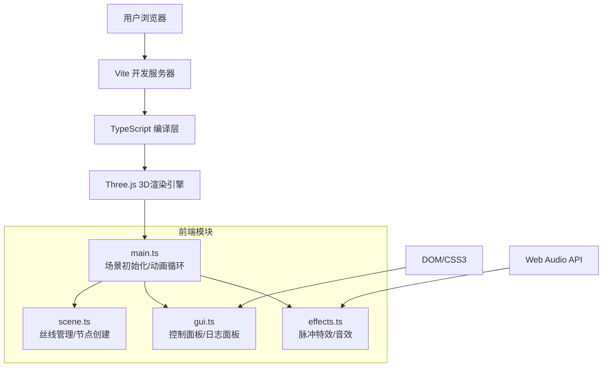

## 1. 架构设计



## 2. 技术描述

- **前端框架**：原生 TypeScript + Three.js，不使用React/Vue，确保轻量高性能
- **构建工具**：Vite 5.x，HMR热更新，生产构建压缩优化
- **3D引擎**：Three.js 0.160.x，包含OrbitControls、EffectComposer、UnrealBloomPass
- **类型支持**：@types/three 提供完整类型定义
- **音效**：Web Audio API 合成竖琴音效，无需外部音频文件
- **样式**：原生CSS3，使用CSS变量管理主题色，backdrop-filter实现毛玻璃效果

## 3. 路由定义

| 路由 | 用途 |
|------|------|
| / | 主页面，包含完整3D场景和UI面板 |

## 4. 项目文件结构

```
star-weave/
├── index.html                 # 入口HTML
├── package.json               # 项目依赖
├── tsconfig.json              # TypeScript配置
├── vite.config.js             # Vite配置
└── src/
    ├── main.ts                # Three.js场景初始化、相机、渲染器、动画循环
    ├── scene.ts               # 丝线管理、节点创建、光网更新
    ├── gui.ts                 # 控制面板、日志面板UI逻辑
    └── effects.ts             # 脉冲扩散、音效特效
```

### 4.1 核心模块职责

| 模块 | 主要职责 | 关键类/函数 |
|------|----------|-------------|
| main.ts | 场景初始化、渲染循环、事件分发 | `initScene()`, `animate()`, `onWindowResize()` |
| scene.ts | 丝线数据结构、节点管理、光网几何 | `SceneManager`, `createNode()`, `createThread()`, `updateFlowPoints()` |
| gui.ts | DOM元素创建、事件绑定、日志更新 | `ControlPanel`, `LogPanel`, `updateWeaveLog()` |
| effects.ts | 脉冲动画、Web Audio音效合成 | `PulseEffect`, `HarpSound`, `triggerPulse()` |

## 5. 核心数据结构

### 5.1 节点数据

```typescript
interface WeaveNode {
    id: string;
    position: THREE.Vector3;
    color: THREE.Color;
    connections: string[];  // 连接的节点ID
    mesh: THREE.Mesh;
}
```

### 5.2 丝线数据

```typescript
interface WeaveThread {
    id: string;
    startNodeId: string;
    endNodeId: string;
    color: THREE.Color;
    length: number;
    points: THREE.Vector3[];  // 丝线曲线上的点
    flowParticles: FlowParticle[];  // 流动光点
    line: THREE.Line;
}
```

### 5.3 流动粒子

```typescript
interface FlowParticle {
    id: string;
    progress: number;  // 0-1 在丝线上的位置
    speed: number;
    mesh: THREE.Mesh;
}
```

### 5.4 操作日志

```typescript
interface WeaveLogEntry {
    id: string;
    timestamp: number;
    threadLength: number;
    color: string;
    startNode: { x: number; y: number; z: number };
    endNode: { x: number; y: number; z: number };
}
```

## 6. 性能优化策略

### 6.1 渲染优化

1. **BufferGeometry复用**：所有丝线使用合并的BufferGeometry，减少draw call
2. **InstancedMesh**：流动光点使用实例化网格，500个节点仅1个draw call
3. **对象池**：粒子和几何体复用，避免频繁GC
4. **帧率控制**：使用`requestAnimationFrame`配合`performance.now()`锁定60fps
5. **视锥剔除**：确保不可见对象不被渲染

### 6.2 内存管理

1. **几何体清理**：丝线删除时及时dispose几何体和材质
2. **纹理管理**：程序化生成纹理，避免重复创建
3. **事件监听**：组件销毁时移除所有事件监听器

### 6.3 交互优化

1. **Raycaster优化**：限制射线检测对象数量，使用BVH加速（可选）
2. **拖拽节流**：mousemove事件使用requestAnimationFrame节流
3. **碰撞检测**：节点选择使用简单球体重叠检测

## 7. 关键技术实现

### 7.1 丝线曲线生成

使用CatmullRomCurve3生成平滑曲线，细分点用于流动粒子定位

### 7.2 辉光效果

使用EffectComposer + UnrealBloomPass，阈值0.8，强度1.5，半径0.5

### 7.3 音效合成

Web Audio API创建OscillatorNode，使用三角波，ADSR包络模拟竖琴音色：
- Attack: 0.01s
- Decay: 0.3s
- Sustain: 0.1
- Release: 1.2s

### 7.4 脉冲扩散

使用自定义ShaderMaterial，uniform控制扩散半径和透明度，实现向外扩散的波纹效果

