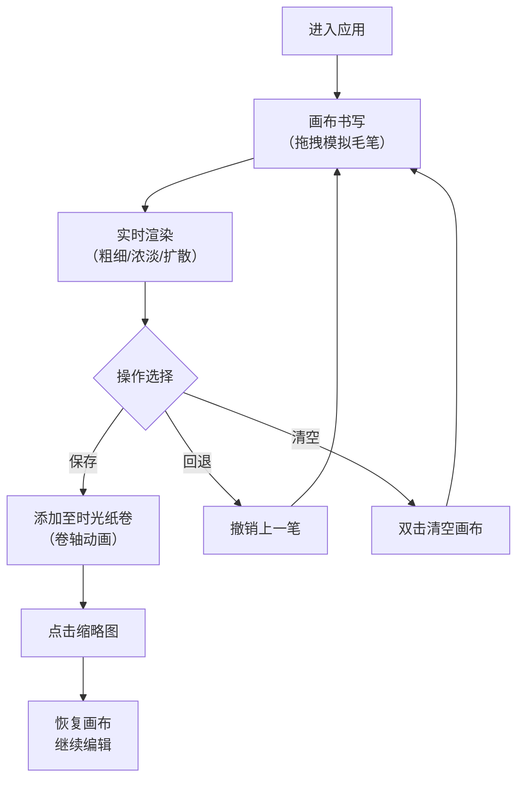

## 1. 产品概述

墨纹·时光笺是一款交互式动态书法可视化应用，让用户化身数字书法家，在仿宣纸纹理的画布上通过鼠标拖拽模拟毛笔书写体验。作品可保存至时光纸卷，随时回溯继续创作。

- **核心价值**：将传统书法艺术与数字交互结合，提供沉浸式的书写体验
- **目标用户**：书法爱好者、艺术创作者、追求禅意体验的用户

## 2. 核心功能

### 2.1 功能模块

1. **书法画布**：Canvas 绘制区域，支持毛笔笔触模拟、压感效果、墨迹扩散动画
2. **控制面板**：笔触粗细调节、墨色浓淡调节、保存/清空/回退操作
3. **时光纸卷**：历史作品缩略图展示、卷轴展开动画、作品恢复功能

### 2.2 页面详情

| 页面名称 | 模块名称 | 功能描述 |
|-----------|-------------|---------------------|
| 主界面 | 书法画布 | 鼠标拖拽绘制，速度/压感影响笔触粗细浓淡，墨迹扩散粒子动画，双击清空 |
| 主界面 | 控制面板 | 笔触粗细滑块、墨色浓淡滑块、保存按钮、清空按钮、回退按钮 |
| 主界面 | 时光纸卷 | 卷轴展开展示缩略图，点击恢复画布，滚动翻页浏览历史作品 |

## 3. 核心流程

用户进入应用 → 在画布上拖拽书写 → 实时呈现毛笔笔触效果与扩散动画 → 点击保存按钮 → 作品缩略图存入时光纸卷（卷轴展开动画）→ 点击历史缩略图 → 恢复画布状态继续编辑 → 双击画布清空重写

## 4. 用户界面设计

### 4.1 设计风格

- **主色调**：墨黑 `#1a1a1a`、宣纸白 `#f5ecd7`
- **视觉风格**：水墨极简风，留白为主，意境悠远
- **按钮样式**：圆形毛玻璃质感，点击涟漪扩散动画，悬浮墨迹洇开效果
- **字体**：选用具有书法韵味的字体，标题用书法风格字体，正文用雅致衬线体
- **背景**：宣纸纹理质感，通过 CSS 纹理叠加实现

### 4.2 页面设计概述

| 页面名称 | 模块名称 | UI 元素 |
|-----------|-------------|-------------|
| 主界面 | 书法画布 | 宣纸纹理背景 `#f5ecd7`，居中大面积展示，鼠标光标变为毛笔形状 |
| 主界面 | 控制面板 | 左上角固定，毛玻璃半透明背景，两个滑块 + 三个圆形按钮，间距宽松 |
| 主界面 | 时光纸卷 | 右下角卷轴造型，竖向缩略图列表，支持滚动，卷轴展开/收起动画 |

### 4.3 动画与交互

- **笔触动画**：根据鼠标移动速度动态调整笔触粗细（慢则粗、快则细），墨色浓淡渐变
- **扩散动画**：笔触落点产生粒子向外扩散，模拟墨在宣纸上洇开效果
- **按钮交互**：点击产生圆形涟漪扩散，悬浮时边缘墨迹轻微晕开
- **卷轴动画**：保存时卷轴从上向下展开，显示新缩略图；滚动时平滑过渡
- **帧率**：全程保持 60fps 流畅体验

### 4.4 响应式

桌面端优先设计，画布自适应窗口尺寸，控制面板与纸卷区域保持固定位置与尺寸。
