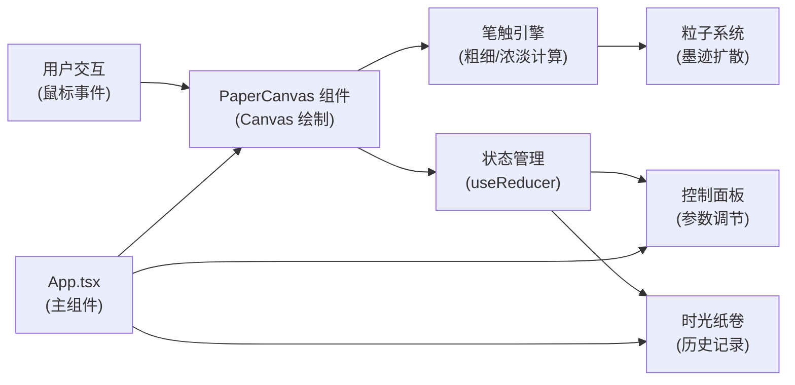

## 1. 架构设计



## 2. 技术描述

- **前端框架**：React@18 + TypeScript@5
- **构建工具**：Vite@5
- **渲染技术**：HTML5 Canvas 2D API
- **状态管理**：React Hooks (useState, useReducer, useRef)
- **样式方案**：CSS Modules + 内联样式
- **动画方案**：requestAnimationFrame (60fps) + CSS 动画
- **数据存储**：localStorage（持久化历史作品）

### 核心技术点
1. **笔触模拟算法**：根据鼠标移动速度计算笔触粗细和透明度
2. **粒子系统**：Canvas 实现墨迹扩散粒子动画
3. **离屏画布**：用于生成缩略图和撤销操作
4. **高性能渲染**：使用 requestAnimationFrame 保证 60fps

## 3. 文件结构

```
├── package.json
├── tsconfig.json
├── vite.config.js
├── index.html
└── src/
    ├── main.tsx
    ├── App.tsx
    ├── types/
    │   └── index.ts
    ├── utils/
    │   ├── brushEngine.ts      # 笔触计算引擎
    │   └── particleSystem.ts   # 粒子系统
    └── components/
        ├── PaperCanvas.tsx     # 画布组件
        ├── ControlPanel.tsx    # 控制面板
        └── TimeScroll.tsx      # 时光纸卷
```

## 4. 类型定义

```typescript
// 笔触点
interface BrushPoint {
  x: number;
  y: number;
  pressure: number;      // 模拟压感 0-1
  velocity: number;      // 移动速度
  timestamp: number;
}

// 笔触配置
interface BrushConfig {
  baseSize: number;      // 基础粗细
  opacity: number;       // 基础浓淡
  color: string;         // 墨色
}

// 笔画记录
interface Stroke {
  points: BrushPoint[];
  config: BrushConfig;
  id: string;
}

// 保存的作品
interface Artwork {
  id: string;
  thumbnail: string;     // base64 缩略图
  strokes: Stroke[];
  canvasData: string;    // 完整画布数据
  timestamp: number;
}

// 应用状态
interface AppState {
  strokes: Stroke[];
  currentStroke: Stroke | null;
  history: Artwork[];
  brushConfig: BrushConfig;
  isDrawing: boolean;
}
```

## 5. 核心算法

### 5.1 笔触粗细计算
```typescript
// 速度越慢，笔触越粗；速度越快，笔触越细
const calculateSize = (velocity: number, baseSize: number, pressure: number) => {
  const speedFactor = Math.max(0.2, 1 - velocity / 10);
  const pressureFactor = 0.5 + pressure * 0.5;
  return baseSize * speedFactor * pressureFactor;
};
```

### 5.2 墨色浓淡计算
```typescript
// 速度越慢，墨色越浓；速度越快，墨色越淡
const calculateOpacity = (velocity: number, baseOpacity: number) => {
  const speedFactor = Math.max(0.3, 1 - velocity / 15);
  return baseOpacity * speedFactor;
};
```

### 5.3 粒子系统
- 每个笔触点生成 3-5 个扩散粒子
- 粒子沿随机方向移动，逐渐消散
- 粒子大小随时间减小，透明度逐渐降低

## 6. 性能优化

1. **分层 Canvas**：主画布用于绘制永久笔触，离屏画布用于生成缩略图
2. **requestAnimationFrame**：所有动画统一调度，保证 60fps
3. **事件节流**：鼠标移动事件节流，避免频繁重绘
4. **懒加载缩略图**：时光纸卷中的缩略图按需加载
