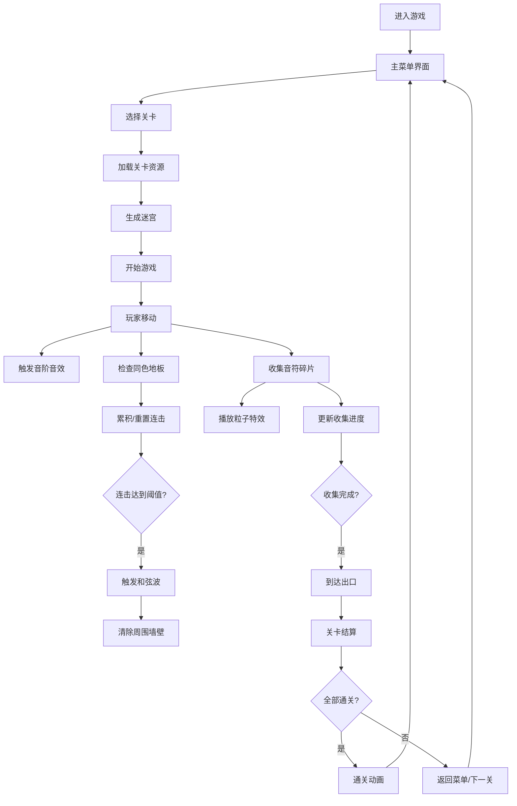

## 1. 产品概述
幻音迷阵·律动回廊是一款融合音乐节奏与迷宫探索的休闲益智游戏，玩家在随音乐节拍变化的霓虹回廊中收集音符碎片，通过移动触发音阶音效，形成连击释放和弦波清除障碍。

- **目标用户**：音乐游戏爱好者、休闲益智玩家
- **产品价值**：结合迷宫探索的策略性与音乐节奏的爽快感，提供沉浸式的视听体验

## 2. 核心功能

### 2.1 用户角色
| 角色 | 注册方式 | 核心权限 |
|------|----------|----------|
| 玩家 | 无需注册 | 进行游戏、选择关卡、查看成绩 |

### 2.2 功能模块
1. **主菜单界面**：游戏标题、开始按钮、关卡选择、操作说明
2. **游戏主界面**：迷宫渲染、玩家控制、音符收集、连击系统、和弦波特效
3. **关卡结算界面**：收集统计、连击记录、耗时统计、解锁下一关
4. **通关界面**：总评分、通关动画、重新开始

### 2.3 页面详情
| 页面名称 | 模块名称 | 功能描述 |
|----------|----------|----------|
| 主菜单界面 | 标题展示 | 霓虹发光的游戏标题动画 |
| 主菜单界面 | 关卡选择 | 3个难度递增的关卡，已完成关卡显示评分 |
| 游戏主界面 | 迷宫渲染 | 随机生成的彩色迷宫，墙壁随节拍变色 |
| 游戏主界面 | 玩家控制 | WASD/方向键移动，发光圆形角色带拖尾 |
| 游戏主界面 | 音符收集 | 收集碎片播放音阶音效，触发粒子特效 |
| 游戏主界面 | 连击系统 | 连续踩同色地板累积连击，5/10/15连击触发和弦波 |
| 游戏主界面 | 和弦波 | 扩散色环清除周围墙壁，屏幕震动，增强音效 |
| 游戏主界面 | UI显示 | 连击数、收集进度条、关卡编号、迷你地图 |
| 关卡结算界面 | 统计展示 | 收集数、最高连击、耗时、星级评价 |

## 3. 核心流程
玩家进入游戏后，在主菜单选择关卡开始游戏，在动态迷宫中移动收集音符碎片，通过连击释放和弦波清除障碍，收集所有碎片后到达出口完成关卡，解锁下一关直至全部通关。

## 4. 用户界面设计

### 4.1 设计风格
- **主色调**：品红#ff00ff、青#00ffff、黑#0a0a0a
- **视觉风格**：霓虹赛博朋克，发光效果，渐变条纹，脉动动画
- **字体**：使用Orbitron或类似科技感字体
- **按钮风格**：霓虹发光边框，悬停时颜色加深，点击时有缩放反馈
- **布局**：全屏游戏界面，左上角HUD，右下角迷你地图

### 4.2 页面设计概述
| 页面名称 | 模块名称 | UI元素 |
|----------|----------|--------|
| 主菜单界面 | 标题区 | 霓虹发光大字，脉动动画，副标题 |
| 主菜单界面 | 关卡选择区 | 3个关卡卡片，显示难度和完成状态 |
| 主菜单界面 | 按钮区 | 开始游戏、操作说明按钮 |
| 游戏主界面 | 迷宫区 | 彩色迷宫格子，动态变色墙壁 |
| 游戏主界面 | 玩家角色 | 发光圆形，拖尾光晕 |
| 游戏主界面 | 音符碎片 | 发光音符图标，脉动效果 |
| 游戏主界面 | HUD | 连击数（数字增长动画）、进度条、关卡编号 |
| 游戏主界面 | 迷你地图 | 简化迷宫，玩家位置和未收集碎片标记 |
| 关卡结算界面 | 统计面板 | 收集数、最高连击、耗时、星级 |
| 关卡结算界面 | 按钮区 | 下一关、重新开始、返回菜单 |

### 4.3 响应式
- 桌面端全屏体验，适配主流分辨率
- 键盘控制为主，支持触屏设备虚拟按键
- 游戏区域保持正方形比例，居中显示

### 4.4 特效与动画
- **角色移动**：拖尾光晕效果，平滑过渡
- **墙壁变色**：随音乐节拍平滑渐变切换
- **音符收集**：浅色粒子扩散特效，音阶音效
- **和弦波**：彩色圆环扩散，屏幕震动，墙壁消失动画
- **连击显示**：数字跳动放大动画，颜色渐变
