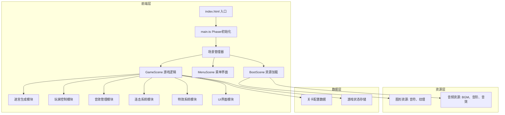

## 1. 架构设计


## 2. 技术描述
- **前端框架**：Phaser 3.80+ 游戏引擎
- **开发语言**：TypeScript 5.4+
- **构建工具**：Vite 5.0+
- **类型支持**：@types/phaser
- **模块系统**：ESNext
- **目标环境**：ES2020

## 3. 文件结构
| 路径 | 用途 |
|------|------|
| `/package.json` | 项目依赖和脚本配置 |
| `/tsconfig.json` | TypeScript编译配置 |
| `/vite.config.js` | Vite构建配置 |
| `/index.html` | HTML入口文件 |
| `/src/main.ts` | 游戏入口，Phaser初始化 |
| `/src/scenes/BootScene.ts` | 资源预加载场景 |
| `/src/scenes/MenuScene.ts` | 主菜单场景 |
| `/src/scenes/GameScene.ts` | 核心游戏场景 |
| `/src/utils/mazeGenerator.ts` | 迷宫生成算法 |
| `/src/utils/audioManager.ts` | 音效管理工具 |
| `/src/types/game.ts` | 游戏类型定义 |
| `/src/config/levels.ts` | 关卡配置数据 |
| `/public/assets/images/` | 图片资源 |
| `/public/assets/audio/` | 音频资源 |

## 4. 核心数据模型

### 4.1 游戏状态类型
```typescript
interface GameState {
  currentLevel: number;
  playerPos: { x: number; y: number };
  collectedNotes: number;
  totalNotes: number;
  combo: number;
  maxCombo: number;
  lastFloorColor: number;
  startTime: number;
  elapsedTime: number;
  levelCompleted: boolean;
  unlockedLevels: number[];
}
```

### 4.2 迷宫数据结构
```typescript
interface Cell {
  x: number;
  y: number;
  type: 'wall' | 'path' | 'exit';
  hasNote: boolean;
  color: number;
  originalType: 'wall' | 'path' | 'exit';
}

interface MazeData {
  width: number;
  height: number;
  cells: Cell[][];
  startPos: { x: number; y: number };
  exitPos: { x: number; y: number };
  notePositions: { x: number; y: number }[];
}
```

### 4.3 关卡配置
```typescript
interface LevelConfig {
  id: number;
  name: string;
  mazeWidth: number;
  mazeHeight: number;
  noteCount: number;
  bpm: number;
  bgmTrack: string;
  wallColors: number[];
  floorColors: number[];
  chordWaveRadius: number;
}
```

## 5. 核心模块设计

### 5.1 迷宫生成模块
- 使用深度优先搜索(DFS)算法生成随机迷宫
- 确保迷宫有且仅有一条从起点到终点的路径
- 在死胡同和分支点放置音符碎片
- 支持按关卡难度调整迷宫大小和复杂度

### 5.2 玩家控制模块
- 监听键盘WASD和方向键输入
- 实现角色网格移动，每格移动动画150ms
- 移动拖尾效果使用Phaser粒子系统
- 碰撞检测：只能在路径格子上移动

### 5.3 音效管理模块
- Web Audio API生成7种音阶音效(C D E F G A B)
- 背景音乐按BPM播放，节拍检测用于同步视觉效果
- 和弦波增强音效，收集音符音效，关卡完成音效

### 5.4 连击系统模块
- 每步移动检查当前地板颜色与上一步是否相同
- 相同则连击+1，不同则重置为1
- 连击达到5/10/15时触发和弦波
- 连击数UI显示带有数字放大动画

### 5.5 特效系统模块
- 音符收集：浅色粒子向外扩散
- 和弦波：彩色圆环从玩家位置向外扩散
- 墙壁消除：渐隐动画伴随粒子效果
- 屏幕震动：Phaser相机抖动效果

## 6. 性能优化
- 迷宫格子使用Spritesheet批量渲染
- 粒子系统限制最大粒子数量
- 动画帧率锁定60fps，使用requestAnimationFrame
- 资源预加载，避免游戏中加载卡顿
- 离屏元素自动休眠，减少绘制调用
