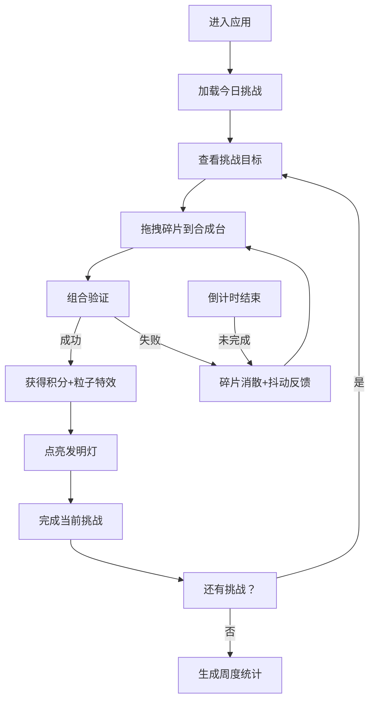

## 1. 产品概述

"灵感火花·创想工坊"是一款蒸汽朋克风格的创意合成类全栈 Web 应用，用户扮演创意发明家，在虚拟工坊中通过拖拽灵感碎片组合生成创意项目，在限时挑战中获得积分与成就。

- **核心目的**：通过趣味化的创意合成玩法，激发用户创造力，提供轻松愉悦的游戏化体验
- **目标用户**：喜欢创意解谜、合成类游戏的休闲玩家
- **产品价值**：将抽象的创意过程具象化为可视化的拖拽合成交互，配合蒸汽朋克美学和丰富的动画反馈

## 2. 核心 Features

### 2.1 用户角色
| 角色 | 注册方式 | 核心权限 |
|------|---------|---------|
| 普通用户 | 无需注册，本地存储 | 参与每日挑战、合成碎片、查看周报、点亮发明灯 |

### 2.2 Feature Module
1. **工坊主页**：合成台交互、碎片拖拽、动画反馈、粒子特效
2. **挑战面板**：每日5个创意挑战、90秒倒计时、挑战进度展示
3. **周报系统**：完成度统计柱状图、成就徽章展示、毛玻璃弹窗
4. **发明墙**：已完成项目点亮展示、成就可视化
5. **积分系统**：积分统计、碎片库存管理

### 2.3 Page Details
| 页面名称 | 模块名称 | 功能描述 |
|---------|---------|---------|
| 工坊主页 | 合成台组件 | 中央合成区域，支持拖拽碎片放入，触发合成逻辑和动画 |
| 工坊主页 | 碎片栏 | 展示可用灵感碎片（灯泡、齿轮、调色板、音符、绿叶），支持拖拽 |
| 工坊主页 | 挑战面板 | 右上角显示当前挑战、倒计时、剩余挑战数 |
| 工坊主页 | 信息栏 | 左上角显示当前积分、碎片库存 |
| 工坊主页 | 发明墙 | 背景展示已完成的发明灯，成功后点亮 |
| 工坊主页 | 周报考 | 底部入口按钮，点击弹出毛玻璃周报窗口 |
| 周报弹窗 | 统计图表 | 柱状图展示本周完成数量、积分趋势 |
| 周报弹窗 | 成就徽章 | 展示获得的稀有成就徽章 |

## 3. 核心流程

用户进入应用 → 查看今日挑战列表 → 选择当前挑战 → 拖拽碎片到合成台 → 触发合成验证 → 成功：获得积分+粒子特效+点亮发明灯 / 失败：碎片消散+抖动反馈 → 90秒倒计时内完成 → 进入下一个挑战 → 每日5个挑战完成 → 每周生成《创想周报》

## 4. 用户界面设计

### 4.1 设计风格
- **整体风格**：蒸汽朋克风格，工业复古与未来科技结合
- **主色调**：黄铜金 #b8860b、暗铁灰 #3c3c3c
- **点缀色**：霓虹蓝 #00d4ff 用于高亮和特效
- **按钮风格**：金属质感、圆角、浮雕阴影、齿轮边框装饰
- **字体**：标题使用装饰性衬线字体，正文使用清晰易读的无衬线字体
- **图标风格**：蒸汽朋克风格图标，金属质感，齿轮、管道等装饰元素

### 4.2 页面设计 Overview
| 页面名称 | 模块名称 | UI 元素 |
|---------|---------|---------|
| 工坊主页 | 合成台 | 铜质金属边框、齿轮旋转动画、中央发光区域、放置提示虚线框 |
| 工坊主页 | 碎片栏 | 3D 卡片效果、悬浮放大、拖拽时半透明跟随 |
| 工坊主页 | 倒计时 | 醒目数字、霓虹蓝发光、最后10秒红色闪烁 |
| 工坊主页 | 发明灯 | 背景排列、未点亮时暗铜色、点亮时暖黄发光、光晕扩散动画 |
| 工坊主页 | 周报考 | 底部悬浮按钮、金属质感、点击上浮 |
| 周报弹窗 | 毛玻璃效果 | backdrop-filter 模糊、半透明深色背景、黄铜边框 |
| 周报弹窗 | 柱状图 | 黄铜色柱子、霓虹蓝高亮、悬浮显示数值 |

### 4.3 响应式设计
- **桌面端优先**：1280px 以上为最佳体验
- **平板适配**：1024px 时调整合成台尺寸，碎片栏改为横向滚动
- **移动端适配**：768px 以下重新布局，合成台占据上部，碎片栏改为底部横向排列，挑战面板改为折叠式
- **触摸优化**：增加触摸目标区域，调整拖拽灵敏度

### 4.4 动画与交互
- **合成成功**：粒子四散爆炸（Canvas 实现）、齿轮旋转加速、合成台光芒脉冲、碎片颜色渐变
- **合成失败**：合成台左右抖动、碎片向上飘散逐渐透明、轻微震动反馈
- **拖拽交互**：拿起时阴影加深、放大 1.1 倍、半透明跟随鼠标
- **倒计时**：每秒数字跳动、最后 10 秒变红并加速闪烁
- **发明灯点亮**：从中心向外扩散光晕、亮度渐变增加、周围小齿轮旋转一圈
