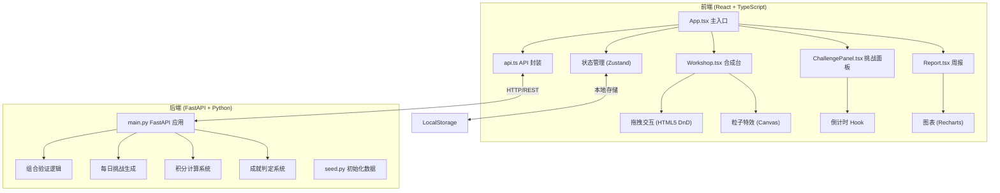
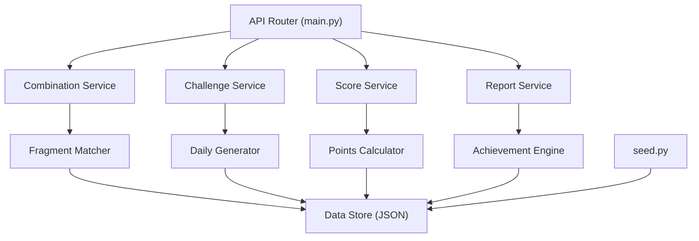
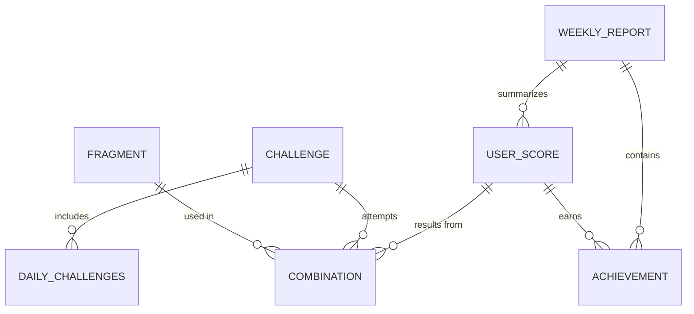

## 1. 架构设计



## 2. 技术描述

### 前端技术栈
- **框架**：React 18 + TypeScript
- **构建工具**：Vite 5
- **状态管理**：Zustand
- **路由**：React Router DOM 6
- **图表**：Recharts
- **样式**：TailwindCSS 3 + CSS 变量
- **动画**：CSS Keyframes + Canvas 粒子系统

### 后端技术栈
- **框架**：FastAPI 0.100+
- **服务器**：Uvicorn
- **数据验证**：Pydantic 2
- **数据存储**：本地 JSON 文件（模拟持久化）

### 初始化命令
- 前端：使用 Vite react-ts 模板初始化
- 后端：Python 虚拟环境 + pip 安装依赖

## 3. 路由定义
| 路由 | 用途 |
|------|------|
| / | 工坊主页（合成台、挑战、碎片交互） |
| /report | 周报页面（统计图表、成就徽章） |

## 4. API 定义

### TypeScript 类型定义
```typescript
interface Fragment {
  id: string;
  type: 'bulb' | 'gear' | 'palette' | 'note' | 'leaf';
  name: string;
  rarity: 'common' | 'rare' | 'legendary';
}

interface Challenge {
  id: string;
  name: string;
  description: string;
  requiredFragments: Fragment['type'][];
  points: number;
  timeLimit: number;
}

interface CombinationResult {
  success: boolean;
  projectName?: string;
  points?: number;
  message: string;
  achievement?: Achievement;
}

interface Achievement {
  id: string;
  name: string;
  description: string;
  icon: string;
  rarity: 'common' | 'rare' | 'legendary';
}

interface WeeklyReport {
  weekStart: string;
  weekEnd: string;
  completedCount: number;
  totalPoints: number;
  dailyBreakdown: { date: string; count: number; points: number }[];
  achievements: Achievement[];
}
```

### API 端点
| 方法 | 路径 | 描述 | 请求 | 响应 |
|------|------|------|------|------|
| GET | /api/fragments | 获取碎片列表 | - | Fragment[] |
| GET | /api/challenges/today | 获取今日挑战 | - | Challenge[] |
| POST | /api/combine | 验证碎片组合 | { fragments: string[], challengeId: string } | CombinationResult |
| GET | /api/report/weekly | 获取周报 | week?: string | WeeklyReport |
| POST | /api/score/submit | 提交分数 | { points: number, challengeId: string } | { newTotal: number } |

## 5. 后端架构



## 6. 数据模型

### 6.1 ER 图


### 6.2 数据结构
```python
# fragments.json
[
  {"id": "frag_1", "type": "bulb", "name": "灵感灯泡", "rarity": "common"},
  {"id": "frag_2", "type": "gear", "name": "机械齿轮", "rarity": "common"},
  ...
]

# challenges.json
[
  {
    "id": "chal_1",
    "name": "智能植物浇水器",
    "description": "让植物永远不缺水的奇妙装置",
    "requiredFragments": ["bulb", "leaf", "gear"],
    "points": 100,
    "timeLimit": 90
  },
  ...
]

# achievements.json
[
  {
    "id": "ach_1",
    "name": "初出茅庐",
    "description": "完成第一个发明",
    "icon": "🌟",
    "rarity": "common"
  },
  ...
]
```
