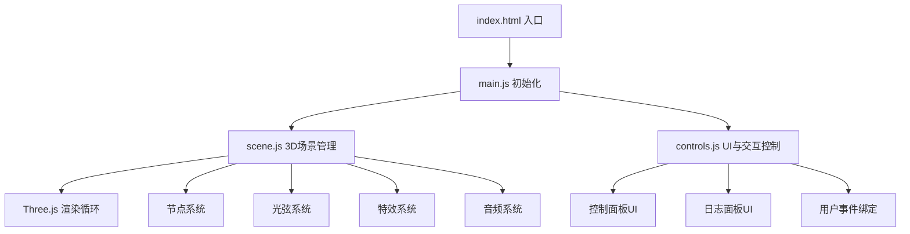

## 1. 架构设计

纯前端单页应用，采用模块化架构，分离3D场景逻辑、交互控制和UI管理。



## 2. 技术说明

- **前端框架**：原生 JavaScript (ES6+)，不使用React/Vue，保持轻量
- **3D引擎**：Three.js ^0.160.0
- **构建工具**：Vite ^5.0.0
- **音频**：Web Audio API（浏览器内置，无需额外依赖）
- **样式**：原生 CSS，使用 CSS 变量管理主题色

## 3. 文件结构

```
project-root/
├── package.json          # 项目配置与依赖
├── vite.config.js        # Vite 构建配置
├── index.html            # 入口 HTML
└── src/
    ├── main.js           # 入口文件，初始化场景、相机、渲染器、控制器
    ├── scene.js          # 3D场景管理：节点、光弦、特效、音频
    └── controls.js       # UI控制面板与用户交互绑定
```

### 模块职责

- **main.js**：应用入口，创建Three.js核心实例，启动渲染循环，连接场景与控制模块
- **scene.js**：封装所有3D逻辑，包括节点创建/删除、光弦生成、动画更新、音爆特效、音频播放
- **controls.js**：管理DOM UI元素，绑定鼠标/触控事件，处理用户输入并调用scene.js的方法

## 4. 核心数据结构

### 节点数据

```javascript
{
  id: number,              // 节点唯一标识
  position: Vector3,       // 3D空间位置
  pitch: string,           // 音高名称 (C4, D5, etc.)
  frequency: number,       // 音频频率
  color: Color,            // 节点颜色
  pulseSpeed: number,      // 脉动速度
  mesh: Mesh,              // Three.js网格对象
  oscillator: OscillatorNode, // Web Audio振荡器
}
```

### 光弦数据

```javascript
{
  startId: number,         // 起始节点ID
  endId: number,           // 结束节点ID
  line: Line,              // Three.js线对象
  flowOffset: number,      // 流动动画偏移量
}
```

### 交互日志

```javascript
{
  nodeId: number,          // 节点编号
  pitch: string,           // 音高
  timestamp: Date,         // 激活时间
  type: 'create' | 'click' // 交互类型
}
```

## 5. 性能优化策略

- **节点数量限制**：最大支持20个节点，避免性能下降
- **几何体复用**：共享球体几何体，仅材质差异化
- **光弦更新优化**：仅在节点位置变化时更新几何体
- **渲染循环**：使用requestAnimationFrame，限制逻辑更新频率
- **内存管理**：删除节点时及时释放几何体、材质和音频资源
- **帧率监控**：内置简单帧率统计，保持60fps目标
