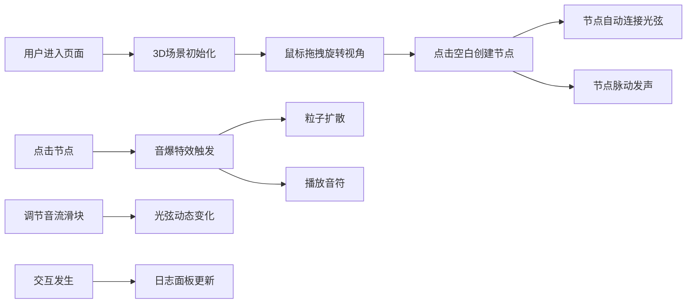

## 1. 产品概述

"光织·音之海"是一个沉浸式3D交互可视化音乐创作项目，用户化身为光影音乐家，在三维空间中通过点击和拖拽布置发光音符节点，创造属于自己的光影交响曲。

- **核心目标**：将音乐创作转化为可视化的3D艺术体验，让用户通过直观的空间交互创造独特的视听作品
- **目标用户**：音乐爱好者、视觉艺术家、创意工作者，以及所有喜欢沉浸式交互体验的用户
- **产品价值**：融合音乐、视觉艺术与交互设计，打造独特的治愈系创意工具

## 2. 核心特性

### 2.1 用户角色

| 角色 | 注册方式 | 核心权限 |
|------|----------|----------|
| 访客用户 | 无需注册，直接访问 | 完整使用所有创作功能，无需登录 |

### 2.2 功能模块

1. **3D场景交互**：音符节点创建、拖拽移动、点击触发
2. **音频系统**：音符发声、音高调节、节点脉动
3. **光弦系统**：节点间自动连接、流动光效、动态参数调节
4. **特效系统**：音爆冲击波、粒子扩散
5. **控制面板**：节点生成、音流强度调节、视角控制、全屏切换
6. **音序日志**：交互历史记录

### 2.3 页面详情

| 页面名称 | 模块名称 | 功能描述 |
|---------|----------|----------|
| 主场景 | 3D可视化区 | 全屏Three.js渲染，支持轨道控制器旋转/缩放，显示音符节点和光弦网络 |
| 主场景 | 控制面板 | 左下角毛玻璃面板，包含节点生成按钮、音流强度滑块、重置视角按钮、全屏开关 |
| 主场景 | 音序日志 | 右下角半透明面板，显示最近5次交互记录 |

## 3. 核心流程

用户打开页面后，首先看到深邃的3D空间，可以通过鼠标拖拽旋转视角、滚轮缩放。点击场景空白处创建发光音符节点，节点会自动与附近节点连接形成光弦网络。点击已有节点触发音爆特效并播放对应音高。通过左下角控制面板调节音流强度，观察光弦粗细和颜色变化。所有交互记录实时显示在右下角日志面板。

## 4. 用户界面设计

### 4.1 设计风格

- **主色调**：电光蓝 `#00d4ff`、珊瑚橙 `#ff6b6b`
- **背景**：深海极光风格，深邃暗蓝渐变背景，配合柔和的光晕效果
- **按钮风格**：霓虹光晕边框，柔和阴影，悬停时有呼吸发光效果
- **字体**：使用现代无衬线字体，标题使用轻盈的显示字体
- **视觉元素**：毛玻璃半透明面板（backdrop-filter: blur）、渐变色发光球体、流动光弦

### 4.2 页面设计概览

| 页面名称 | 模块名称 | UI元素 |
|---------|----------|--------|
| 主场景 | 3D可视化区 | 渐变发光球体节点、流动光弦、粒子特效、深海背景、环境光 |
| 主场景 | 控制面板 | 毛玻璃半透明背景、霓虹按钮、滑动条、开关组件、柔和阴影 |
| 主场景 | 音序日志 | 半透明深色背景、时间戳、音高标识、节点编号、滚动动画 |

### 4.3 响应式设计

- **桌面优先**：针对大屏幕优化，全屏沉浸式体验
- **自适应**：控制面板和日志面板位置固定，随窗口大小自动调整
- **交互优化**：支持鼠标和触控设备，拖拽节点时有磁吸弹性动画

### 4.4 3D场景设计

- **环境**：深海极光氛围，深蓝色背景配合远处柔和光晕
- **光照**：环境光 + 节点自发光，节点发光照亮周围空间
- **相机**：PerspectiveCamera，初始位置距离场景中心15单位，轨道控制器限制合理范围
- **构图**：节点布置在以原点为中心的虚拟球面上，保持视觉平衡
- **交互动画**：节点脉动缩放、光弦流动、音爆冲击波、粒子扩散、拖拽磁吸弹性
- **性能优化**：限制最大节点数量，使用BufferGeometry，保持60fps帧率
- **后处理**：轻微Bloom发光效果，增强霓虹视觉感
