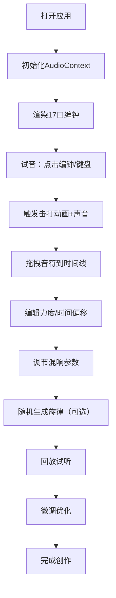

## 1. 产品概述

本项目是一个基于Web Audio API的古代编钟演奏交互应用，让用户能够在浏览器中模拟古代宫廷乐师在编钟架上演奏的体验，通过击打不同大小和厚度的铜钟来合成多音轨旋律。

- 主要解决传统编钟演奏中每口钟的音高、延音时长和余韵混响在空间中的叠加效果难以像现代合成器一样被灵活编排和实时试听的问题
- 面向音乐爱好者、古代文化研究者和创意工作者，提供沉浸式的古代编钟演奏与创作体验
- 产品价值在于将传统文化与现代音频技术结合，让古老的编钟艺术焕发新的生命力

## 2. 核心功能

### 2.1 用户角色

| 角色 | 注册方式 | 核心权限 |
|------|----------|----------|
| 普通用户 | 无需注册 | 编钟演奏、旋律录制、混响调节、随机旋律生成、回放试听 |

### 2.2 功能模块

1. **编钟演奏区**：17口青铜编钟可视化，支持鼠标点击和键盘（A-K）触发击打
2. **时间线轨道**：更漏刻度时间轴，支持拖拽放置、编辑击打事件
3. **混响控制面板**：声像位置、混响半径、混响时长调节
4. **旋律生成器**：基于五声音阶的随机旋律生成
5. **回放系统**：录制旋律的精确回放与节拍控制

### 2.3 页面详情

| 页面名称 | 模块名称 | 功能描述 |
|----------|----------|----------|
| 主界面 | 编钟架组件 | 17口编钟（C4-B5半音阶）弧形排列，CSS绘制青铜质感，响应键盘和鼠标击打事件 |
| 主界面 | 时间线组件 | 水平滚动轨道，古代更漏刻度（一刻钟=15秒，分六段），支持拖拽放置编辑 |
| 主界面 | 混响面板组件 | 垂直滑块组，调节编钟位置（0-100%）、混响半径（1-5m）、混响时长（0.3-3秒） |
| 主界面 | 控制工具栏 | 播放/暂停、随机生成、清空轨道、BPM调节按钮 |

## 3. 核心流程

用户主要流程：打开应用 → 点击编钟或按键试音 → 拖拽音符到时间线 → 调节力度和时间偏移 → 调整混响参数 → 点击随机生成（可选） → 回放聆听 → 微调优化。

## 4. 用户界面设计

### 4.1 设计风格

- **主色调**：宋代宫廷风格
  - 背景：暗红 #3a1a1a
  - 编钟架：深色木纹 #4a3020
  - 文字：淡金 #e0c060
  - 按钮边框：朱红 #b22222
  - 编钟铜锈：径向渐变 #8b5a2b 到 #3a1a0a
- **按钮风格**：朱红边框，悬停时淡金色辉光，圆角4px，古典雅致
- **字体**：标题使用隶书体，正文使用宋体，体现古代文化氛围
- **布局风格**：左右分栏（编钟架左50%，轨道+面板右50%），移动端自动折行
- **图标风格**：古典纹饰元素，木质纹理按钮

### 4.2 页面设计概述

| 页面名称 | 模块名称 | UI元素 |
|----------|----------|--------|
| 主界面 | 编钟架组件 | 弧形排列编钟、铜锈渐变质感、钟钮深褐色、音高标签、击打波纹动画、钟体辉光 |
| 主界面 | 时间线组件 | 木色刻度条 #6b4e3a、音符事件块（金色描边）、水平滚动、编辑弹窗 |
| 主界面 | 混响面板组件 | 垂直滑块、隶书标签、朱红滑块轨道、金色滑块按钮 |
| 主界面 | 控制工具栏 | 播放/暂停按钮、随机生成按钮、清空按钮、BPM数字输入框 |

### 4.3 响应性

- **桌面端**（≥768px）：左右分栏布局，编钟架占左侧50%，右侧上方时间线，下方混响面板
- **移动端**（<768px）：垂直堆叠布局，编钟架在上，时间线居中，混响面板在下
- **触摸优化**：增大可点击区域，支持触摸滑动操作

### 4.4 动画效果

- **编钟击打**：锤头从上方落下（0.1s），钟体左右摆动3度（0.3s）
- **波纹扩散**：半透明圆环 #e0c060 从钟心向外扩散渐隐（0.5s）
- **钟体辉光**：box-shadow: 0 0 10px #e0c060，持续0.5s
- **音符拖拽**：半透明跟随效果，放置时缩放动画
- **滑块交互**：悬停时滑块放大，调节时数值实时更新
