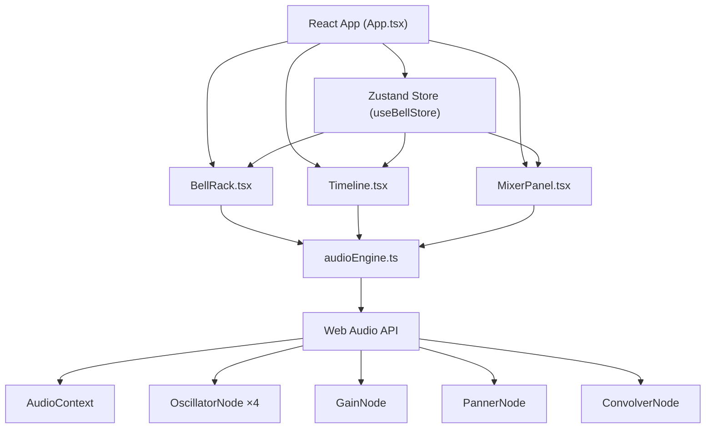

## 1. 架构设计



## 2. 技术描述

- **前端框架**：React@18 + TypeScript@5 + Vite@5
- **状态管理**：zustand@4
- **音频引擎**：Web Audio API（原生API，无需额外库）
- **样式方案**：CSS Modules + CSS Variables（不使用Tailwind，自定义古典风格样式）
- **初始化工具**：vite-init
- **后端**：无（纯前端应用）
- **数据库**：无（状态存储在内存和Zustand中）

## 3. 路由定义

| 路由 | 用途 |
|------|------|
| / | 主应用页面（单页应用，无多路由） |

## 4. 数据模型

### 4.1 核心类型定义

```typescript
// 编钟定义
interface Bell {
  id: string;
  note: string;       // 音名 C4-B5
  frequency: number;  // 频率 Hz
  key: string;        // 键盘映射 A-K
  size: number;       // 钟体大小 0.6-1.4
  position: number;   // 弧形位置索引 0-16
}

// 击打事件
interface HitEvent {
  id: string;
  bellId: string;
  time: number;       // 时间位置（毫秒）
  velocity: number;   // 力度 0-100
  offset: number;     // 时间偏移 -200~200ms
}

// 混响参数
interface ReverbParams {
  panX: number;       // 声像X轴 0-100
  radius: number;     // 混响半径 1-5m
  duration: number;   // 混响时长 0.3-3s
}

// 轨道状态
interface TrackState {
  events: HitEvent[];
  bpm: number;        // 默认60
  isPlaying: boolean;
  currentTime: number;
  totalDuration: number; // 8小节 × 4拍 × (60000/BPM)
}

// 全局Store
interface BellStore {
  bells: Bell[];
  activeBells: Set<string>;
  hitEvents: HitEvent[];
  track: TrackState;
  reverb: ReverbParams;
  hitBell: (bellId: string, velocity?: number) => void;
  addTrackEvent: (event: Omit<HitEvent, 'id'>) => void;
  updateTrackEvent: (id: string, updates: Partial<HitEvent>) => void;
  removeTrackEvent: (id: string) => void;
  setReverb: (params: Partial<ReverbParams>) => void;
  setBpm: (bpm: number) => void;
  togglePlay: () => void;
  seekTo: (time: number) => void;
  clearTrack: () => void;
  generateRandomMelody: () => void;
}
```

## 5. 文件结构

```
├── package.json
├── vite.config.js
├── tsconfig.json
├── index.html
└── src/
    ├── main.tsx              # React入口
    ├── App.tsx               # 根组件
    ├── store/
    │   └── useBellStore.ts   # Zustand状态管理
    ├── components/
    │   ├── BellRack.tsx      # 编钟架组件
    │   ├── Bell.tsx          # 单个编钟子组件
    │   ├── Timeline.tsx      # 时间线组件
    │   ├── TimelineEvent.tsx # 时间线事件子组件
    │   └── MixerPanel.tsx    # 混响控制面板
    ├── utils/
    │   └── audioEngine.ts    # 音频引擎单例
    ├── types/
    │   └── index.ts          # 类型定义
    ├── data/
    │   └── bells.ts          # 编钟数据配置
    └── styles/
        ├── globals.css       # 全局样式
        └── variables.css     # CSS变量定义
```

## 6. 性能指标

- **击打延迟**：button-to-sound latency ≤ 50ms（使用requestAnimationFrame和预分配AudioNode）
- **节拍精度**：每120帧内节拍偏移 ≤ ±2帧（使用Web Audio API的currentTime进行精确调度）
- **动画性能**：所有动画使用CSS transform和opacity，避免重排重绘
- **内存管理**：OscillatorNode播放完成后立即断开连接，防止内存泄漏
- **响应时间**：UI交互响应 ≤ 16ms（60fps）

## 7. 关键实现说明

### 7.1 音频引擎核心算法

- **泛音合成**：基频 + 3个泛音（2倍、3倍、4倍频），振幅分别为100%、50%、30%、15%
- **音量包络**：ADSR包络，Attack 10ms, Decay 500ms, Sustain 0.3, Release 2000ms
- **空间化**：PannerNode实现立体声像，ConvolverNode实现卷积混响
- **冲激响应**：程序生成指数衰减噪声（0.2s）模拟大殿混响

### 7.2 时间线调度

- 使用`AudioContext.currentTime`进行精确的音频事件调度
- 预调度策略：提前100ms调度音频事件，确保准时播放
- 播放头同步：使用`requestAnimationFrame`与音频时钟同步更新UI

### 7.3 随机旋律生成

- 五声音阶（宫商角徵羽 = C D E G A）
- 8小节 × 4拍 = 32个位置
- 每个位置有60%概率放置音符，40%为空拍
- 力度随机范围：60-100
- 时间偏移随机范围：-50~50ms
