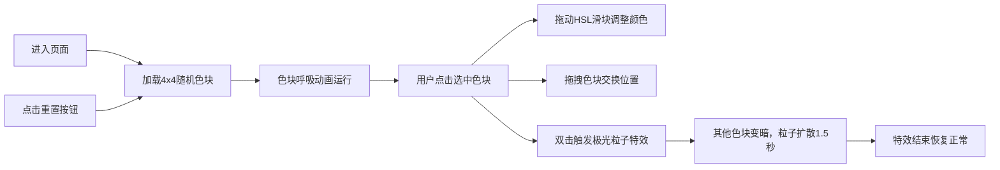

## 1. 产品概述

极光密码·幻彩面板是一款交互式动态颜色定制工具，让用户化身灯光设计师，通过点击、拖拽等手势操作，定制由多个发光色块组成的动态极光画板。

- **核心价值**：提供沉浸式的色彩创作体验，融合赛博朋克美学与流畅交互动效
- **目标用户**：设计爱好者、色彩创作者、追求视觉体验的普通用户
- **市场定位**：高端网页交互展示项目，展现前端动效与色彩控制能力

## 2. 核心特性

### 2.1 功能模块

1. **色画面板**：4x4网格色块布局，呼吸动画+渐变流动效果
2. **色彩控制**：色相、饱和度、亮度滑块实时调整
3. **拖拽排序**：色块拖拽交换位置，视觉反馈清晰
4. **极光特效**：双击触发全屏粒子爆发特效
5. **响应式适配**：桌面/平板/手机多端适配

### 2.2 页面详情

| 页面名称 | 模块名称 | 功能描述 |
|-----------|-------------|---------------------|
| 主页面 | 色画面板 | 16个色块网格，支持选中、拖拽、双击交互 |
| 主页面 | 控制栏 | HSL色彩滑块、重置按钮，移动端可折叠 |
| 主页面 | 极光特效层 | 全屏粒子爆发特效覆盖层 |

## 3. 核心流程

用户进入页面 → 看到16个随机呼吸色块 → 点击选中色块 → 拖动滑块调整颜色 → 拖拽色块重新排序 → 双击色块触发极光特效 → 点击重置恢复初始状态

## 4. 用户界面设计

### 4.1 设计风格

- **主色调**：深紫 `#1a0a2e`、霓虹蓝 `#00d4ff`
- **视觉风格**：赛博极光风，磨砂玻璃质感，发光边框
- **背景**：径向渐变模拟星空，营造深邃宇宙感
- **交互反馈**：所有过渡0.3-0.5秒缓出，60fps流畅动画
- **字体**：采用Orbitron作为标题字体（科技感），Zen Maru Gothic作为正文字体

### 4.2 页面设计概述

| 页面名称 | 模块名称 | UI元素 |
|-----------|-------------|-------------|
| 主页面 | 色画面板 | 4x4网格，磨砂玻璃色块，内阴影，发光边框，呼吸+流动渐变 |
| 主页面 | 控制栏 | 三个滑块（色相/饱和度/亮度），重置按钮，玻璃拟态面板 |
| 主页面 | 极光特效层 | 数百彩色粒子，弧线飞行轨迹，渐隐效果 |

### 4.3 响应式设计

- **桌面端**：色块区域占画布80%，控制栏固定底部
- **平板端**：色块区域占画布95%，控制栏底部固定
- **手机端**：色块改为单列纵向滚动布局，控制栏折叠为可展开面板
- **触摸优化**：所有交互元素最小48x48px触摸区域

### 4.4 动效设计

- **呼吸动画**：色块透明度和尺寸周期性变化（0.8-1.0），周期3秒
- **渐变流动**：背景色带横向位移，周期5秒
- **选中反馈**：色块边框加粗，发光增强，轻微放大
- **拖拽反馈**：被拖元素半透明，目标位置高亮闪烁
- **极光特效**：粒子沿贝塞尔曲线飞行，颜色随机取自当前色块调色板，生命周期1.5秒
