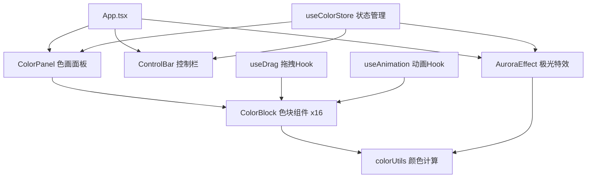

## 1. 架构设计

纯前端单页应用，采用组件化架构，状态集中管理，动画分层控制。



## 2. 技术选型

- **前端框架**：React@18 + TypeScript@5
- **构建工具**：Vite@5
- **状态管理**：Zustand
- **样式方案**：TailwindCSS@3 + CSS自定义属性
- **动画方案**：CSS Keyframes + requestAnimationFrame + Canvas 2D
- **图标库**：lucide-react

## 3. 目录结构

```
├── index.html                 # 入口HTML
├── package.json               # 项目依赖
├── tsconfig.json              # TS配置
├── vite.config.js             # Vite配置
└── src/
    ├── main.tsx               # 应用入口
    ├── App.tsx                # 根组件
    ├── components/
    │   ├── ColorPanel.tsx     # 色画面板（网格布局）
    │   ├── ColorBlock.tsx     # 单个色块（呼吸+拖拽）
    │   ├── ControlBar.tsx     # 控制栏（滑块+重置）
    │   └── AuroraEffect.tsx   # 极光粒子特效
    ├── hooks/
    │   ├── useColorStore.ts   # 颜色状态管理
    │   └── useDrag.ts         # 拖拽逻辑Hook
    └── utils/
        └── colorUtils.ts      # 颜色计算工具
```

## 4. 核心数据模型

### 4.1 色块数据结构

```typescript
interface ColorBlock {
  id: string;
  hue: number;        // 0-360
  saturation: number; // 0-100
  lightness: number;  // 0-100
  position: number;   // 0-15 网格位置
  animationSpeed: number; // 呼吸动画速度倍率
}
```

### 4.2 应用状态

```typescript
interface ColorState {
  blocks: ColorBlock[];
  selectedId: string | null;
  isDragging: boolean;
  dragOverPosition: number | null;
  isAuroraActive: boolean;
  auroraOrigin: { x: number; y: number; hue: number } | null;
  // Actions
  selectBlock: (id: string) => void;
  updateBlockColor: (id: string, h: number, s: number, l: number) => void;
  swapBlocks: (pos1: number, pos2: number) => void;
  setDragState: (isDragging: boolean, overPos: number | null) => void;
  triggerAurora: (x: number, y: number, hue: number) => void;
  endAurora: () => void;
  resetAll: () => void;
}
```

## 5. 关键实现方案

### 5.1 呼吸动画与渐变流动

- 使用CSS `@keyframes` 实现 `breathing` 和 `flowGradient` 动画
- 每个色块通过CSS变量 `--hue`、`--speed` 控制个性化参数
- 渐变流动通过 `background-position` 动画实现

### 5.2 拖拽排序

- 原生HTML5 Drag & Drop API
- `useDrag` Hook 封装拖拽状态管理
- 拖拽时 `opacity: 0.5` 跟随鼠标
- 目标位置添加 `drop-highlight` 类实现高亮

### 5.3 极光粒子特效

- Canvas 2D 实现高性能粒子渲染
- 粒子池模式避免频繁GC
- 贝塞尔曲线算法实现弧线飞行轨迹
- `requestAnimationFrame` 驱动60fps动画
- 粒子颜色基于触发色块的色相偏移生成

### 5.4 响应式布局

- Tailwind `grid-cols-4` 桌面端4列
- `md:grid-cols-4` 平板保持4列
- `sm:grid-cols-1` 手机端单列滚动
- 控制栏使用 `sm:h-auto` + `sm:overflow-hidden` 实现折叠

## 6. 性能优化

- 色块动画使用 `transform` 和 `opacity`，触发GPU加速
- 粒子特效使用离屏Canvas缓冲
- 状态更新采用批量更新模式
- 滑块 `onChange` 使用节流（16ms）
- 所有CSS动画启用 `will-change` 提示
