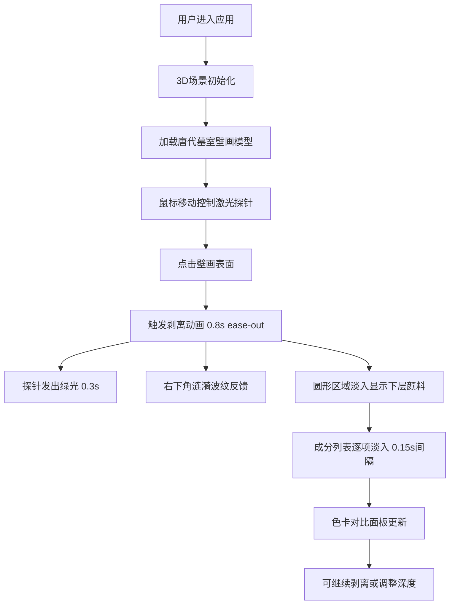

## 1. 产品概述
基于浏览器的古代墓室壁画颜料层析与矿物成分交互模拟3D可视化应用，让用户以敦煌莫高窟壁画修复师的身份，在虚拟唐代墓室中通过激光扫描探针逐层剥离壁画尘垢，实时观察颜料色彩还原并生成矿物成分分析报告。
- 核心价值：为文化遗产保护爱好者、艺术史研究者提供沉浸式壁画修复体验
- 目标用户：博物馆教育工作者、艺术专业学生、文化遗产爱好者

## 2. 核心 Features

### 2.1 用户角色
| 角色 | 注册方式 | 核心权限 |
|------|----------|----------|
| 修复师用户 | 无需注册，直接使用 | 完整的壁画剥离、成分分析、数据查看权限 |

### 2.2 Feature 模块
1. **3D墓室场景**：唐代墓室壁画模型、激光探针交互、深度标尺显示
2. **层析剥离系统**：鼠标点击触发局部剥离动画、圆形淡入效果、多层颜料渲染
3. **成分分析模块**：自动生成矿物成分列表、分子式显示、含量百分比
4. **色彩对比面板**：剥离前后色卡对比、原始色与氧化色并排展示
5. **进度控制模块**：深度滑块、剥离进度条、层数显示

### 2.3 页面详情
| 页面名称 | 模块名称 | 功能描述 |
|---------|----------|----------|
| 主应用页面 | 3D场景模块 | 可旋转缩放的唐代墓室壁画，龟裂纹理与土坯基底，激光探针跟随鼠标移动 |
| 主应用页面 | 剥离交互模块 | 点击壁画触发0.8秒ease-out剥离动画，每次0.1mm深度，最大10层 |
| 主应用页面 | 成分分析模块 | 基于剥离层自动生成矿物列表，每项间隔0.15秒淡入动画 |
| 主应用页面 | 控制面板模块 | 垂直深度滑块、进度条、触摸友好型响应式设计 |
| 主应用页面 | 色卡对比模块 | 氧化色（#3a3a3a）与还原色（#cc3333/#2a6b8a）并排展示 |

## 3. 核心流程

### 3.1 用户操作流程
用户进入应用 → 3D场景加载完成 → 鼠标移动控制激光探针 → 点击壁画表面 → 触发剥离动画（0.8秒）→ 探针发出绿光（0.3秒）→ 涟漪波纹反馈 → 下层颜料圆形淡入显示 → 成分列表逐项淡入 → 色卡对比更新 → 可继续点击剥离或拖动深度滑块

### 3.2 流程图

## 4. 界面设计

### 4.1 设计风格
- **主色调**：深褐#2a1a0a（背景）、藤黄#d4a76a（文字）、仿古纸#f5e6c8（卡片）、铜锈绿#4a7a6b（交互）、朱砂红#cc3333（高亮）
- **字体**：衬线体（Georgia/Noto Serif SC），营造古籍修复氛围
- **按钮样式**：圆角矩形，铜锈绿填充，悬停时轻微上浮
- **布局风格**：左右分栏（60%/40%），卡片式组件，半透明仿古纸效果
- **视觉元素**：龟裂纹理、土坯质感、铜锈金属光泽、古籍纸张纹理

### 4.2 页面设计概览
| 页面名称 | 模块名称 | UI元素 |
|---------|----------|--------|
| 主应用 | 3D场景 | 深褐背景、唐代墓室壁画、激光探针（绿光#00cc66）、深度标尺、剥离线框高亮 |
| 主应用 | 控制面板 | 垂直滑块（0.0mm~1.0mm刻度）、进度条、仿古纸卡片 |
| 主应用 | 成分列表 | 圆角矩形卡片、矿物色块、分子式、含量百分比、悬停上浮动画 |
| 主应用 | 色卡对比 | 左右并排色块、色值标注、氧化状态说明 |

### 4.3 响应式设计
- **桌面端（>768px）**：左右分栏布局，左侧60% 3D场景，右侧40%控制面板
- **移动端（≤768px）**：上下布局，上方60vh 3D场景，下方40vh控制面板
- **触摸优化**：滑块高度增加至36px，成分列表字号缩小至12px，点击区域扩大

### 4.4 3D场景设计
- **环境**：暗色调墓室空间，柔和暖光模拟烛光效果，轻微体积雾营造年代感
- **光照**：主光源（暖黄色，模拟墓室内光线）+ 探针点光源（绿色，跟随鼠标）
- **相机**：初始位置壁画正前方3单位，45度俯视，OrbitControls控制
- **壁画材质**：多层Shader材质，表面尘垢层+颜料层+土坯基底，512x512龟裂纹理
- **动画**：剥离区域圆形淡入（Alpha渐变）、探针绿光闪烁、涟漪波纹扩散
- **后处理**：轻微泛光效果、色彩校正、胶片颗粒增加质感
- **性能**：60FPS运行，交互延迟<16ms，总响应时间<100ms

## 5. 性能指标
- 3D场景帧率：≥60FPS
- 鼠标交互延迟：<16ms
- 剥离动画+成分计算总响应时间：<100ms
- 首次加载时间：<3s
