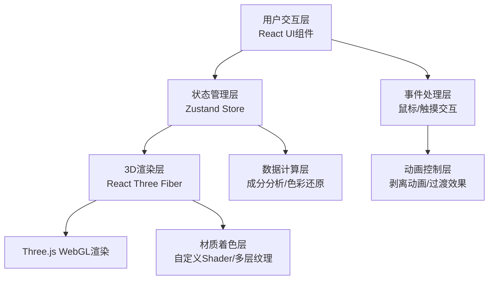

## 1. 架构设计

### 1.1 系统架构图


### 1.2 分层架构说明
| 层级 | 职责 | 核心模块 |
|------|------|----------|
| 用户交互层 | 界面渲染、用户输入处理 | UI.tsx - 控制面板、成分列表、色卡对比 |
| 状态管理层 | 全局状态管理、数据共享 | store.ts - 剥离层数、颜料成分、界面状态 |
| 3D渲染层 | 3D场景构建、模型渲染 | Scene.tsx - 墓室壁画、激光探针、OrbitControls |
| 事件处理层 | 鼠标/触摸事件、交互响应 | 点击剥离、鼠标跟随、滑块控制 |
| 动画控制层 | 过渡动画、视觉反馈 | 剥离淡入、绿光闪烁、涟漪波纹 |
| 数据计算层 | 成分分析算法、色彩还原 | 矿物成分生成、氧化色计算 |
| 材质着色层 | 自定义着色器、多层纹理 | 壁画Shader、尘垢层、颜料层渲染 |

## 2. 技术选型说明

### 2.1 核心技术栈
| 技术 | 版本 | 用途 |
|------|------|------|
| React | 18.x | UI组件框架 |
| React DOM | 18.x | DOM渲染 |
| TypeScript | 5.x | 类型安全 |
| Vite | 5.x | 构建工具、开发服务器 |
| @vitejs/plugin-react | 4.x | React HMR支持 |
| Three.js | 0.160.x | WebGL 3D渲染引擎 |
| @react-three/fiber | 8.x | React Three.js渲染器 |
| @react-three/drei | 9.x | R3F辅助组件库 |
| Zustand | 4.x | 轻量级状态管理 |
| simplex-noise | 4.x | 噪声生成（龟裂纹理） |

### 2.2 开发规范
- **代码风格**：ESLint + Prettier，严格TypeScript模式
- **命名规范**：PascalCase组件名，camelCase变量/函数，UPPER_CASE常量
- **目录结构**：按功能模块组织，组件与逻辑分离
- **性能优化**：React.memo、useMemo、useCallback合理使用

## 3. 目录结构

```
auto34/
├── package.json              # 依赖配置
├── vite.config.js            # Vite构建配置
├── tsconfig.json             # TypeScript配置
├── index.html                # 入口HTML
└── src/
    ├── main.tsx              # React入口挂载
    ├── App.tsx               # 根应用组件
    ├── store.ts              # Zustand状态管理
    ├── Scene.tsx             # 3D场景组件
    ├── UI.tsx                # UI界面组件
    ├── types.ts              # TypeScript类型定义
    ├── utils/
    │   ├── shader.ts         # 着色器代码
    │   ├── minerals.ts       # 矿物数据
    │   └── noise.ts          # 噪声工具
    └── styles/
        └── global.css        # 全局样式
```

## 4. 数据模型

### 4.1 核心数据类型

```typescript
// 矿物成分类型
interface Mineral {
  id: string;
  name: string;           // 中文名称：朱砂、石青等
  formula: string;        // 分子式：HgS、2CuCO3·Cu(OH)2等
  color: string;          // 原色HEX
  oxidizedColor: string;  // 氧化色HEX
  percentage: number;     // 含量百分比 0-100
}

// 剥离层类型
interface Layer {
  id: number;
  depth: number;          // 深度 0.0-1.0mm
  minerals: Mineral[];    // 该层矿物成分
  stripped: boolean;      // 是否已剥离
  stripProgress: number;  // 剥离动画进度 0-1
}

// 剥离点类型
interface StripPoint {
  id: string;
  x: number;              // UV坐标X
  y: number;              // UV坐标Y
  layer: number;          // 剥离到第几层
  radius: number;         // 剥离半径
  progress: number;       // 动画进度 0-1
}

// 全局状态类型
interface AppState {
  currentLayer: number;           // 当前剥离层数 0-10
  currentDepth: number;           // 当前深度 0.0-1.0mm
  layers: Layer[];                // 所有层数据
  stripPoints: StripPoint[];      // 所有剥离点
  activeTab: 'analysis' | 'compare';  // 选项卡状态
  probePosition: [number, number, number];  // 探针位置
  isProbeActive: boolean;         // 探针是否激活（发光）
  rippleEffect: boolean;          // 涟漪效果开关
  
  // Actions
  setCurrentLayer: (layer: number) => void;
  addStripPoint: (x: number, y: number) => void;
  updateStripProgress: (id: string, progress: number) => void;
  setProbePosition: (pos: [number, number, number]) => void;
  activateProbe: () => void;
  triggerRipple: () => void;
  setActiveTab: (tab: 'analysis' | 'compare') => void;
}
```

### 4.2 矿物数据库
```typescript
// 预设矿物数据
const MINERALS = [
  { id: 'cinnabar', name: '朱砂', formula: 'HgS', color: '#cc3333', oxidizedColor: '#3a3a3a' },
  { id: 'azurite', name: '石青', formula: '2CuCO₃·Cu(OH)₂', color: '#2a6b8a', oxidizedColor: '#3a3a3a' },
  { id: 'malachite', name: '氯铜矿', formula: 'Cu₂(OH)₃Cl', color: '#2d5a4a', oxidizedColor: '#3a3a3a' },
  { id: 'leadWhite', name: '铅白', formula: '2PbCO₃·Pb(OH)₂', color: '#f5f0e6', oxidizedColor: '#3a3a3a' },
  { id: 'ochre', name: '赭石', formula: 'Fe₂O₃', color: '#8b4513', oxidizedColor: '#5a3a1a' },
  { id: 'gold', name: '金粉', formula: 'Au', color: '#ffd700', oxidizedColor: '#8b7355' },
];
```

## 5. 核心算法

### 5.1 颜料色彩还原算法
```
输入：当前层深度、剥离点UV坐标
输出：还原后RGB颜色值

算法步骤：
1. 根据深度确定当前颜料层（0.1mm间隔）
2. 基于UV坐标的噪声值确定该区域矿物分布
3. 根据矿物混合比例计算基础颜色
4. 应用氧化系数（未剥离区域氧化色，已剥离区域原色）
5. 叠加龟裂纹理和尘垢效果
```

### 5.2 矿物成分分析算法
```
输入：当前剥离层数、剥离点位置
输出：矿物成分列表及百分比

算法步骤：
1. 确定分析区域（剥离点半径内）
2. 基于simplex噪声生成矿物分布模式
3. 按深度权重分配各矿物含量（深层石青多，表层铅白多）
4. 归一化百分比确保总和为100%
5. 按含量排序输出
```

### 5.3 剥离动画插值
```
动画时长：0.8秒，ease-out缓动
圆形半径：从0扩展到目标半径（0.15单位）
透明度：上层尘垢Alpha从1渐变到0
下层颜料：Alpha从0渐变到1
探针发光：0.3秒绿光脉冲
涟漪效果：3个同心圆向外扩散，0.6秒完成
```

## 6. 着色器设计

### 6.1 壁画多层材质Shader
```glsl
// Vertex Shader
varying vec2 vUv;
varying vec3 vNormal;
varying vec3 vPosition;

void main() {
  vUv = uv;
  vNormal = normalize(normalMatrix * normal);
  vPosition = position;
  gl_Position = projectionMatrix * modelViewMatrix * vec4(position, 1.0);
}

// Fragment Shader
uniform sampler2D uDirtTexture;      // 尘垢纹理
uniform sampler2D uPaintTexture;     // 颜料纹理
uniform sampler2D uCrackTexture;     // 龟裂纹理
uniform float uStripPoints[100];     // 剥离点数据（x, y, radius, progress）
uniform int uStripPointCount;
uniform float uCurrentLayer;         // 当前层

void main() {
  vec2 uv = vUv;
  
  // 计算剥离遮罩
  float stripMask = 0.0;
  for (int i = 0; i < 100; i++) {
    if (i >= uStripPointCount) break;
    vec4 point = vec4(
      uStripPoints[i*4],
      uStripPoints[i*4+1],
      uStripPoints[i*4+2],
      uStripPoints[i*4+3]
    );
    float dist = distance(uv, point.xy);
    float radius = point.z * point.w;
    float edge = smoothstep(radius, radius + 0.02, dist);
    stripMask = max(stripMask, 1.0 - edge);
  }
  
  // 多层颜色混合
  vec4 dirtColor = texture2D(uDirtTexture, uv);
  vec4 paintColor = texture2D(uPaintTexture, uv);
  vec4 crackColor = texture2D(uCrackTexture, uv);
  
  // 氧化效果（未剥离区域）
  vec3 oxidizedPaint = mix(paintColor.rgb, vec3(0.227), 0.8);
  
  // 最终颜色混合
  vec3 finalColor = mix(
    mix(dirtColor.rgb, oxidizedPaint, 0.3),  // 未剥离：尘垢+氧化颜料
    paintColor.rgb,                          // 已剥离：原始颜料
    stripMask
  );
  
  // 叠加龟裂纹理
  finalColor *= mix(vec3(1.0), crackColor.rgb, crackColor.a * 0.3);
  
  gl_FragColor = vec4(finalColor, 1.0);
}
```

## 7. 性能优化策略

### 7.1 3D性能优化
- **InstancedMesh**：复用剥离点几何体
- **LOD**：壁画模型根据距离切换细节
- **纹理压缩**：使用basis universal压缩纹理
- **视锥体剔除**：自动剔除不可见物体
- **帧率控制**：requestAnimationFrame自动适配刷新率

### 7.2 React性能优化
- **状态隔离**：Zustand selectors避免不必要重渲染
- **Memoization**：React.memo包装UI组件
- **事件委托**：减少事件监听器数量
- **按需加载**：动态导入非关键模块

### 7.3 动画性能优化
- **CSS Transitions**：优先使用GPU加速属性
- **requestAnimationFrame**：所有动画统一调度
- **避免Layout Thrashing**：批量DOM读写
- **transform/opacity**：仅修改可合成属性

## 8. 着色器与材质系统

### 8.1 壁画材质系统
- **基础层**：土坯基底（#b8a070）+ 噪声纹理
- **颜料层**：多层矿物颜料混合，支持深度切换
- **尘垢层**：表面氧化层，可剥离
- **细节层**：龟裂纹理、划痕、年代痕迹

### 8.2 交互材质
- **探针材质**：MeshStandardMaterial + 自发光
- **线框高亮**：EdgesGeometry + LineBasicMaterial
- **涟漪效果**：自定义ShaderMaterial + 透明度动画

## 9. 响应式布局实现

### 9.1 CSS媒体查询
```css
/* 桌面端 */
@media (min-width: 769px) {
  .app-container {
    display: flex;
    flex-direction: row;
  }
  .scene-container { width: 60%; }
  .panel-container { width: 40%; }
}

/* 移动端 */
@media (max-width: 768px) {
  .app-container {
    display: flex;
    flex-direction: column;
  }
  .scene-container { height: 60vh; }
  .panel-container { height: 40vh; }
  .slider { height: 36px; }
  .mineral-list { font-size: 12px; }
}
```

## 10. 无障碍与可访问性

### 10.1 键盘导航
- Tab键切换交互元素
- 方向键控制深度滑块
- Enter/Space触发剥离

### 10.2 ARIA标签
- 3D场景设置role="application"
- 滑块设置aria-valuemin/aria-valuemax/aria-valuenow
- 矿物列表设置aria-live="polite"
