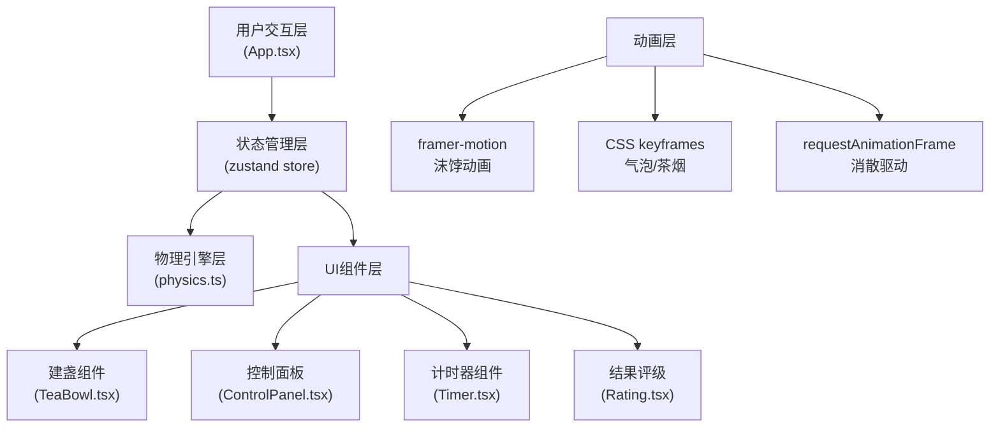

## 1. 架构设计



## 2. 技术描述

- **前端框架**：React@18 + TypeScript@5 + Vite@5
- **状态管理**：zustand@4
- **动画库**：framer-motion@11
- **工具库**：uuid@9
- **构建工具**：Vite@5，@vitejs/plugin-react@4
- **初始化方式**：vite-init react-ts 模板
- **后端**：无（纯前端应用）
- **数据库**：无

## 3. 项目结构

```
.
├── package.json
├── vite.config.js          (别名@指向src)
├── tsconfig.json           (严格模式, JSX保留)
├── index.html              (Roboto Mono字体)
└── src/
    ├── App.tsx             (主布局组件)
    ├── store.ts            (zustand状态管理)
    ├── utils/
    │   └── physics.ts      (沫饽物理模拟)
    └── components/
        ├── TeaBowl.tsx     (建盏组件)
        ├── ControlPanel.tsx (控制面板)
        ├── Timer.tsx       (水漏计时器)
        └── Rating.tsx      (结果评级)
```

## 4. 数据模型与状态定义

### 4.1 Store 状态定义

```typescript
interface TeaStore {
  // 交互参数
  angle: number;      // 注水角度 0-45
  force: number;      // 击拂力度 1-10
  speed: number;      // 转速 0-2 (慢/中/快)
  
  // 沫饽状态
  foamDepth: number;  // 沫饽厚度 0-100
  decay: number;      // 消散度 0-1
  
  // 游戏状态
  isPlaying: boolean; // 是否正在击拂
  timeLeft: number;   // 剩余时间 30-0
  showRating: boolean;// 是否显示评级
  elapsedTime: number;// 已用时间
  
  // 操作方法
  setAngle: (val: number) => void;
  setForce: (val: number) => void;
  setSpeed: (val: number) => void;
  startWhisk: () => void;
  updateFoam: () => void;
  updateDecay: (delta: number) => void;
  reset: () => void;
}
```

### 4.2 物理计算函数

```typescript
// 计算沫饽深度
// 规则：angle每增1度深度减0.5，force每级加10，speed每档加5，基础值20
function calculateFoamDepth(angle: number, force: number, speed: number): number;

// 计算消散度
// 规则：foamDepth<30时每0.5秒减0.1，<50时每1秒减0.05，其他每2秒减0.02
function calculateDecay(foamDepth: number, elapsedTime: number): number;
```

## 5. 路由定义

| 路由 | 用途 |
|------|------|
| / | 主页面（唯一页面） |

## 6. 组件数据流向

```
用户交互 → ControlPanel → store更新 
                              ↓
store.foamDepth → TeaBowl渲染沫饽高度
store.decay     → TeaBowl渲染消散效果
store.timeLeft  → Timer渲染倒计时
store.isPlaying → 控制动画循环
                              ↓
requestAnimationFrame → physics.calculateDecay → store.batch更新
```

## 7. 性能优化方案

1. **动画帧率控制**：使用requestAnimationFrame驱动，每帧调用一次store.batch批量更新
2. **状态批处理**：使用zustand的batch方法，每帧只触发一次组件重渲染
3. **选择器优化**：组件使用zustand选择器只订阅所需状态
4. **CSS动画优先**：沫饽生成使用transform:scaleY纯CSS动画，避免JS布局计算
5. **内存管理**：组件卸载时清除requestAnimationFrame和定时器
