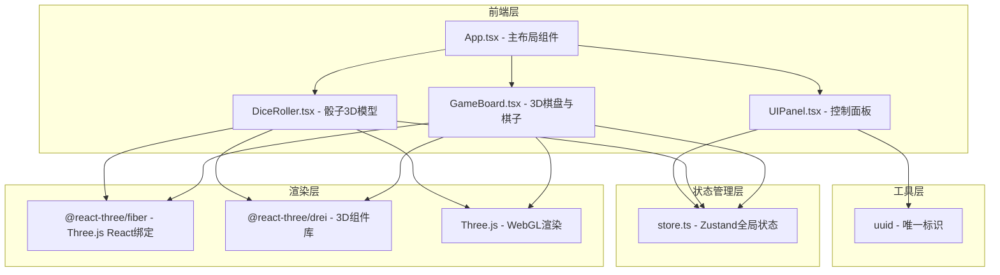

## 1. 架构设计



## 2. 技术描述

- **前端**：React@18 + TypeScript@5 + Vite@5
- **3D渲染**：three@^0.160.0 + @react-three/fiber@^8.15.0 + @react-three/drei@^9.92.0
- **状态管理**：zustand@^4.4.0
- **工具库**：uuid@^9.0.0
- **初始化工具**：vite-init
- **后端**：无（纯前端应用）
- **数据库**：无（内存状态管理）

## 3. 目录结构

```
auto36/
├── src/
│   ├── App.tsx              # 主布局组件
│   ├── GameBoard.tsx        # 3D棋盘与棋子渲染
│   ├── DiceRoller.tsx       # 骰子3D模型与投掷
│   ├── UIPanel.tsx          # 右侧控制面板
│   ├── store.ts             # Zustand全局状态
│   └── main.tsx             # 入口文件
├── package.json             # 依赖配置
├── vite.config.js           # Vite配置
├── tsconfig.json            # TypeScript配置
├── index.html               # 入口HTML
└── .trae/
    └── documents/
        ├── PRD.md
        └── TechnicalArchitecture.md
```

## 4. 核心数据模型

### 4.1 棋子数据结构

```typescript
interface Piece {
  id: string;
  player: 'red' | 'black';
  type: string; // 篆体文字：日月星辰雷电 vs 山川风云雨
  position: { row: number; col: number };
  isCaptured: boolean;
}
```

### 4.2 棋盘格位数据结构

```typescript
interface Cell {
  row: number;
  col: number;
  isPath: boolean;
  isRiver: boolean;
  isStar: boolean;
  pieceId?: string;
}
```

### 4.3 骰子数据结构

```typescript
interface Dice {
  id: number;
  value: number;
  position: { x: number; y: number; z: number };
  rotation: { x: number; y: number; z: number };
  isRolling: boolean;
}
```

### 4.4 历史记录数据结构

```typescript
interface HistoryRecord {
  id: string;
  turn: number;
  player: 'red' | 'black';
  pieceType: string;
  action: 'move' | 'capture' | 'river_event' | 'extra_turn';
  from: { row: number; col: number };
  to: { row: number; col: number };
  diceSum: number;
  timestamp: number;
}
```

### 4.5 全局状态结构

```typescript
interface GameState {
  board: Cell[][];
  pieces: Piece[];
  currentPlayer: 'red' | 'black';
  dice: Dice[];
  diceWeights: number[]; // 6个面的权重
  diceSum: number;
  isRolling: boolean;
  gameOver: boolean;
  winner: 'red' | 'black' | null;
  history: HistoryRecord[];
  isReplayMode: boolean;
  replaySpeed: number;
  replayIndex: number;
  highlightedCells: { row: number; col: number }[];
  particles: Particle[];
}
```

## 5. 核心功能实现要点

### 5.1 棋盘路径系统

- 6x6网格棋盘，6条主路径交叉布局
- 河道占路径宽度1/3，暗蓝色
- 四角木柱+锦帛遮阳棚
- 金色星位标记终点

### 5.2 棋子系统

- 八角棱柱几何体（CylinderGeometry 8边）
- 材质区分红黑双方
- CanvasTexture渲染篆体文字到底部

### 5.3 骰子系统

- BoxGeometry创建立方体骰子
- 每面CanvasTexture绘制圆点
- 物理模拟弹跳与碰撞
- 加权随机算法：`weightedRandom(weights)`

### 5.4 游戏逻辑

- BFS计算可移动位置
- 河道事件概率：30%回起点、20%额外回合、50%无影响
- 卡位检测：同直线相邻且中间无空格则无法穿过
- 胜利条件检测：吃光对方棋子或抵达终点星位

### 5.5 动画与特效

- 棋子移动：ease-out 0.3秒
- 吃子：scale从1到0（0.2秒）+ 32个金色粒子扩散
- 水花：半透明蓝色圆片升起至0.1单位消散
- 骰子弹跳：物理模拟+碰撞检测

### 5.6 概率可视化

- 饼图：根据权重计算扇形角度，颜色从#ff3333到#3333ff渐变
- 直方图：模拟1000次投掷，统计各点数出现频率

### 5.7 性能优化

- 粒子池：上限30个，每帧最多5个新粒子
- 对象复用：避免频繁创建销毁Three.js对象
- LOD：根据距离调整细节级别
- requestAnimationFrame确保30FPS以上

## 6. 性能与质量保证

- 帧率监控：requestAnimationFrame计时，确保>=30FPS
- 节流防抖：长按投掷不重复触发
- 响应式：resize事件调整相机和渲染尺寸
- TypeScript严格模式：确保类型安全
