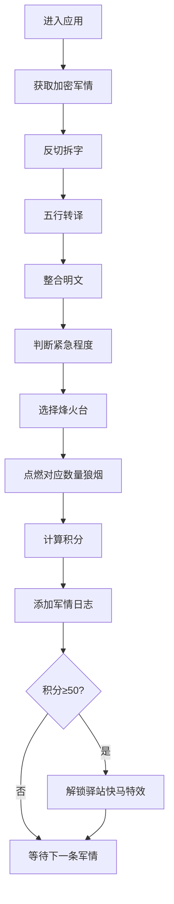

## 1. 产品概述
古代军事情报加密传驿与烽火台信号解析系统，让用户以明代兵部职方司主事的身份，在虚拟九边重镇地图上处理加密军情，通过解密算法还原敌情，并调度烽火台传递军情。
- 核心价值：沉浸式体验古代军事信息传递与解密过程，融合历史文化与游戏化交互
- 目标用户：对历史、军事、解谜类应用感兴趣的用户

## 2. 核心特性

### 2.1 用户角色
| 角色 | 注册方式 | 核心权限 |
|------|----------|----------|
| 兵部主事 | 无需注册，直接进入 | 处理军情、解密情报、调度烽火台、查看日志 |

### 2.2 功能模块
1. **主界面**：左侧九边地图区域、右侧解密控制面板、底部烽火台状态栏
2. **军情解密模块**：反切拆字→五行转译→整合明文三步解密动画
3. **烽火台调度模块**：根据紧急程度点燃对应数量狼烟，支持风力风向动态效果
4. **地图交互模块**：CSS绘制地图、军情标记、拖拽平移、缩放控制
5. **积分奖惩系统**：解密得分、超时/错误扣分、50分解锁驿站快马特效
6. **军情日志模块**：时间轴记录已处理军情，支持清空日志

### 2.3 页面详情
| 页面名称 | 模块名称 | 功能描述 |
|----------|----------|-------------|
| 主界面 | 地图区域 | CSS绘制九边地图简图，5个烽火台标记，军情来源位置标记，支持Ctrl+滚轮缩放、拖拽平移 |
| 主界面 | 解密面板 | 显示加密密文，三步解密按钮，每步带动画效果，最终显示明文军情 |
| 主界面 | 烽火台状态栏 | 显示当前风向风力，各烽火台状态，积分显示 |
| 主界面 | 军情日志 | 底部时间轴记录，每条记录带滑入动画，支持清空 |

## 3. 核心流程
1. 用户进入应用，自动从后端获取一条加密军情
2. 用户依次点击"反切拆字"→"五行转译"→"整合明文"完成解密
3. 根据解密后的紧急程度（平报/急报/八百里加急），点击对应烽火台点燃狼烟（1/3/5股）
4. 系统根据操作正确性和耗时计算积分
5. 军情记录自动添加到底部时间轴
6. 积分达到50分时触发"驿站快马"特效

## 4. 用户界面设计

### 4.1 设计风格
- 主色调：米黄色底纹（#f5e6c8）、深红雕刻风格（#8b0000）、金色双线边框（#d4a017）
- 地图配色：浅赭石色土地（#c4a882）、墨绿色山林（#2d5a27）、蓝色细线河流（#4a6fa5）
- 烽火台：#6b3a1a木结构 + #cc0000台顶，点燃后#ff6600到#ffcc00渐变火焰
- 按钮风格：仿木刻版画（深棕#3a1a0a，白色文字，悬停#5a3a2a，点击凹陷效果）
- 字体：标题使用古典风格字体，正文使用清晰易读字体
- 整体风格：明代兵部奏折风格，仿古宣纸纹理背景

### 4.2 页面设计概述
| 页面名称 | 模块名称 | UI元素 |
|----------|----------|--------|
| 主界面 | 标题栏 | 深红背景、金色边框、雕刻风格文字、0.3s过渡动画 |
| 主界面 | 地图区域 | 60%宽度，CSS绘制地图，烽火台标记，军情标记，点击弹出预览卡片 |
| 主界面 | 解密面板 | 35%宽度，仿宣纸背景，三步解密按钮，字符跳动动画，颜色渐变 |
| 主界面 | 烽火台状态栏 | 底部区域，风向风力指示，烽火台状态图标，积分显示 |
| 主界面 | 军情日志 | 时间轴布局，记录渐入动画，清空按钮 |

### 4.3 响应性
- 桌面优先设计，最低支持1280px宽度
- 地图区域与解密面板自适应布局
- 触控优化：支持触摸拖拽地图，点击烽火台

### 4.4 动画与交互
- 解密步骤：字符跳动、颜色渐变（0.2-0.4s缓动）
- 狼烟效果：CSS clip-path曲线上浮动画，随风力摆动
- 烽火台点燃：火焰粒子上升，烟柱飘散
- 地图标记：点击弹出卡片，滑入效果
- 日志记录：从下方滑入并淡出到正常显示
- 烽火台点击：Web Audio API生成木架嘎吱声
- 驿站快马：CSS动画马沿驿道奔跑，尘土轨迹

