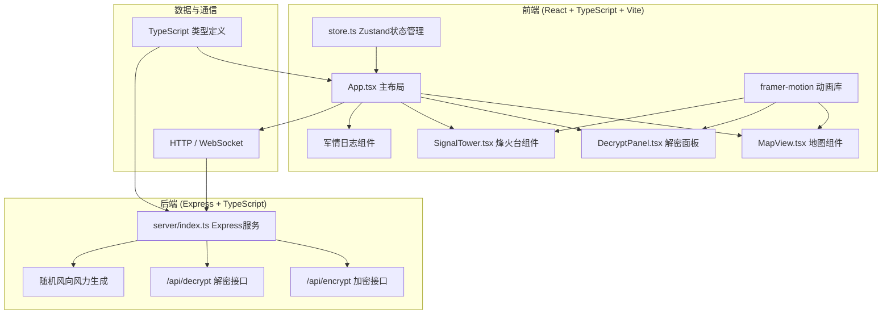
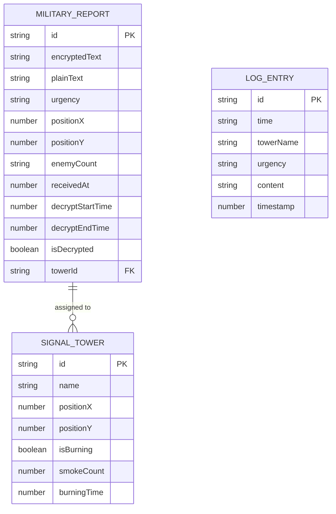

## 1. 架构设计



## 2. 技术描述
- **前端**：React@18 + TypeScript + Vite@5 + Zustand@4 + framer-motion@11
- **后端**：Express@4 + TypeScript + cors@2 + uuid@9
- **初始化工具**：vite-init
- **构建配置**：Vite配置含proxy代理到后端3001端口
- **样式方案**：CSS Modules + 自定义CSS变量，不使用Tailwind

## 3. 项目结构
```
auto37/
├── package.json          # 项目依赖与脚本
├── index.html            # 入口页面
├── vite.config.js        # 构建配置
├── tsconfig.json         # TypeScript配置
├── src/
│   ├── main.tsx          # React入口
│   ├── App.tsx           # 主布局组件
│   ├── store.ts          # Zustand全局状态
│   ├── components/
│   │   ├── MapView.tsx       # 九边地图组件
│   │   ├── DecryptPanel.tsx  # 解密控制面板
│   │   ├── SignalTower.tsx   # 烽火台子组件
│   │   └── MilitaryLog.tsx   # 军情日志组件
│   └── types/
│       └── index.ts          # 类型定义
└── server/
    └── index.ts          # Express后端服务
```

## 4. 路由定义
| 路由 | 用途 |
|------|------|
| / | 主应用页面 |
| /api/encrypt | 获取加密军情 |
| /api/decrypt | 提交解密请求 |

## 5. API 定义

### 类型定义
```typescript
// 军情紧急程度
type UrgencyLevel = 'normal' | 'urgent' | 'emergency';

// 风向
type WindDirection = 'N' | 'NE' | 'E' | 'SE' | 'S' | 'SW' | 'W' | 'NW';

// 烽火台状态
interface SignalTower {
  id: string;
  name: string; // 甲、乙、丙、丁、戊
  position: { x: number; y: number };
  isBurning: boolean;
  smokeCount: number; // 1-5股
  burningTime: number;
}

// 军情
interface MilitaryReport {
  id: string;
  encryptedText: string;
  plainText: string;
  urgency: UrgencyLevel;
  sourcePosition: { x: number; y: number };
  enemyCount: 'hundred' | 'thousand' | 'tenThousand';
  receivedAt: number;
  decryptStartTime?: number;
  decryptEndTime?: number;
  isDecrypted: boolean;
  towerId?: string;
}

// 天气数据
interface WeatherData {
  windDirection: WindDirection;
  windSpeed: number; // 0-4级
}

// 解密步骤
type DecryptStep = 'idle' | 'fanqie' | 'wuxing' | 'complete';

// 全局状态
interface AppState {
  reports: MilitaryReport[];
  currentReport: MilitaryReport | null;
  towers: SignalTower[];
  decryptStep: DecryptStep;
  decryptProgress: number;
  mapZoom: number;
  mapOffset: { x: number; y: number };
  score: number;
  weather: WeatherData;
  logs: LogEntry[];
  selectedTower: string | null;
  showCourierEffect: boolean;
}

// 日志条目
interface LogEntry {
  id: string;
  time: string;
  towerName: string;
  urgency: UrgencyLevel;
  content: string;
  timestamp: number;
}
```

### API 响应格式

#### GET /api/encrypt
获取新的加密军情
```typescript
interface EncryptResponse {
  report: MilitaryReport;
  weather: WeatherData;
}
```

#### POST /api/decrypt
提交解密，验证解密结果
```typescript
interface DecryptRequest {
  reportId: string;
  step: DecryptStep;
}

interface DecryptResponse {
  success: boolean;
  plainText?: string;
  stepResult?: string;
  nextStep?: DecryptStep;
}
```

## 6. 数据模型

### 6.1 数据模型定义



### 6.2 核心算法

#### 反切注音解密
- 将每个汉字拆解为声母和韵母
- 例如："火" → "呼果切" → 取声母"h"和韵母"uo"
- 支持字符跳动动画展示拆解过程

#### 五行代字转译
- 金木水火土对应数字和方位：
  - 金 → 1、西
  - 木 → 3、东
  - 水 → 2、北
  - 火 → 4、南
  - 土 → 5、中
- 相生关系：木→火→土→金→水→木
- 相克关系：木→土→水→火→金→木

#### 烽火台狼烟动画
- 使用CSS clip-path创建波浪形烟柱
- 风力影响摆动幅度（0级=静止，4级=大幅摆动）
- 风向影响烟柱倾斜方向（北风→向南偏15-30度）
- 烟柱粒子使用CSS animation实现上浮飘散效果

#### 积分计算
- 正确解密 + 正确点燃烽火台：+10分
- 解密耗时超过30秒：-5分
- 烽火台等级错误（如急报只点1股烟）：-5分
- 积分达到50分：解锁驿站快马特效

## 7. 性能优化
- 使用React.memo优化组件重渲染
- 烽火台粒子动画使用CSS transform和opacity，避免重排
- 解密动画使用framer-motion的硬件加速属性
- 地图缩放使用transform: scale()，避免重绘
- 初始加载时间控制在3秒内，代码分割按需加载

