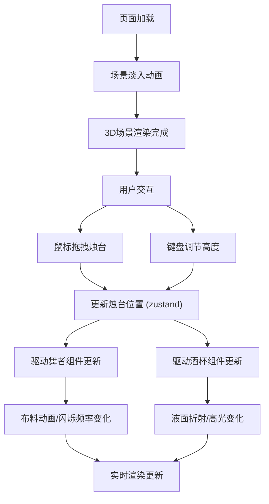

## 1. 产品概述
本产品是一个基于浏览器的3D可视化交互应用，复现唐代长安西市胡商酒肆中胡旋舞表演的场景。用户可通过交互控制烛台位置与高度，实时观察光影、布料动画和液体动态效果，沉浸式体验盛唐酒肆夜宴氛围。

- 目标用户：历史文化爱好者、艺术创作者、3D交互体验用户
- 产品价值：通过沉浸式3D交互，让用户直观感受光影对场景氛围的影响，体验传统文化与现代技术的融合

## 2. 核心功能

### 2.1 用户角色
| 角色 | 注册方式 | 核心权限 |
|------|----------|----------|
| 体验用户 | 无需注册 | 完整体验3D场景交互功能 |

### 2.2 功能模块
1. **主场景页面**：3D酒肆场景渲染、胡旋舞者动画、酒杯液体动态、烛台交互控制
2. **控制面板**：烛台坐标显示、高度调节滑块
3. **性能监控**：实时FPS显示、粒子数量自适应

### 2.3 页面详情
| 页面名称 | 模块名称 | 功能描述 |
|----------|----------|----------|
| 主场景页面 | 3D场景渲染 | 9平方米酒肆室内空间，包含地面方砖、胡床、酒坛架、圆形联珠纹地毯 |
| 主场景页面 | 胡旋舞者组件 | 联珠纹罗裙布料模拟、金银线闪烁效果、旋转动画 |
| 主场景页面 | 酒杯组件 | 铜制高足杯、葡萄酒液面折射、菲涅尔反射效果 |
| 主场景页面 | 烛台控制器 | 鼠标拖拽移动、键盘上下键调节高度、zustand状态管理 |
| 主场景页面 | 火焰粒子系统 | 30+粒子动态火焰、颜色渐变、风吹效果 |
| 控制面板 | 信息显示 | 烛台X/Y坐标实时显示、高度滑动条 |
| 辅助面板 | 操作提示 | 键盘操作说明、金色边框浮窗 |
| 辅助面板 | 性能仪表 | 右下角FPS实时显示 |

## 3. 核心流程
用户进入页面后，场景自动淡入。用户可通过鼠标拖拽烛台在桌面上移动，通过上下方向键调节烛台高度。烛台位置变化实时影响：
1. 胡姬裙摆金银线闪烁频率（越近越密集）
2. 酒杯液面高光强度（越近越锐利）
3. 整个场景的光影变化

## 4. 用户界面设计

### 4.1 设计风格
- **主色调**：暖橙(#ffa500)、暗红(#8b0000)、灰褐(#5d3a1a)、金色(#ffd700)
- **背景**：深暗色#1a1a1a，营造夜晚酒肆氛围
- **控制面板**：毛玻璃效果，背景rgba(255,255,255,0.1)，半透明
- **字体**：使用具有古典韵味的字体，标题使用装饰性字体，正文使用清晰易读的衬线字体
- **动画**：页面入场淡入1秒，烛台拖拽手形光标，平滑过渡效果

### 4.2 页面布局
| 区域 | 位置 | 元素 |
|------|------|------|
| 主场景 | 全屏 | Three.js 3D渲染画布 |
| 控制面板 | 顶部居中 | 坐标显示、高度滑块 |
| 操作提示 | 左下角 | 键盘操作说明浮窗，金色边框 |
| 性能仪表 | 右下角 | FPS实时显示 |

### 4.3 响应性
- 桌面端优先设计，全屏体验
- 支持窗口大小自适应，3D画布随窗口调整
- 鼠标拖拽和键盘操作完全支持

### 4.4 3D场景指导
- **环境氛围**：夜晚酒肆，暖色调烛光照明，整体偏暗营造沉浸感
- **光照设置**：烛台为主要动态光源（点光源），配合环境光和补光
- **摄像机设置**：第三人称视角，固定机位，可通过OrbitControls微调视角
- **场景构图**：舞者位于中央圆形地毯，左侧胡床，右侧酒坛，前景桌面放置酒杯和烛台
- **后期处理**：泛光效果增强烛光氛围，轻微色调映射
- **性能优化**：布料模拟简化计算，粒子系统根据帧率自适应

