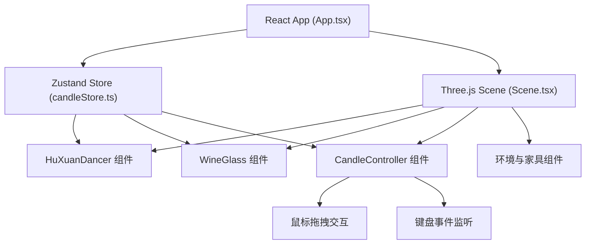

## 1. 架构设计



## 2. 技术描述

- **前端框架**：React 18 + TypeScript
- **构建工具**：Vite 5
- **3D引擎**：Three.js 0.160 + @react-three/fiber 8 + @react-three/drei 9
- **状态管理**：Zustand 4
- **样式方案**：Tailwind CSS 3（UI组件）+ Three.js材质（3D对象）

## 3. 项目结构

```
src/
├── components/
│   ├── 3d/
│   │   ├── HuXuanDancer.tsx      # 胡旋舞者组件
│   │   ├── WineGlass.tsx         # 酒杯与酒液组件
│   │   ├── CandleController.tsx  # 烛台控制器
│   │   ├── CandleFlame.tsx       # 火焰粒子系统
│   │   ├── SceneEnvironment.tsx  # 场景环境与家具
│   │   └── Floor.tsx             # 地面方砖
│   ├── ui/
│   │   ├── ControlPanel.tsx      # 顶部控制面板
│   │   ├── KeyboardHint.tsx      # 键盘操作提示
│   │   └── FPSMeter.tsx          # 性能仪表
│   └── Scene.tsx                 # 主3D场景
├── store/
│   └── candleStore.ts            # zustand状态管理
├── hooks/
│   ├── useCandleDrag.ts          # 烛台拖拽hook
│   ├── useKeyboardHeight.ts      # 键盘高度控制hook
│   └── useFPS.ts                 # FPS计算hook
├── utils/
│   ├── clothSimulation.ts        # 布料模拟算法
│   └── particleSystem.ts         # 粒子系统工具
├── types/
│   └── index.ts                  # 类型定义
├── App.tsx
├── main.tsx
└── index.css
```

## 4. 核心数据类型定义

```typescript
// 烛台状态
interface CandleState {
  position: { x: number; y: number; z: number };
  height: number; // 0.3 - 1.2
  setPosition: (x: number, y: number, z: number) => void;
  setHeight: (height: number) => void;
  getLightIntensity: () => number;
}

// 布料顶点
interface ClothVertex {
  position: THREE.Vector3;
  previous: THREE.Vector3;
  original: THREE.Vector3;
  acceleration: THREE.Vector3;
  mass: number;
}

// 火焰粒子
interface FlameParticle {
  position: THREE.Vector3;
  velocity: THREE.Vector3;
  size: number;
  life: number;
  maxLife: number;
}
```

## 5. 关键技术实现

### 5.1 布料模拟算法
- 使用Verlet积分进行布料物理模拟
- 重力0.98，旋转离心力0.3
- 约束求解维持布料结构
- 简化的弹簧-质点模型，平衡性能与效果

### 5.2 火焰粒子系统
- 30+粒子，颜色从#ffffa0到#ff6600渐变
- 粒子大小0.02-0.06随机
- 高度动态波动±15%
- 风方向每5秒随机切换（8方向）
- 帧率<30fps时粒子数量减半

### 5.3 液体渲染
- 菲涅尔反射效果实现
- 距离<1单位时高光强度0.8，>2单位时0.3
- 颜色从底部#8b0000向表面#6a1010渐变
- 液面轻微波动模拟

### 5.4 性能优化
- 布料模拟每帧迭代次数限制
- 粒子系统对象池复用
- 距离剔除优化
- LOD（细节层次）策略

