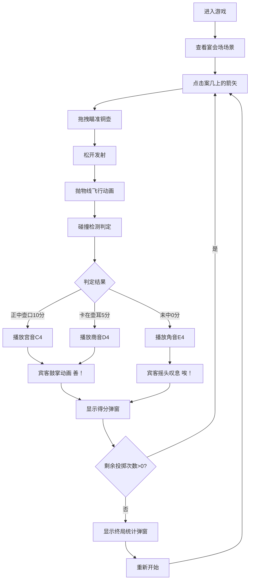

## 1. 产品概述

本产品是一款基于浏览器的古代投壶游戏交互模拟应用，还原西汉宴席上的投壶雅戏场景，让用户体验古代宴饮文化中的投壶娱乐。

- 核心目标：通过沉浸式的游戏体验，结合精美的CSS绘制场景、流畅的物理投掷动画、传统编钟乐声和宾客互动，营造真实的汉代宴饮氛围
- 目标用户：对中国古代文化感兴趣的游戏玩家、历史文化爱好者
- 市场价值：将传统文化与现代游戏技术结合，打造寓教于乐的文化传播载体

## 2. 核心功能

### 2.1 功能模块

1. **游戏主场景**：汉代宴席厅堂CSS绘制、铜壶、案几、箭矢拖拽投掷
2. **计分系统**：三种投中结果判定（正中壶口10分、卡在壶耳5分、未中0分）、分数弹窗动画
3. **乐声系统**：编钟音效（宫商角三音）、Web Audio多声部叠加
4. **宾客反应**：6位围观宾客、鼓掌/叹息动画、泡状文字飘散
5. **轮次统计**：10次投掷、进度条显示、终局统计（得分、命中率、最高连击）

### 2.2 页面详情

| 页面名称 | 模块名称 | 功能描述 |
|-----------|-------------|---------------------|
| 游戏主页面 | 宴会场场景 | 青石地面、连枝灯、朱红长席、青铜酒樽、投壶铜壶的CSS绘制 |
| 游戏主页面 | 投掷交互 | 箭矢拖拽、抛物线飞行动画、碰撞检测得分判定 |
| 游戏主页面 | 计分显示 | 数字翻转动画、实时分数显示 |
| 游戏主页面 | 乐声播放 | 编钟音效队列管理、多声部叠加 |
| 游戏主页面 | 宾客反应 | 鼓掌/摇头动画、"善！"/"唉！"泡状文字 |
| 游戏主页面 | 进度统计 | 剩余次数进度条、终局弹窗统计 |

## 3. 核心流程

用户进入游戏 → 查看宴会场场景 → 点击案几上的箭矢 → 拖拽箭矢瞄准铜壶 → 松开发射 → 箭矢沿抛物线飞行 → 碰撞检测判定得分 → 播放编钟乐声 → 宾客触发反应动画 → 显示得分弹窗 → 重复10次 → 游戏结束显示终局统计 → 可重新开始

## 4. 用户界面设计

### 4.1 设计风格

- **主色调**：暖色调宴饮风格，土黄(#d4a76a)至暗红(#8b1a1a)垂直渐变背景
- **辅助色**：青石地面#7a8a7a、铜质#b87333、青铜#4a6741至#7a9a7a、朱红#8b1a1a
- **金属质感**：连枝灯和酒樽用径向/圆柱渐变模拟金属光泽，铜壶用椭圆渐变模拟青铜质感
- **字体**：楷体用于泡状文字，主体使用清晰易读的中文字体
- **按键反馈**：鼠标悬停时案几和箭矢有3D变换抬起感(perspective(600px) rotateX(5deg))

### 4.2 页面设计概述

| 页面名称 | 模块名称 | UI元素 |
|-----------|-------------|-------------|
| 游戏主页面 | 宴会场布局 | 中央600px×400px核心区域、两侧宾客区域、青石地面、连枝灯对称分布 |
| 游戏主页面 | 核心器物 | 朱红长席(400px×80px)、青铜酒樽3只、铜壶(高80px壶口40px)、案几(200px×30px) |
| 游戏主页面 | 宾客区域 | 6位宾客（3男3女）分置两侧，简笔CSS绘制 |
| 游戏主页面 | 进度条 | 屏幕上方300px宽进度条，绿到红渐变显示剩余次数 |
| 游戏主页面 | 得分弹窗 | 数字翻转0.5s动画，显示本次得分 |
| 游戏主页面 | 终局弹窗 | 半透明黑背景、白色圆角框、24px字号、中心缩放出现动画 |

### 4.3 响应式

- 桌面端优先设计，核心区域600px×400px
- 屏幕宽度小于800px时：宾客缩减至4个并靠拢，案几和铜壶等比缩小0.8倍
- 字体和弹窗位置自适应屏幕尺寸

### 4.4 动画与交互

- 箭矢飞行：二次贝塞尔曲线抛物线，framer-motion useSpring弹性运动，落地弹跳2px衰减0.8
- 宾客鼓掌：手臂抬起上下摆动0.6s CSS keyframes
- 宾客叹息：头部左右摆动0.4s
- 泡状文字：从嘴部向上飘散1s后消失
- 得分数字：帧动画翻转效果，持续0.5s
- 终局弹窗：中心缩放出现动画
