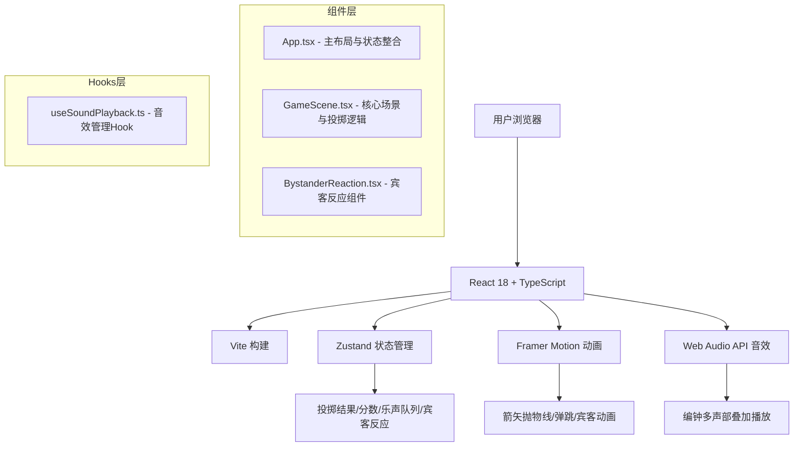

## 1. 架构设计



## 2. 技术描述

- **前端框架**：React 18 + TypeScript + Vite
- **状态管理**：Zustand（轻量级状态管理，管理投掷结果、分数、乐声队列、宾客反应）
- **动画库**：Framer Motion（抛物线运动、弹性效果、帧动画）
- **音效**：Web Audio API（振荡器生成编钟音色，支持多声部叠加）
- **样式**：纯CSS + CSS变量 + CSS动画（无需Tailwind CSS）
- **性能优化**：React.memo + Zustand选择性订阅减少重渲染

## 3. 项目文件结构

```
.
├── package.json
├── vite.config.js
├── tsconfig.json
├── index.html
└── src/
    ├── main.tsx
    ├── App.tsx
    ├── components/
    │   ├── GameScene.tsx
    │   └── BystanderReaction.tsx
    └── hooks/
        └── useSoundPlayback.ts
```

### 文件说明

| 文件 | 职责 |
|------|------|
| `package.json` | 依赖：react、react-dom、typescript、vite、@vitejs/plugin-react、framer-motion、zustand |
| `vite.config.js` | Vite基础构建配置，React插件 |
| `tsconfig.json` | 严格模式，target es2020 |
| `index.html` | 入口页面，标题"投壶雅戏" |
| `src/main.tsx` | React挂载入口，调用App组件 |
| `src/App.tsx` | 主游戏布局，场景渲染和状态管理整合 |
| `src/components/GameScene.tsx` | 核心游戏场景：宴会场CSS布局、铜壶、箭矢拖拽投掷、物理计算、得分判定 |
| `src/components/BystanderReaction.tsx` | 围观宾客反应：鼓掌/叹息CSS动画、音效、泡状文字 |
| `src/hooks/useSoundPlayback.ts` | 自定义Hook，管理编钟音效加载和播放队列，Web Audio多声部叠加 |

## 4. 核心数据模型

### Zustand Store 状态定义

```typescript
interface GameState {
  // 游戏进度
  totalThrows: number;      // 总投掷次数(10)
  remainingThrows: number;  // 剩余次数
  currentScore: number;     // 当前总分
  
  // 投掷结果
  lastResult: 'bullseye' | 'ear' | 'miss' | null;  // 上次结果
  lastScore: number;        // 上次得分
  
  // 统计
  hitCount: number;         // 命中次数
  bullseyeCount: number;    // 正中次数
  earCount: number;         // 卡耳次数
  maxStreak: number;        // 最高连续命中
  currentStreak: number;    // 当前连续命中
  
  // 乐声队列
  soundQueue: SoundEvent[];
  
  // 宾客反应
  reactionTrigger: number;  // 反应触发器（递增触发动画）
  isHit: boolean;           // 是否命中
  
  // 游戏状态
  isGameOver: boolean;
  showScorePopup: boolean;
  showEndPopup: boolean;
  
  // 方法
  registerThrow: (result: 'bullseye' | 'ear' | 'miss') => void;
  resetGame: () => void;
  triggerReaction: (isHit: boolean) => void;
  addSoundToQueue: (sound: SoundEvent) => void;
}
```

### 碰撞检测

基于坐标距离公式：
- 正中壶口：箭头坐标与壶口中心距离 < 12px
- 卡在壶耳：箭头坐标与壶耳中心距离 < 10px
- 未中：其他情况

## 5. 性能优化策略

1. **React.memo**：对GameScene、BystanderReaction等组件使用memo，避免不必要重渲染
2. **Zustand选择性订阅**：使用`useStore(state => state.x)`精确订阅所需状态
3. **CSS动画优先**：宾客反应使用CSS keyframes而非JS动画，不阻塞主线程
4. **requestAnimationFrame**：箭矢物理计算使用RAF确保60fps
5. **Web Audio独立线程**：音效播放使用Web Audio API，不阻塞UI渲染
6. **碰撞检测优化**：距离计算使用`Math.hypot`，耗时<1ms

## 6. 音效实现

使用Web Audio API生成编钟音色：
- 宫音(C4)：261.63Hz，持续0.8s，淡出
- 商音(D4)：293.66Hz，持续0.6s
- 角音(E4)：329.63Hz，持续0.4s，音色更低沉

支持多声部叠加：快速连续投掷时，前后音效同时播放不中断。
