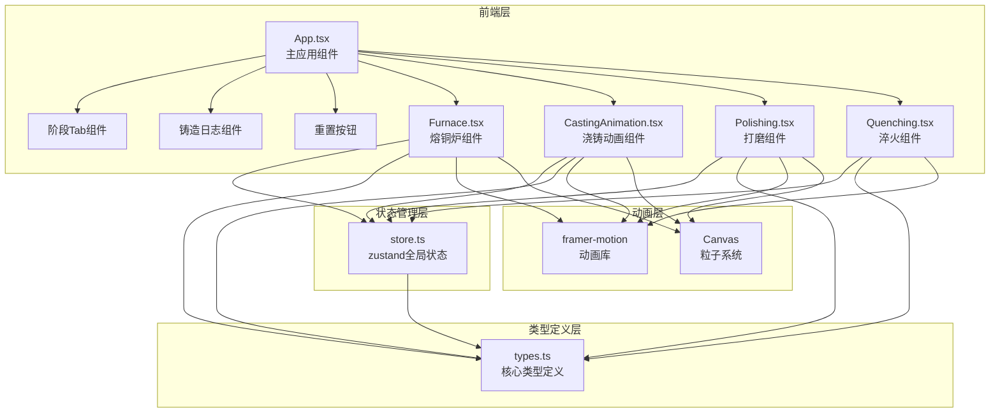

## 1. 架构设计



## 2. 技术描述

- **前端框架**：React@18 + TypeScript@5
- **构建工具**：Vite@5 + @vitejs/plugin-react@4
- **状态管理**：zustand@4
- **动画库**：framer-motion@11
- **样式方案**：CSS Modules + CSS Variables
- **Canvas绑定**：原生Canvas 2D API实现粒子系统

## 3. 项目结构

```
src/
├── types.ts          # 核心类型定义
├── store.ts          # zustand全局状态管理
├── App.tsx           # 主应用组件
├── main.tsx          # 应用入口
├── index.css         # 全局样式
└── components/
    ├── Furnace.tsx           # 熔铜炉组件
    ├── CastingAnimation.tsx  # 浇铸动画组件
    ├── Polishing.tsx         # 打磨组件
    └── Quenching.tsx         # 淬火组件
```

## 4. 核心类型定义

### 4.1 枚举类型

```typescript
enum QuenchMedium {
  Water = 'water',
  Oil = 'oil'
}

enum CastingPhase {
  Smelting = 'smelting',
  Casting = 'casting',
  Polishing = 'polishing',
  Quenching = 'quenching'
}
```

### 4.2 数据接口

```typescript
interface MetalMixture {
  copperRatio: number;      // 铜比例 80-95%
  tinRatio: number;         // 锡比例 5-20%
  temperature: number;      // 炉温 700-1100°C
  roomTemperature: number;  // 室温 20-30°C（随机）
}

interface SwordState {
  ingotRough: boolean;      // 剑坯是否成型
  polished: boolean;        // 是否完成打磨
  quenched: boolean;        // 是否完成淬火
  hardness: number;         // 硬度值 0-100
  toughness: number;        // 韧性值 0-100
  sharpness: number;        // 锋利度值 0-100
  initialHardness: number;  // 初始硬度（用于对比）
  initialToughness: number; // 初始韧性（用于对比）
  initialSharpness: number; // 初始锋利度（用于对比）
}

interface QuenchParams {
  medium: QuenchMedium;     // 淬火介质
  duration: number;         // 冷却时长 2-8秒
  crackRisk: number;        // 裂纹风险 0-100%
}

interface CastingLog {
  id: number;
  timestamp: number;
  message: string;
}

interface CastingStore {
  // 状态
  phase: CastingPhase;
  unlockedPhases: CastingPhase[];
  mixture: MetalMixture;
  sword: SwordState;
  quenchParams: QuenchParams;
  polishCount: number;
  scratchLines: { x1: number; y1: number; x2: number; y2: number }[];
  pourFlag: boolean;
  coolingProgress: number;  // 0-100%
  logs: CastingLog[];
  
  // Actions
  updateMixture: (updates: Partial<MetalMixture>) => void;
  pourMold: () => void;
  updateCoolingProgress: (progress: number) => void;
  finishCasting: () => void;
  addPolishStroke: (line: { x1: number; y1: number; x2: number; y2: number }) => void;
  finishPolishing: () => void;
  setQuenchParams: (params: Partial<QuenchParams>) => void;
  performQuench: () => void;
  addLog: (message: string) => void;
  reset: () => void;
}
```

## 5. 性能优化策略

### 5.1 动画性能

- **Canvas粒子系统**：使用requestAnimationFrame，限制帧率30fps
- **粒子数量控制**：火焰粒子最多50个，浇铸粒子最多30个
- **内存管理**：打磨划痕记录限制200条，超出自动删除最旧记录
- **CSS动画**：优先使用transform和opacity属性，避免重排重绘

### 5.2 响应式优化

- **媒体查询**：使用CSS变量定义断点，统一管理响应式布局
- **按需渲染**：未解锁阶段的组件使用React.memo避免不必要重渲染
- **事件节流**：鼠标拖拽事件使用throttle，确保交互响应<50ms

### 5.3 状态更新

- **zustand选择器**：使用selectors避免不必要的组件重渲染
- **批量更新**：多个状态更新使用batch合并
