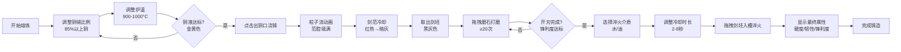

## 1. 产品概述

古代青铜剑铸造交互演示应用，通过可视化交互模拟青铜剑从熔炼到淬火的完整铸造流程，解决传统铸造工艺中合金配比、浇铸温度、淬火时机等参数对成品品质影响无法直观感受和反复试错的问题。

- 面向历史爱好者、冶金专业学生和游戏玩家，提供沉浸式的古代铸造工艺学习体验
- 通过实时反馈和参数调整，帮助用户理解青铜铸造的核心技术原理

## 2. 核心功能

### 2.1 用户角色

| 角色 | 注册方式 | 核心权限 |
|------|----------|----------|
| 普通用户 | 无需注册 | 完整的铸造流程体验，参数调整，结果查看 |

### 2.2 功能模块

1. **熔炼控制模块**：熔铜炉可视化，铜锡比例调节，温度控制，火焰动画
2. **浇铸冷却模块**：铜液流动粒子动画，剑范冷却过程，冷却速度影响
3. **打磨开刃模块**：鼠标拖拽磨石交互，剑刃露出效果，打磨次数统计
4. **淬火测试模块**：水淬/油淬选择，冷却时长控制，最终属性计算与展示

### 2.3 页面详情

| 页面名称 | 模块名称 | 功能描述 |
|----------|----------|----------|
| 主应用页面 | 阶段切换Tab | 熔炼→浇铸→打磨→淬火四阶段切换，未解锁阶段灰显 |
| 主应用页面 | 熔炼控制区 | 熔铜炉、风箱动画、铜锡比例滑块、温度滑块、铜液状态指示 |
| 主应用页面 | 浇铸冷却区 | 出铜口交互、粒子流动画、剑范冷却变色、室温显示 |
| 主应用页面 | 打磨开刃区 | 剑坯展示、磨石拖拽交互、打磨轨迹记录、锋利度指示 |
| 主应用页面 | 淬火测试区 | 水/油槽展示、剑坯拖拽入槽、淬火参数配置、属性结果对比 |
| 主应用页面 | 铸造日志 | 右上角显示最近5步操作记录 |
| 主应用页面 | 重置按钮 | 右下角重置整个铸造流程 |

## 3. 核心流程

用户进入应用后，从熔炼阶段开始，依次完成四个阶段的操作：

## 4. 用户界面设计

### 4.1 设计风格

- **主色调**：浅米色#f0e6d0（麻布背景）、深褐木纹#4a3520（操作区）、朱砂红#cc3333（按钮滑块）
- **辅助色**：陶土色#8b7a6a、铜金色#ffd700、暗铜色#cc4400、青石色#7a8a7a
- **字体**：竖排小篆（fallback到serif）用于活动数据展示
- **装饰元素**：蟠螭纹边框（CSS clip-path与渐变模拟）
- **按钮风格**：圆角矩形，朱砂红填充，金色边框，悬停有浮雕效果
- **布局风格**：卡片式布局，带仿古边框装饰，宽屏左右排列，窄屏堆叠

### 4.2 页面设计概述

| 页面名称 | 模块名称 | UI元素 |
|----------|----------|--------|
| 主应用页面 | 阶段Tab | 四个Tab按钮，当前激活朱砂红，未解锁灰显，带蟠螭纹边框 |
| 主应用页面 | 熔炼区 | 熔铜炉（陶土色+径向渐变炉膛）、风箱（木色+拉杆动画）、火焰粒子系统（Canvas）、滑块控件 |
| 主应用页面 | 浇铸区 | 陶槽、剑范（陶土色剑形凹槽）、铜液粒子流（贝塞尔曲线运动）、冷却变色动画 |
| 主应用页面 | 打磨区 | 剑坯（黑灰色）、磨石（青石色矩形）、Canvas划痕记录、锋利度进度条 |
| 主应用页面 | 淬火区 | 水槽（水色#3a6b8a+波纹动画）、油槽（油色#8b6b3b+粘稠流动）、属性柱状图对比 |
| 主应用页面 | 铸造日志 | 右上角竖排小篆字体，最近5条操作记录 |
| 主应用页面 | 重置按钮 | 右下角朱砂红圆形按钮，悬停放大效果 |

### 4.3 响应式设计

- **设计方式**：Desktop-first，移动端适配
- **断点**：768px为分界点
- **宽屏（≥768px）**：剑范区和打磨区左右排列，淬火槽保持9:16宽高比
- **窄屏（<768px）**：所有区域垂直堆叠，淬火槽保持9:16宽高比
- **触摸优化**：滑块和拖拽区域增加触摸热区，最小触摸目标48px

### 4.4 动画与交互细节

- **火焰动画**：Canvas粒子系统，颜色从#ff4400至#ffaa00渐变，30fps以上
- **浇铸粒子**：沿贝塞尔曲线运动的铜液粒子，20fps
- **冷却动画**：剑范颜色从#ff6633渐变至#665544，过渡时长随室温变化
- **波纹动画**：水槽用CSS keyframes实现半透明波纹，油槽用粘稠流动效果
- **打磨交互**：鼠标拖拽磨石，轨迹用白色划痕记录，剑刃逐渐露出铜本色
