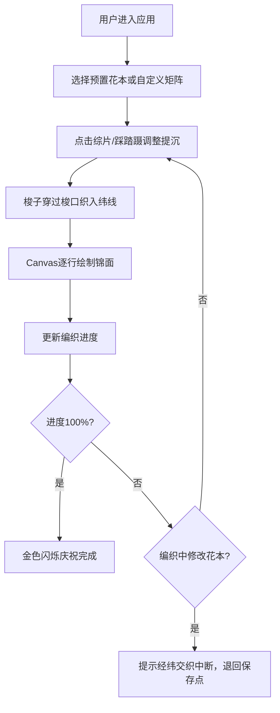

## 1. 产品概述

本应用是一个基于浏览器的古代织锦机提花与经纬线交织模拟器，让用户体验宋代成都锦院匠人的织造过程。通过虚拟织机的操作，用户可以调整综片提沉顺序和脚踏板节奏，控制经线与纬线的交织，实时观察四季花纹的编织生成。

- 核心价值：传承非物质文化遗产，以互动形式展示古代蜀锦织造技艺
- 目标用户：历史文化爱好者、传统工艺学习者、教育展示场景

## 2. 核心功能

### 2.1 功能模块
1. **织机操控面板**：虚拟提花织机模型，包含花楼、综片、蹑、梭子可视化
2. **花本编辑器**：预置花纹选择与自定义花纹矩阵编辑
3. **锦面渲染器**：Canvas 2D实时绘制经纬交织纹样
4. **进度与反馈系统**：编织进度显示、交互反馈动画、错误提示

### 2.2 页面详情
| 页面名称 | 模块名称 | 功能描述 |
|-----------|-------------|---------------------|
| 主页面 | 织机操控区 | CSS3绘制汉代提花织机模型，支持点击综片、踩踏蹑、拖动梭子 |
| 主页面 | 花本编辑器 | 4x4矩阵显示，预置蜀葵/锦鸡/四叶草花纹，支持拖拽修改 |
| 主页面 | 锦面预览区 | Canvas逐行绘制锦面，显示编织进度，完成时金色闪烁庆祝 |
| 主页面 | 状态反馈系统 | 操作震动反馈、错误提示、进度动画、木质音效动画 |

## 3. 核心流程

## 4. 用户界面设计

### 4.1 设计风格
- **主色调**：仿古绢帛色 #f5e6c8（背景），木质色 #8b7355（织机部件），红色 #d04040（综片提起）
- **配色方案**：纬线四色——红 #cc3333 / 蓝 #2a6b8a / 绿 #3a8a3a / 黄 #d4a017
- **装饰元素**：木框装饰 #8b7355，金色庆祝 #ffd700
- **字体**：采用衬线字体（如 Noto Serif SC）营造古典氛围，标题大号粗体，正文适中
- **布局**：桌面端左右布局（织机60% / 锦面40%），移动端上下布局
- **动画**：所有交互0.3s平滑过渡，综片提沉transform动画，进度渐变填充

### 4.2 页面设计概述
| 页面名称 | 模块名称 | UI元素 |
|-----------|-------------|-------------|
| 主页面 | 织机操控区 | 花楼木架（线性渐变#e0d0b0至#c8b898），16个综片（提起变红），8个蹑（可点击），木梭（左右平移） |
| 主页面 | 花本编辑器 | 4x4色块矩阵（红=提起/灰=落下），花纹选择按钮，重置按钮 |
| 主页面 | 锦面预览区 | 400x400 Canvas，仿木框装饰，进度百分比，色条进度条 |
| 主页面 | 状态反馈 | 震动微动画，木质嗒嗒闪动，金色闪烁庆祝，错误提示气泡 |

### 4.3 响应式设计
- **桌面端（≥768px）**：左右两栏布局，织机区60%宽度，锦面区40%宽度，16个综片
- **移动端（<768px）**：上下堆叠布局，织机高度缩减至200px，综片改为8个显示
- **触控优化**：按钮最小44x44px，综片和蹑增大点击区域

### 4.4 视觉细节
- **纹理**：织机使用CSS线性渐变模拟木质纹理（#e0d0b0 → #c8b898）
- **阴影**：综片和蹑带有box-shadow微阴影，hover时色温变化（#e8dcc8）
- **混合色**：经纬交织处颜色混合（如红经蓝纬显示紫色#8a2be2）
- **进度条**：每完成1%触发色条渐变填充动画
