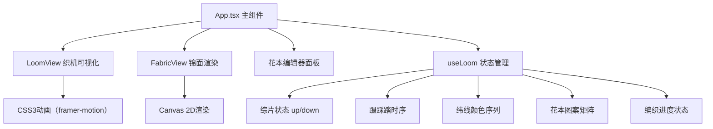

## 1. 架构设计



## 2. 技术描述

- **前端框架**：React 18 + TypeScript 5
- **构建工具**：Vite 5 + @vitejs/plugin-react
- **状态管理**：Zustand 4（轻量状态管理）+ 自定义Hook useLoom
- **动画库**：framer-motion 11（流畅过渡动画）
- **渲染方式**：CSS3绘制织机部件，Canvas 2D绘制锦面
- **性能优化**：useMemo缓存花本计算，requestAnimationFrame驱动Canvas，增量绘制

## 3. 目录结构

```
d:\Solocoder\VersionFast\tasks\auto41\
├── index.html                      # 入口HTML
├── package.json                    # 依赖配置
├── vite.config.js                  # Vite配置
├── tsconfig.json                   # TypeScript配置
└── src/
    ├── App.tsx                     # 主组件
    ├── main.tsx                    # 入口文件
    ├── styles/
    │   └── global.css              # 全局样式
    ├── hooks/
    │   └── useLoom.ts              # 织机状态Hook
    ├── components/
    │   ├── LoomView.tsx            # 织机可视化组件
    │   ├── FabricView.tsx          # 锦面渲染组件
    │   └── PatternEditor.tsx       # 花本编辑器组件
    ├── utils/
    │   └── loomUtils.ts            # 织机工具函数
    └── types/
        └── loom.ts                 # 类型定义
```

## 4. 核心数据结构

### 4.1 织机状态
```typescript
// 综片状态
type HeddleState = 'up' | 'down';

// 蹑状态
type TreadleState = 'pressed' | 'released';

// 花本矩阵 4x4
type PatternMatrix = (0 | 1)[][];

// 纬线颜色
type WeftColor = '#cc3333' | '#2a6b8a' | '#3a8a3a' | '#d4a017';

// 织机状态接口
interface LoomState {
  heddles: HeddleState[];        // 16个综片状态
  treadles: TreadleState[];      // 8个蹑状态
  currentPattern: PatternMatrix; // 当前花本矩阵
  weftColors: WeftColor[];       // 纬线颜色序列
  shuttlePosition: 'left' | 'center' | 'right'; // 梭子位置
  isWeaving: boolean;            // 是否正在编织
  progress: number;              // 编织进度 0-100
  currentRow: number;            // 当前织造行数
  savedRow: number;              // 上次保存点行号
  errorMessage: string | null;   // 错误提示
  isComplete: boolean;           // 是否完成
}
```

### 4.2 预置花纹
```typescript
const PRESET_PATTERNS = {
  蜀葵: {
    matrix: [[1,0,1,0],[0,1,0,1],[1,0,1,0],[0,1,0,1]],
    colors: ['#cc3333', '#3a8a3a', '#cc3333', '#3a8a3a'],
    description: '红绿交织'
  },
  锦鸡: {
    matrix: [[1,1,0,0],[1,1,0,0],[0,0,1,1],[0,0,1,1]],
    colors: ['#2a6b8a', '#2a6b8a', '#d4a017', '#d4a017'],
    description: '蓝黄相间'
  },
  四叶草: {
    matrix: [[0,1,1,0],[1,0,0,1],[1,0,0,1],[0,1,1,0]],
    colors: ['#3a8a3a', '#ffffff', '#3a8a3a', '#ffffff'],
    description: '绿底白纹'
  }
};
```

## 5. 关键技术实现

### 5.1 性能优化策略
- **Canvas增量绘制**：每次requestAnimationFrame仅重绘变化的行（当前行及相邻行），而非全画面刷新
- **useMemo缓存**：花本矩阵到综片序列的计算使用useMemo，确保≤10ms
- **requestAnimationFrame**：驱动Canvas渲染，保证≥50FPS
- **useRef保存画布状态**：避免不必要的重绘，保存最近完整花纹行坐标

### 5.2 动画实现
- **综片提沉**：framer-motion animate={{ y: up ? -10 : 0 }} transition 0.3s
- **蹑踩踏**：点击切换状态，背景色过渡0.3s
- **梭子移动**：左右平移100px，拖曳经线视觉效果
- **操作震动**：transform: translateX(2px) 后复原，duration 0.15s
- **完成庆祝**：金色#ffd700闪烁1秒

### 5.3 颜色混合算法
```typescript
// 经纬颜色混合（简单平均）
function mixColors(warp: string, weft: string): string {
  const warpRGB = hexToRgb(warp);
  const weftRGB = hexToRgb(weft);
  return rgbToHex({
    r: Math.round((warpRGB.r + weftRGB.r) / 2),
    g: Math.round((warpRGB.g + weftRGB.g) / 2),
    b: Math.round((warpRGB.b + weftRGB.b) / 2)
  });
}
```

## 6. 性能指标

| 指标 | 目标值 | 实现方式 |
|------|--------|----------|
| Canvas帧率 | ≥50FPS | requestAnimationFrame + 增量绘制 |
| 花本计算时间 | ≤10ms | useMemo缓存 + 高效矩阵运算 |
| 响应延迟 | ≤100ms | Zustand轻量状态 + CSS硬件加速 |
| 内存占用 | ≤100MB | Canvas像素数据及时释放 |
