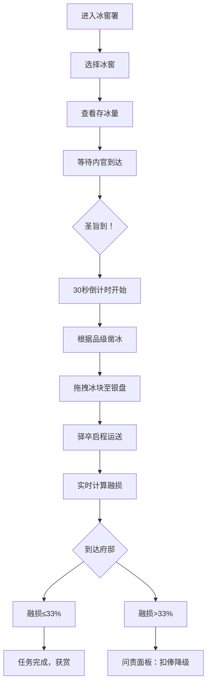

## 1. 产品概述
明代京城冰窖署凌人职业模拟器，还原古代冰窖贮冰与赐冰仪式的完整流程。
- 主要目的：让用户体验古代凌人官职的日常工作，包括冬季贮冰、夏季赐冰的完整流程
- 目标用户：历史爱好者、传统文化学习者、休闲游戏玩家
- 产品价值：通过沉浸式交互体验，传播中国古代官制和民俗文化知识

## 2. 核心功能

### 2.1 用户角色
| 角色 | 注册方式 | 核心权限 |
|------|---------|---------|
| 凌人 | 直接进入 | 管理三座冰窖、凿冰取冰、应对赐冰任务、承担融损问责 |

### 2.2 功能模块
1. **冰窖选择页**：三座冰窖（永乐窖、宣德窖、正统窖）的选择与存冰量展示
2. **冰窖剖面图**：CSS绘制的半地下式冰窖剖面图，展示冰砖堆叠与细节
3. **凿冰交互区**：30秒限时凿冰任务，粒子效果与银盘装载
4. **运送展示区**：驿卒快马运送动画与实时融损计算
5. **问责面板**：融损超标时的扣俸与降级风险展示

### 2.3 页面详情
| 页面名称 | 模块名称 | 功能描述 |
|---------|---------|---------|
| 主界面 | 冰窖选择 | 点击三座冰窖进入详情，显示总存冰量统计 |
| 冰窖详情 | 剖面图展示 | CSS绘制冰窖剖面，冰砖悬停显示采冰日期和融损率 |
| 赐冰环节 | 内官到达 | 黄骠马奔跑动画，触发30秒倒计时 |
| 赐冰环节 | 凿冰交互 | 鼠标点击冰面产生冰屑粒子，拖拽冰块到银盘 |
| 运送环节 | 融损模拟 | 根据气温风速计算融损，实时展示剩余冰量 |
| 结果展示 | 问责面板 | 融损超33%时显示扣俸数额和降级风险 |

## 3. 核心流程
用户进入主界面，选择一座冰窖查看存冰情况。等待内官携圣旨到达，触发赐冰任务。在30秒内根据官员品级凿取对应规格的冰块，装入银盘。驿卒快马运送冰块，系统实时计算融损。送达后检查融损率，若超过三分之一则触发问责。

## 4. 用户界面设计

### 4.1 设计风格
- **主色调**：枣红 `#8b2500` 配鎏金 `#b8860b` 边框
- **背景色**：仿古宣纸纹理 `#f5deb3`
- **窖壁色**：青砖 `#4a5a6a`
- **窖底色**：稻草 `#d2b48c`
- **冰色渐变**：`#c8e6f0` 至 `#e0f0f8`
- **冰凿色**：木柄 `#5a4a3a`，铁头金属质感
- **字体**：正楷体（KaiTi/STKaiti）
- **按钮风格**：枣红底鎏金边框，悬停时金色描边并放大1.05倍
- **布局风格**：仿古宫廷卷轴式布局，两侧鎏金装饰边框

### 4.2 页面设计概述
| 页面名称 | 模块名称 | UI元素 |
|---------|---------|--------|
| 主界面 | 冰窖选择 | 三座冰窖立体图标，鎏金边框，悬停放大动效，存冰量数字用鎏金色 |
| 冰窖详情 | 剖面图 | CSS绘制的半地下冰窖剖面，冰砖堆叠带渐变和裂纹纹理，悬停显示信息浮层 |
| 赐冰环节 | 内官到达 | 黄骠马从左侧奔入动画，尘土飞扬粒子效果，圣旨展开动画 |
| 赐冰环节 | 凿冰交互 | 冰凿跟随鼠标，点击产生冰屑飞溅粒子（白到淡蓝渐变），银盘随冰块数量闪烁光芒 |
| 运送环节 | 融损模拟 | 驿卒快马奔跑动画，青石板路背景，气温风速仪表盘，实时冰量进度条 |
| 结果展示 | 问责面板 | 仿古卷轴展开动画，朱红印章，扣俸数字用红色，降级警告用闪烁效果 |

### 4.3 响应式
- 桌面端优先，最小适配宽度1280px
- 采用固定布局居中展示，两侧保留仿古装饰边
- 交互元素在1280px-1920px范围内自适应缩放

### 4.4 动画与特效
- **冰面效果**：半透明渐变，光线折射模拟，细密裂纹纹理
- **粒子效果**：冰屑飞溅（白色到淡蓝渐变），马蹄尘土（土黄色粒子）
- **光芒效果**：银盘放冰后短促光芒扩散，冰窖存冰满时鎏金光晕
- **过渡动画**：页面切换采用卷轴滚动效果，按钮悬停采用金色描边过渡
- **性能要求**：粒子动画和融化计算保持50fps以上
