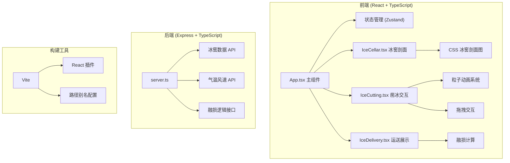

## 1. 架构设计


## 2. 技术描述
- **前端**：React@18 + TypeScript + Vite + framer-motion + zustand
- **初始化工具**：vite-init react-express-ts 模板
- **后端**：Express@4 + TypeScript + cors
- **数据**：Mock数据，无数据库
- **样式**：CSS Modules + 内联样式（动画相关）
- **动画**：framer-motion + CSS Keyframes + Canvas粒子

## 3. 目录结构
```
auto42/
├── src/
│   ├── components/
│   │   ├── IceCellar.tsx      # 冰窖剖面和存冰展示
│   │   ├── IceCutting.tsx     # 凿冰交互与粒子效果
│   │   └── IceDelivery.tsx    # 驿卒运送动画与融损计算
│   ├── store/
│   │   └── useGameStore.ts    # Zustand状态管理
│   ├── types/
│   │   └── index.ts           # TypeScript类型定义
│   ├── utils/
│   │   ├── particle.ts        # 粒子系统工具
│   │   └── melting.ts         # 融损计算工具
│   ├── App.tsx                # 主组件
│   ├── main.tsx               # 入口文件
│   └── index.css              # 全局样式
├── server/
│   └── server.ts              # Express服务端
├── package.json
├── vite.config.js
├── tsconfig.json
└── index.html
```

## 4. API 定义

### 4.1 类型定义
```typescript
interface IceBrick {
  id: string;
  harvestDate: string;
  size: { width: number; height: number; depth: number };
  meltRate: number;
  currentVolume: number;
}

interface IceCellarData {
  id: string;
  name: string;
  capacity: number;
  iceBricks: IceBrick[];
}

interface WeatherData {
  temperature: number;
  windSpeed: number;
}

interface DeliveryResult {
  initialVolume: number;
  finalVolume: number;
  meltPercentage: number;
  isPenalized: boolean;
  penalty: {
    salaryDeduction: number;
    demotionRisk: string;
  } | null;
}
```

### 4.2 接口定义
| 方法 | 路径 | 描述 | 请求参数 | 返回数据 |
|------|------|------|----------|----------|
| GET | `/api/cellars` | 获取所有冰窖数据 | 无 | `IceCellarData[]` |
| GET | `/api/cellars/:id` | 获取单座冰窖详情 | `id: string` | `IceCellarData` |
| GET | `/api/weather` | 获取当日气温风速 | 无 | `WeatherData` |
| POST | `/api/calculate-melt` | 计算融损量 | `{ volume: number, temperature: number, windSpeed: number, duration: number }` | `DeliveryResult` |

## 5. 状态管理 (Zustand)
```typescript
interface GameState {
  currentPhase: 'select' | 'cellar' | 'cutting' | 'delivery' | 'result';
  selectedCellar: IceCellarData | null;
  weather: WeatherData | null;
  timeRemaining: number;
  targetRank: 'yipin' | 'erpin' | 'sanpin';
  cutIceVolume: number;
  deliveryResult: DeliveryResult | null;
  actions: {
    selectCellar: (cellar: IceCellarData) => void;
    startCutting: (rank: string) => void;
    completeCutting: (volume: number) => void;
    startDelivery: () => void;
    completeDelivery: (result: DeliveryResult) => void;
    resetGame: () => void;
  };
}
```

## 6. 核心算法

### 6.1 融损计算公式
```
融损速率 = 基础融损率 × (1 + 温度系数 × (气温 - 25)) × (1 + 风速系数 × 风速)
基础融损率 = 0.005 (每分钟)
温度系数 = 0.08 (每°C)
风速系数 = 0.05 (每级)
最终体积 = 初始体积 × (1 - 融损速率 × 时间分钟数)
融损率 = (1 - 最终体积/初始体积) × 100%
```

### 6.2 粒子系统
- 冰屑粒子：位置、速度、大小、透明度、生命周期
- 生成时机：鼠标点击冰面时
- 渲染方式：Canvas 2D，requestAnimationFrame循环
- 性能优化：对象池复用，限制最大粒子数（200个）

## 7. 性能优化
- 使用 `requestAnimationFrame` 处理动画循环
- 粒子对象池避免频繁GC
- CSS `will-change` 优化动画性能
- React `memo` 避免不必要重渲染
- 融损计算使用 Web Worker（可选，如性能需要）
- 限制同时渲染的粒子数量
