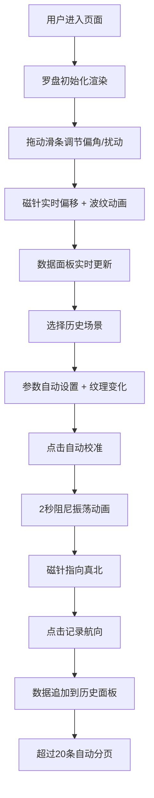

## 1. 产品概述

航海罗盘模拟器是一个基于Web的交互式教育工具，通过3D可视化直观展示古代航海中的地磁偏角修正原理。解决传统航向计算中磁偏角与铁质扰动难以理解和展示的问题，为航海历史爱好者、学生和教育工作者提供沉浸式学习体验。

### 核心价值
- 直观展示磁偏角（declination）和铁质扰动（deviation）对航向的影响
- 通过历史场景模拟重现不同时期航海技术特点
- 提供航向修正的实时可视化与数据记录功能

---

## 2. 核心功能

### 2.1 功能模块
1. **罗盘主场景**：3D铜质罗盘建模与交互
2. **偏角与偏差调节**：磁偏角和扰动强度实时控制
3. **航向计算与修正**：数据面板与自动校准动画
4. **历史场景模拟**：多时期航海场景切换
5. **数据导出**：历史记录与分页浏览

### 2.2 页面详情

| 页面名称 | 模块名称 | 功能描述 |
|----------|----------|----------|
| 主页面 | 3D罗盘 | Three.js铜质罗盘，24方位刻字，0-360度刻度，可交互磁针 |
| 主页面 | 控制面板 | 磁偏角滑条（-15°~+15°）、扰动强度滑条（0-5级） |
| 主页面 | 数据面板 | 3x3网格展示磁航向、修正角、真航向，自动校准按钮 |
| 主页面 | 场景选择器 | 郑和宝船/麦哲伦/库克船队三场景切换 |
| 主页面 | 历史记录 | 可滚动记录面板，20条后自动分页（每页10条） |

---

## 3. 核心流程

### 用户交互流程
1. 用户可单击磁针使其自由摆动，或拖拽改变指向
2. 滑动偏角/扰动滑条时，罗盘浮现地磁等偏线
3. 点击自动校准触发阻尼振荡动画，逐步修正到真北
4. 切换历史场景自动设置典型参数和盘面风格
5. 记录航向按钮保存当前状态到历史记录

---

## 4. 用户界面设计

### 4.1 设计风格
- **主题**：深色航海主题，古典与科技融合
- **主色调**：海蓝色渐变 `#0a1a2a` → `#1a2a4a`
- **强调色**：金色 `#ffcc00`、铜红 `#cc3333`、白色 `#f0e6d0`
- **辅助色**：浅蓝 `#2a6b8a`、木纹棕 `#5d3a1a`
- **字体**：衬线体（serif），大小14px，营造古典航海氛围
- **按钮**：圆角4px，悬停金色光晕，0.2秒缓动过渡
- **动效**：滑条变化触发同心圆波纹（1.5秒），自动校准阻尼振荡

### 4.2 页面设计概述

| 页面名称 | 模块名称 | UI元素 |
|----------|----------|--------|
| 主页面 | 3D罗盘 | 铜质盘面（径向渐变#b8964c→#6b4e2e），24方位刻字，5度/30度刻度线，双色磁针（红#cc3333/白#f0e6d0），铜轴悬浮 |
| 主页面 | 控制面板 | 垂直滑条（轨道#3a4a6a，滑块#ffcc00），数值标签，贝塞尔地磁等偏线 |
| 主页面 | 数据面板 | 3x3网格，半透明#2a3a4a背景，自动校准按钮，红蓝渐变光晕指示 |
| 主页面 | 场景选择器 | 下拉菜单，木质/铜质纹理切换 |
| 主页面 | 历史记录 | CSS网格，每行30px高，分页控件 |

### 4.3 响应式设计
- **桌面端（≥768px）**：罗盘直径200px，滑条垂直置于右侧，数据面板3列布局
- **移动端（<768px）**：罗盘缩小为150px，滑条横向置于罗盘下方，数据面板2列布局
- **触摸优化**：拖拽区域放大，按钮最小44x44px

### 4.4 3D场景指导
- **环境**：深色背景，无HDRI，聚焦罗盘主体
- **光照**：两盏点光源（上方主光+侧方补光），营造金属质感
- **相机**：正交投影，固定俯视视角，轻微倾角增加立体感
- **动画**：磁针旋转用四元数插值，阻尼振荡用指数衰减公式
- **特效**：刻度线光晕用shader实现，地磁线用贝塞尔曲线动态绘制
- **性能**：罗盘几何体复用，动画60FPS，滑条响应<50ms

---
