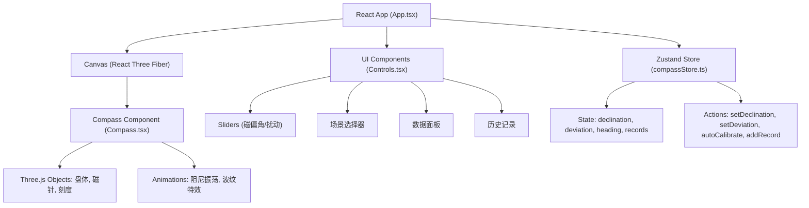

## 1. 架构设计



### 分层架构
- **表现层**：React + React Three Fiber 负责UI和3D渲染
- **状态层**：Zustand 统一管理罗盘状态和历史数据
- **逻辑层**：航向计算、自动校准动画、数据导出
- **渲染层**：Three.js 3D场景、材质、动画

---

## 2. 技术描述

### 核心技术栈
- **前端框架**：React@18 + TypeScript@5
- **构建工具**：Vite@5 + @vitejs/plugin-react
- **3D渲染**：Three.js@0.160 + @react-three/fiber@8 + @react-three/drei@9
- **状态管理**：Zustand@4
- **动画库**：framer-motion@11
- **路径别名**：`@/` 指向 `src/`

### 性能优化
- 罗盘几何体使用 `useMemo` 缓存
- 动画用 `requestAnimationFrame` 驱动，60FPS
- 滑条更新节流，确保响应<50ms
- 历史记录虚拟滚动（超过20条分页）

---

## 3. 路由定义

| 路由 | 用途 |
|------|------|
| `/` | 主页面，罗盘模拟器 |

---

## 4. 数据模型

### 4.1 状态定义

```typescript
// 历史记录项
interface CompassRecord {
  id: string;
  timestamp: number;
  magneticHeading: number;
  declination: number;
  deviation: number;
  correctionAngle: number;
  trueHeading: number;
  scene: string;
}

// 场景预设
interface ScenePreset {
  name: string;
  year: number;
  declination: number;
  deviation: number;
  texture: 'wood' | 'bronze' | 'copper';
}

// Store状态
interface CompassState {
  heading: number;           // 磁航向 0-360
  declination: number;       // 磁偏角 -15~+15
  deviation: number;         // 铁质扰动 0-5
  isCalibrating: boolean;    // 校准动画中
  records: CompassRecord[];  // 历史记录
  currentPage: number;       // 当前分页
  currentScene: string;      // 当前场景
  correctionAngle: number;   // 总修正角
  
  // Actions
  setDeclination: (val: number) => void;
  setDeviation: (val: number) => void;
  setHeading: (val: number) => void;
  autoCalibrate: () => void;
  addRecord: () => void;
  setScene: (scene: string) => void;
  setPage: (page: number) => void;
}
```

### 4.2 工具函数

```typescript
// 方位名称（24山）
const DIRECTIONS_24 = ['子', '癸', '丑', '艮', '寅', '甲', '卯', '乙', '辰', '巽', '巳', '丙', '午', '丁', '未', '坤', '申', '庚', '酉', '辛', '戌', '乾', '亥', '壬'];

// 获取方位名
const getDirectionName = (heading: number): string => {
  const index = Math.round(heading / 15) % 24;
  return DIRECTIONS_24[index];
};

// 计算总修正角
const calculateCorrection = (declination: number, deviation: number): number => {
  const deviationAngle = deviation * 1.5; // 每级1.5度
  return declination + deviationAngle;
};

// 计算真航向
const calculateTrueHeading = (magnetic: number, correction: number): number => {
  return (magnetic + correction + 360) % 360;
};

// 阻尼振荡公式
const dampOscillation = (t: number, amplitude: number, freq: number, damping: number): number => {
  return amplitude * Math.exp(-damping * t) * Math.cos(freq * t);
};
```

---

## 5. 文件结构

```
src/
├── App.tsx              # 根组件，布局管理，Zustand初始化
├── main.tsx             # 入口文件
├── index.css            # 全局样式
├── components/
│   ├── Compass.tsx      # Three.js罗盘组件（3D建模+交互）
│   ├── Controls.tsx     # 控制面板（滑条+场景选择+按钮）
│   ├── DataPanel.tsx    # 数据面板（航向显示+自动校准）
│   └── HistoryPanel.tsx # 历史记录面板
├── store/
│   └── compassStore.ts  # Zustand状态管理
└── utils/
    └── compassUtils.ts  # 航向计算、方位转换等工具
```

---

## 6. 场景预设数据

```typescript
const SCENE_PRESETS: Record<string, ScenePreset> = {
  zhenghe: {
    name: '郑和宝船 (1405)',
    year: 1405,
    declination: -2,
    deviation: 1,
    texture: 'wood'
  },
  magellan: {
    name: '麦哲伦环球 (1519)',
    year: 1519,
    declination: 3,
    deviation: 2,
    texture: 'bronze'
  },
  cook: {
    name: '库克船队 (1768)',
    year: 1768,
    declination: 8,
    deviation: 3,
    texture: 'copper'
  }
};
```
