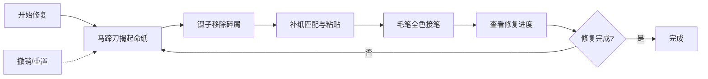

## 1. 产品概述

古代书画装裱修复模拟Web应用，用户以明代文思院裱画匠的身份，在虚拟装裱台上完成青绿山水手卷的揭裱、补缀与全色接笔修复流程。

- 核心价值：通过精细的交互模拟，让用户体验传统书画装裱技艺的匠心过程
- 目标用户：对传统文化、书画修复感兴趣的用户，教育与展示场景

## 2. 核心功能

### 2.1 用户角色
| 角色 | 注册方式 | 核心权限 |
|------|----------|----------|
| 裱画匠 | 无需注册 | 使用所有修复工具，完成画芯修复 |

### 2.2 功能模块
1. **装裱台画布**：画芯显示、破损区域叠加、缩放平移、视角切换
2. **工具面板**：马蹄刀、镊子、补纸选择器、毛笔、调色盘
3. **修复系统**：揭起动作、碎屑移除、补纸粘贴、全色接笔
4. **进度管理**：修复进度显示、微缩预览、区域跳转
5. **操作历史**：20步撤销、重置恢复

### 2.3 页面详情
| 页面名称 | 模块名称 | 功能描述 |
|---------|---------|----------|
| 主页面 | 装裱台画布 | 100x60px绢本青绿山水手卷，半透明破损区域标记，滚轮缩放（0.5x-3x），空格拖拽平移，三种视角切换 |
| 主页面 | 工具面板 | 五种工具切换，激活状态发光反馈，参数调节滑块，自定义混色 |
| 主页面 | 顶部状态栏 | 修复进度百分比，微缩全局预览图（1/10大小），红点标记破损位置 |
| 主页面 | 右侧操作区 | 撤销按钮，重置按钮 |

## 3. 核心流程

用户进入应用 → 查看破损画芯 → 选择马蹄刀沿边缘拖拽揭起命纸 → 切换镊子夹除虫蛀碎屑 → 选择补纸类型并调整纹理角度匹配 → 裁切补纸并粘贴到空白区域 → 选择毛笔调节大小并调色 → 按压时长控制浓淡进行全色接笔 → 查看修复进度 → 可随时撤销或重置。

## 4. 用户界面设计

### 4.1 设计风格
- **主色调**：米黄#f5f0e1、墨褐#3a2a1a、朱砂红#cc3333
- **配色**：石绿#2a7a4a、赭石#8b5a2a、藤黄#d4a76a、花青#2a5a8a
- **字体**：采用宋体/衬线字体体现古籍风格，标题用书法感字体
- **布局**：仿古籍右开式，装裱台居中占70%，工具面板垂直固定左侧（宽160px，背景#f5f0e1，木纹边框#8b7a5a）
- **图标**：简洁线描SVG风格，马蹄刀、镊子、毛笔等工具轮廓，颜色#5a4a3a

### 4.2 页面设计概述
| 页面名称 | 模块名称 | UI元素 |
|---------|---------|--------|
| 主页面 | 装裱台画布 | 绢本纹理背景、不规则破损多边形、经纬纹路（格距3px浅灰细线）、半透明划痕、揭起偏移效果、笔触渲染 |
| 主页面 | 工具面板 | 工具按钮（激活发光内阴影#d4a76a）、纹理角度滑块、匹配度指示条、笔刷大小选择、调色盘色块、混色拖拽区域 |
| 主页面 | 状态栏 | 进度百分比文字、微缩预览画布、红点标记、点击跳转 |
| 主页面 | 操作反馈 | 工具切换弹性缩放动画（0.3s）、补纸粘贴渐显旋转动画（5度摆动）、笔触扩散溶解效果（0.1s）、无效操作红色闪烁 |

### 4.3 响应式设计
- **桌面端（>768px）**：左侧垂直工具面板，装裱台居中，右侧操作按钮
- **平板端（≤768px）**：工具面板收为底部浮动栏（高80px，圆角木纹背景，icon水平排列）
- **移动端（≤480px）**：调色盘简化为4个固定色块，补纸选择器折叠为下拉菜单，装裱台自动缩放适配视口

### 4.4 动效设计
- 工具切换：面板右边缘0.3秒弹性缩放
- 补纸粘贴：从外到内渐显 + 5度旋转后回正摆动
- 全色接笔：0.1秒从中心向外扩散的模糊溶解效果
- 工具激活：0.2px发光内阴影（#d4a76a）
- 无效操作：背景色切换至#ff6b6b后500ms恢复
