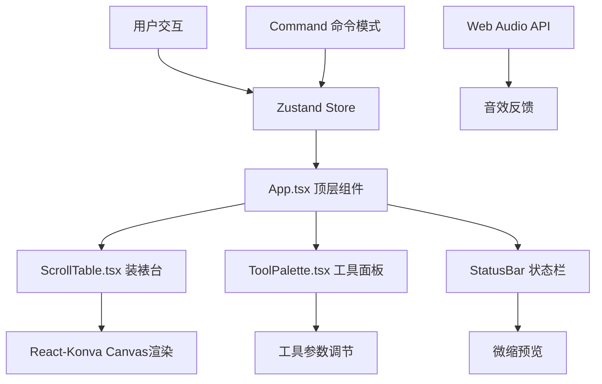

## 1. 架构设计



## 2. 技术选型

- **前端框架**：React 18 + TypeScript
- **构建工具**：Vite 5 + @vitejs/plugin-react
- **Canvas渲染**：Konva + react-konva
- **状态管理**：Zustand
- **包管理器**：npm
- **开发服务器**：Vite Dev Server

## 3. 核心文件结构

| 文件路径 | 职责说明 |
|---------|----------|
| `package.json` | 项目依赖与脚本配置 |
| `vite.config.js` | Vite配置，React插件，路径别名 |
| `tsconfig.json` | TypeScript严格模式配置 |
| `index.html` | 入口HTML，Canvas容器 |
| `src/App.tsx` | 顶层组件，组合各模块 |
| `src/components/ScrollTable.tsx` | 装裱台画布，React-Konva实现 |
| `src/components/ToolPalette.tsx` | 工具面板，工具选择与参数调节 |
| `src/components/StatusBar.tsx` | 顶部状态栏，进度与微缩预览 |
| `src/store/useRestorationStore.ts` | Zustand状态管理 |
| `src/types/index.ts` | TypeScript类型定义 |
| `src/utils/canvasUtils.ts` | Canvas操作工具函数 |
| `src/utils/audioUtils.ts` | Web Audio API音效工具 |
| `src/utils/patterns.ts` | 初始破损区域与画芯图案数据 |
| `src/hooks/useUndoRedo.ts` | 撤销重做Hook |

## 4. 数据模型

### 4.1 状态模型

```typescript
interface ToolParams {
  brushSize: number;          // 1-5px
  pressure: number;           // 0-1 压感
  paperType: 'cotton' | 'ribbed' | 'hemp';
  textureAngle: number;       // 0-360度
  color: string;              // 当前颜色
}

interface DamageArea {
  id: string;
  points: number[];           // 多边形顶点
  type: 'crack' | 'moth' | 'stain';
  lifted: boolean;            // 是否已揭起
  removed: boolean;           // 是否已移除
  patched: boolean;           // 是否已修补
}

interface Stroke {
  id: string;
  points: number[];
  color: string;
  size: number;
  opacity: number;
  timestamp: number;
}

interface Patch {
  id: string;
  x: number;
  y: number;
  width: number;
  height: number;
  paperType: string;
  textureAngle: number;
}

interface RestorationState {
  activeTool: 'knife' | 'tweezers' | 'paper' | 'brush' | null;
  toolParams: ToolParams;
  damageAreas: DamageArea[];
  strokes: Stroke[];
  patches: Patch[];
  scale: number;              // 0.5-3x
  position: { x: number; y: number };
  viewMode: 'original' | 'damage' | 'overlay';
  progress: number;           // 0-100
  // 撤销栈
  history: Snapshot[];
  historyIndex: number;
}
```

### 4.2 命令模式

```typescript
interface Command {
  execute(): void;
  undo(): void;
}

class LiftDamageCommand implements Command { /* ... */ }
class RemoveDamageCommand implements Command { /* ... */ }
class AddPatchCommand implements Command { /* ... */ }
class AddStrokeCommand implements Command { /* ... */ }
```

## 5. 性能约束实现方案

### 5.1 60fps渲染保障
- 使用React-Konva的Layer分离策略：静态层（画芯、经纬线）、动态层（破损、笔触、划痕）
- 缩放平移使用transform而非重绘
- 笔触绘制使用离屏Canvas缓存

### 5.2 撤销栈优化
- 每个快照使用`canvas.toDataURL('image/png', 0.6)`压缩，限制在500KB以内
- 最多存储20个快照，超出自动移除最早记录
- 仅存储差异变化而非全量数据

### 5.3 音效优化
- Web Audio API生成合成音效，不使用外部音频文件
- 单声道8位PCM编码，每个音效<5KB
- 吸附音效：短促高频正弦波

## 6. 核心算法

### 6.1 破损区域检测
- 鼠标路径与多边形边界碰撞检测（Ray casting算法）
- 划痕经过破损区域边界时触发揭起动作

### 6.2 纹理匹配算法
- 计算补纸纹理角度与绢本经纬线（水平/垂直）夹角
- 夹角<30度时匹配度指示条变绿#4caf50

### 6.3 全色接笔融合
- 计算新笔触与周围未损笔迹的重叠率
- 重叠率>50%时触发边缘模糊（卷积核3x3高斯模糊）

### 6.4 压感模拟
- mousedown持续时长0-5秒映射到透明度0.3-0.9和浓淡0.2-1.0
- 使用requestAnimationFrame实时更新按压时长
