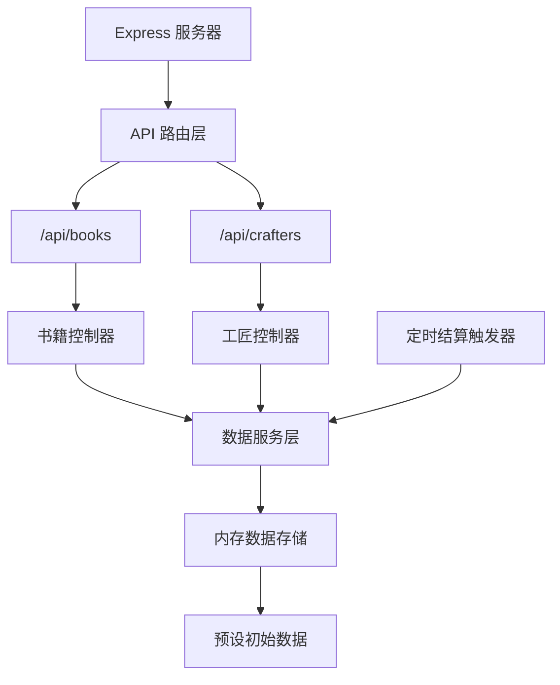
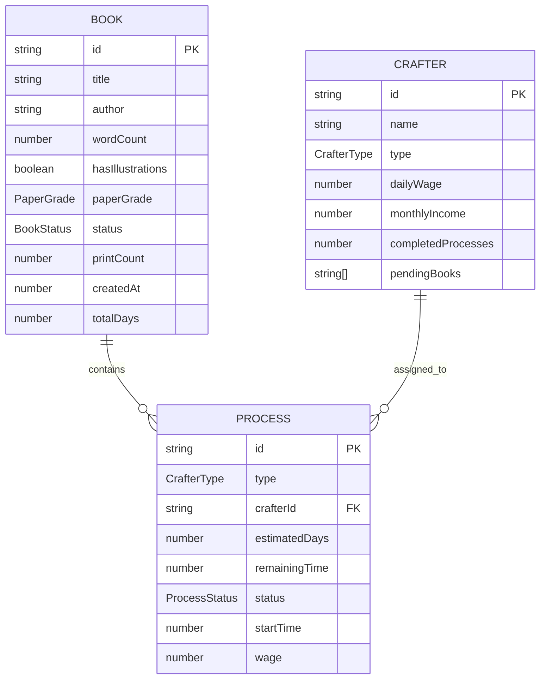

## 1. 架构设计

```mermaid
flowchart TD
    subgraph "前端层 (Frontend"
    A["React 18 + TypeScript
    B["Zustand 状态管理"]
    C["Framer Motion 动画"]
    D["Vite 构建工具"]
    end

    subgraph "后端层 (Backend)"
    E["Express 4 + TypeScript"]
    F["API 接口层"]
    G["模拟数据持久化"]
    end

    subgraph "数据层 (Data)"
    H["内存数据存储"]
    I["初始预设数据"]
    end

    A --> B
    A --> C
    A --> D
    D --> E
    E --> F
    F --> G
    G --> H
    H --> I
```

## 2. 技术描述

- **前端技术栈**:
  - React 18 + TypeScript
  - Zustand (状态管理)
  - Framer Motion (动画库)
  - Vite 5 (构建工具)
  - @vitejs/plugin-react (Vite React 插件)

- **后端技术栈**:
  - Express 4 + TypeScript
  - CORS (跨域支持)
  - UUID (唯一ID生成)

- **数据存储**:
  - 内存数据存储（开发/演示环境)
  - 预设工匠和书稿初始数据

## 3. 项目结构

```
auto46/
├── package.json
├── vite.config.js
├── tsconfig.json
├── index.html
├── src/
│   ├── App.tsx
│   ├── store.ts
│   ├── components/
│   │   ├── Sidebar.tsx
│   │   ├── Dashboard.tsx
│   │   ├── BookList.tsx
│   │   ├── BookCard.tsx
│   │   ├── CrafterTable.tsx
│   │   ├── ProcessModal.tsx
│   │   ├── BookForm.tsx
│   │   └── Notification.tsx
│   ├── types/
│   │   └── index.ts
│   └── utils/
│       └── api.ts
└── server/
    ├── index.ts
    └── data.ts
```

## 4. 路由定义

| 路由 | 用途 |
|------|------|
| / | 首页（包含统计仪表盘、书稿列表、工匠看板） |

## 5. API 定义

### 5.1 类型定义

```typescript
// 工序状态枚举
enum ProcessStatus {
  PENDING = 'pending',
  IN_PROGRESS = 'in_progress',
  COMPLETED = 'completed'
}

// 书稿状态枚举
enum BookStatus {
  WAITING_ENGRAVING = 'waiting_engraving',
  ENGRAVING = 'engraving',
  WAITING_PRINTING = 'waiting_printing',
  PRINTING = 'printing',
  PRINTING = 'printing',
  WAITING_BINDING = 'waiting_binding',
  BINDING = 'binding',
  PUBLISHED = 'published'
}

// 工匠职业枚举
enum CrafterType {
  ENGRAVER = 'engraver',
  PRINTER = 'printer',
  BINDER = 'binder'
}

// 用纸等级
enum PaperGrade {
  WHITE_HEMP = 'white_hemp',
  YELLOW_HEMP = 'yellow_hemp',
  BAMBOO = 'bamboo'
}

// 工匠接口
interface Crafter {
  id: string;
  name: string;
  type: CrafterType;
  dailyWage: number;
  monthlyIncome: number;
  completedProcesses: number;
  pendingBooks: string[];
}

// 工序接口
interface Process {
  type: CrafterType;
  crafterId: string | null;
  estimatedDays: number;
  remainingTime: number;
  status: ProcessStatus;
  startTime: number | null;
  wage: number;
}

// 书稿接口
interface Book {
  id: string;
  title: string;
  author: string;
  wordCount: number;
  hasIllustrations: boolean;
  paperGrade: PaperGrade;
  status: BookStatus;
  printCount: number;
  processes: {
    engraving: Process;
    printing: Process;
    binding: Process;
  };
  createdAt: number;
  totalDays: number;
}

// 结算通知
interface SettlementNotification {
  id: string;
  crafterName: string;
  processType: string;
  bookTitle: string;
  amount: number;
  timestamp: number;
}
```

### 5.2 接口列表

```typescript
// GET /api/books
// 获取所有书稿列表
interface GetBooksResponse {
  books: Book[];
}

// POST /api/books
// 创建新书稿
interface CreateBookRequest {
  title: string;
  author: string;
  wordCount: number;
  hasIllustrations: boolean;
  paperGrade: PaperGrade;
}
interface CreateBookResponse {
  book: Book;
}

// POST /api/books/:id/start-process
// 开始某个工序
interface StartProcessRequest {
  processType: CrafterType;
  crafterId: string;
  estimatedDays: number;
}
interface StartProcessResponse {
  book: Book;
  notification: SettlementNotification | null;
}

// POST /api/books/:id/complete-process
// 完成某个工序（定时器触发）
interface CompleteProcessResponse {
  book: Book;
  notification: SettlementNotification;
  crafter: Crafter;
}

// GET /api/crafters
// 获取所有工匠列表
interface GetCraftersResponse {
  crafters: Crafter[];
}

// POST /api/crafters/:id/settle
// 结算工匠工钱
interface SettleCrafterRequest {
  amount: number;
  bookId: string;
  processType: CrafterType;
}
interface SettleCrafterResponse {
  crafter: Crafter;
}
```

## 6. 服务端架构



## 7. 数据模型

### 7.1 实体关系图



### 7.2 初始数据定义

**工匠初始数据（10人）：
- 刻工（4人）：陈阿大、李铁笔、张一刀、刘神刻
- 印工（3人）：王二牛、赵墨香、钱印手
- 装订工（3人）：孙巧手、周装匠、吴线装

**书稿初始数据（3本示例书稿）：
- 《东京梦华录》- 孟元老 - 35000字 - 配图 - 白麻纸
- 《清明上河图记》- 张择端 - 12000字 - 配图 - 黄麻纸
- 《武林旧事》- 周密 - 28000字 - 不配图 - 竹纸

## 8. 性能优化策略

1. **状态管理优化**：
   - 使用 Zustand 选择器避免不必要重渲染
   - 工序计时器使用 requestAnimationFrame 确保60fps
   - 大数字更新使用 CSS transform 避免布局抖动

2. **动画优化**：
   - 使用 Framer Motion 的 transform 和 opacity 动画
   - 避免在动画中触发重排（reflow）
   - 使用 will-change 提升动画性能

3. **渲染优化**：
   - 列表项使用 React.memo 包裹
   - 倒计时更新采用批量更新策略
   - 表格虚拟化（如数据量增大）

4. **构建优化**：
   - Vite 原生 ESM 热更新
   - 生产构建开启代码分割
   - TypeScript 严格模式确保类型安全
