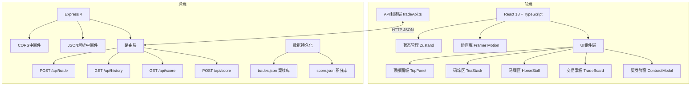
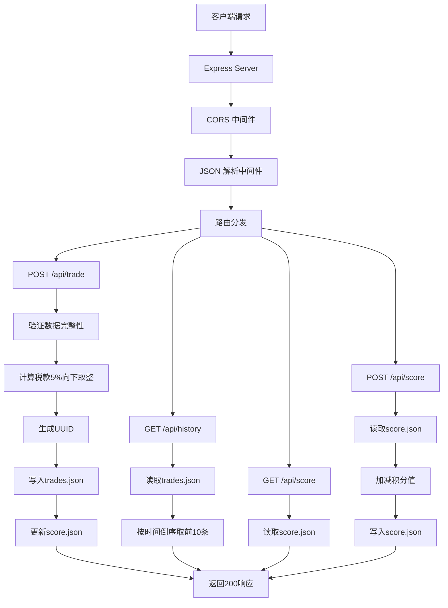
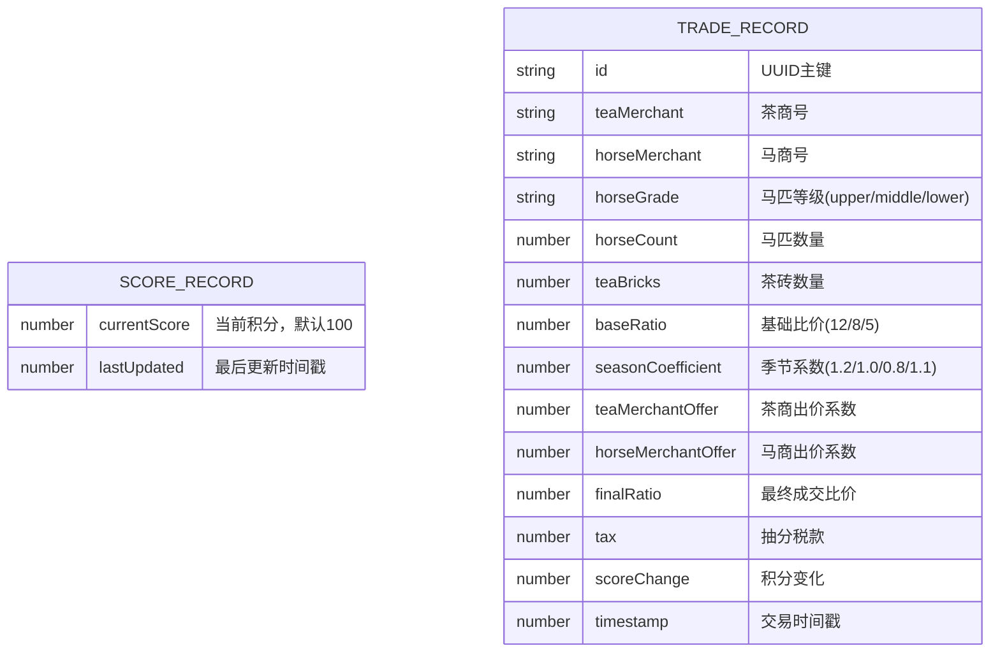

## 1. 架构设计



## 2. 技术描述

- **前端**：React@18 + TypeScript@5 + Vite@5
- **构建工具**：Vite@5 + @vitejs/plugin-react@4
- **状态管理**：Zustand@4
- **动画库**：Framer Motion@11
- **后端**：Express@4 + Cors@2
- **唯一标识**：uuid@9
- **数据库**：本地JSON文件（trades.json、score.json）
- **字体**：Google Fonts - Ma Shan Zheng（行楷）

## 3. 路由定义

| 路由 | 用途 |
|------|------|
| / | 主交易界面（单页应用） |
| POST /api/trade | 提交交易记录，生成契券并存入案牍库 |
| GET /api/history | 获取最近10条交易历史记录 |
| GET /api/score | 获取当前积分 |
| POST /api/score | 更新积分（交易成功/失败/购买优先权） |

## 4. API 定义

### 4.1 类型定义

```typescript
// 马匹等级
type HorseGrade = 'upper' | 'middle' | 'lower';

// 季节
type Season = 'spring' | 'summer' | 'autumn' | 'winter';

// 交易记录
interface TradeRecord {
  id: string;
  teaMerchant: string;
  horseMerchant: string;
  horseGrade: HorseGrade;
  horseCount: number;
  teaBricks: number;
  baseRatio: number;      // 基础比价
  seasonCoefficient: number; // 季节系数
  teaMerchantOffer: number;  // 茶商出价系数 (-0.3 ~ 0)
  horseMerchantOffer: number; // 马商出价系数 (0 ~ 0.2)
  finalRatio: number;      // 最终成交比价
  tax: number;            // 抽分税款（5%向下取整）
  scoreChange: number;    // 积分变化
  timestamp: number;
}

// 积分记录
interface ScoreRecord {
  currentScore: number;
  lastUpdated: number;
}

// 契券数据
interface ContractData {
  teaMerchant: string;
  horseMerchant: string;
  horseGrade: HorseGrade;
  horseCount: number;
  teaBricks: number;
  finalRatio: number;
  tax: number;
  scoreChange: number;
}
```

### 4.2 请求/响应模式

**POST /api/trade**
- Request Body: `ContractData`
- Response: `{ success: boolean; record: TradeRecord }`

**GET /api/history**
- Response: `{ records: TradeRecord[] }` (最近10条，按时间倒序)

**GET /api/score**
- Response: `{ currentScore: number }`

**POST /api/score**
- Request Body: `{ change: number; reason: string }`
- Response: `{ success: boolean; newScore: number }`

## 5. 服务器架构图



## 6. 数据模型

### 6.1 数据模型定义



### 6.2 初始化数据

**score.json 初始内容**
```json
{
  "currentScore": 100,
  "lastUpdated": 0
}
```

**trades.json 初始内容**
```json
{
  "records": []
}
```

### 6.3 核心业务规则

1. **基础比价**：上等马12块、中等马8块、下等马5块
2. **季节系数**：春1.2、夏1.0、秋0.8、冬1.1
3. **茶商出价范围**：-30% ~ 0%（压价）
4. **马商出价范围**：0% ~ +20%（抬价）
5. **成交条件**：双方出价差距 ≤ 1块砖茶
6. **抽分税款**：5%向下取整，以砖茶实物计
7. **失败惩罚**：连续3次失败扣减积分
8. **优先交易权**：每次消耗10积分
