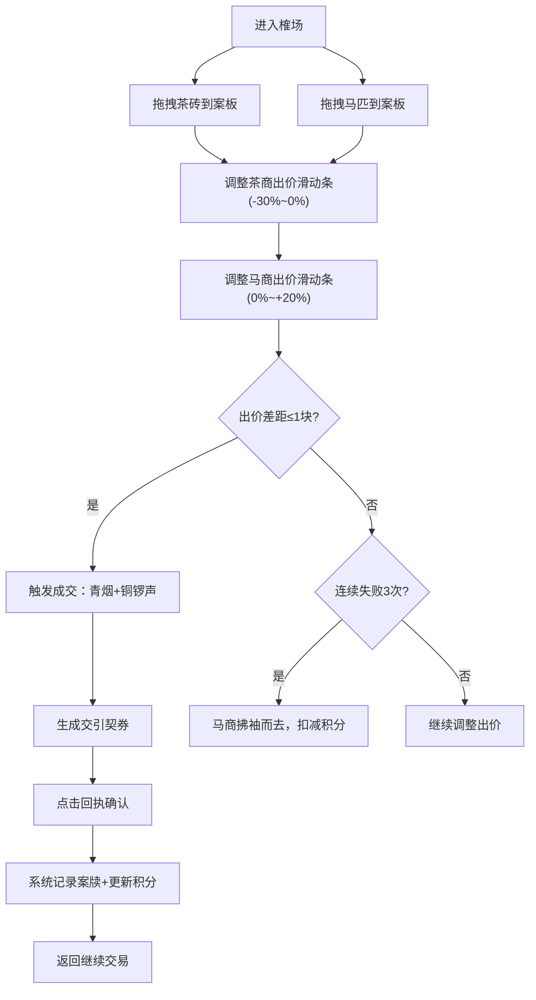

## 1. 产品概述

明代雅安茶马司榷场茶马互市仿真交易系统，还原古代以物易物的交易场景，用户扮演茶商与马商进行讨价还价，体验传统商贸文化。

- 核心目的：通过互动式界面模拟明代茶马互市的交易流程，让用户体验传统商贸文化
- 目标用户：对中国古代经济史、商贸文化感兴趣的学习者和游戏玩家
- 市场价值：寓教于乐，将历史文化与现代Web技术结合，打造独特的沉浸式体验

## 2. 核心功能

### 2.1 用户角色

| 角色 | 注册方式 | 核心权限 |
|------|----------|----------|
| 茶商（用户） | 无需注册，自动以"川西陈记茶号"身份进入 | 拖拽茶砖、调整出价、确认交易、查看历史记录、使用积分 |
| 马商（NPC） | 系统内置 | 提供马匹、自动出价、三次失败后离场 |
| 茶马司主事（系统） | 系统内置 | 生成契券、抽分税款、记录案牍 |

### 2.2 功能模块

1. **榷场主界面**：CSS绘制的明代榷场俯瞰图，包含码垛区、马厩区、交易案板
2. **拖拽交易系统**：茶砖拖拽称量、马匹拖拽选中、实时比价计算
3. **出价议价系统**：双滑动条调整出价、自动成交判定、季节行情波动
4. **契券生成系统**：交引契券弹窗、朱砂官印、抽分税款计算
5. **积分系统**：初始100积分、优先交易权购买、交易失败扣减
6. **历史记录系统**：交易记录存储、案牍库查询、积分同步

### 2.3 页面详情

| 页面名称 | 模块名称 | 功能描述 |
|----------|----------|----------|
| 主交易界面 | 顶部面板 | 显示积分、交易次数、当前季节、交易历史摘要 |
| 主交易界面 | 码垛区 | 青石板地面、十摞茶砖堆、可拖拽茶砖到案板 |
| 主交易界面 | 马厩区 | 黄土夯地、三匹不同颜色的马、膘情等级标识 |
| 主交易界面 | 交易案板 | 红漆木桌、铜权戥子、比价显示、出价滑动条、成交烟雾 |
| 契券弹窗 | 交引契券 | 行楷字体、货物清单、抽分税款、朱砂官印、发付/回执按钮 |

## 3. 核心流程

用户进入榷场，拖拽茶砖和马匹到交易案板，调整双方出价滑动条，当出价差距≤1块砖茶时自动成交，生成交引契券，用户点击回执确认，系统记录交易并更新积分。连续三次交易失败则马商离场，扣减积分。

## 4. 用户界面设计

### 4.1 设计风格

- **主色调**：仿古暖色调，粗麻布浅黄#f5e6c8背景，深木色#6b3a1a案板区，赭色#5a3a1a字体
- **强调色**：朱砂红#cc3300（官印、数字、进度条），铜绿色#2a7a5a（按钮）
- **字体**：行楷字体Ma Shan Zheng（契券），系统字体（界面）
- **布局**：两栏+顶部面板结构，左侧码垛区40%、中间案板20%、右侧马厩区40%
- **视觉风格**：明代市井图卷风格，《清明上河图》式散点透视，近大远小层叠关系
- **动效**：60fps流畅动画，拖拽放大1.15倍半透明，出价条金色流光，成交青烟淡出

### 4.2 页面设计概述

| 页面名称 | 模块名称 | UI元素 |
|----------|----------|--------|
| 主交易界面 | 顶部面板 | 积分显示、成功/失败次数、季节指示器（每10秒轮换+背景色变化）、最近3条交易摘要 |
| 主交易界面 | 码垛区 | 青石板#6b7b6b地面纹理，十摞茶砖（每摞5块，20×15×10px，笋壳竖条纹） |
| 主交易界面 | 马厩区 | 黄土#b8a078地面，三匹马（枣骝#4a1a0a、青骢#6b7b8b、白龙#e8e0d0），鬃毛波浪线，膘情星级 |
| 主交易界面 | 交易案板 | 红漆木桌#8b3a3a横纹桌面，铜权#6b4e3a摆动动画，红木戥子#8b5a2b带刻度，比价实时显示，双滑动条带百分比提示 |
| 契券弹窗 | 交引契券 | 行楷字体Ma Shan Zheng，茶商/马商信息，货物清单，抽分税款红框标注，朱砂官印#cc3300 rotate(-5deg)，发付/回执铜绿按钮 |

### 4.3 响应式设计

- 桌面端优先设计，保持两栏布局
- 平板端：码垛区和马厩区各占45%，案板10%
- 移动端：改为上下布局，顶部面板→码垛区→案板→马厩区
- 底部契券弹窗宽度80%视口，最小360px
- 所有交互元素支持触摸操作

### 4.4 性能要求

- 界面响应时间<200ms
- 所有CSS动画60fps流畅运行
- 拖拽操作无卡顿
- 数据持久化通过本地JSON文件实现
