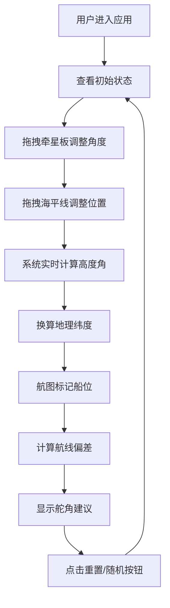

## 1. 产品概述

本项目是一个基于浏览器的古代牵星板测纬度与天文航海定位模拟Web应用，让用户体验宋代舟师使用牵星板进行远洋导航的过程。通过交互式Canvas模拟，用户可拖拽调节牵星板角度和海平线位置，实时计算北极星高度角和船位纬度，并在南洋航图上自动标定船位，同时根据船位偏差给出舵角调整建议。

- **核心价值**：通过沉浸式交互体验，科普中国古代天文航海技术，展示海上丝绸之路的导航智慧
- **目标用户**：历史爱好者、航海文化研究者、教育工作者及学生群体
- **应用场景**：博物馆互动展示、在线教育、历史文化科普平台

## 2. 核心功能

### 2.1 用户角色
| 角色 | 注册方式 | 核心权限 |
|------|----------|----------|
| 普通用户 | 无需注册 | 使用全部交互功能，调整牵星板参数，查看计算结果 |

### 2.2 功能模块
1. **牵星板交互区**：Canvas绘制星板、海平线、星空背景，支持鼠标拖拽调整
2. **南洋航图展示**：Konva绘制泉州至三佛齐航线图，实时标记船位
3. **信息面板**：显示当前角度、纬度、船位、舵角建议等数据
4. **控制按钮**：重置参数、随机测试功能

### 2.3 页面详情
| 页面名称 | 模块名称 | 功能描述 |
|---------|---------|----------|
| 主页面 | 牵星板交互区 | 鼠标拖拽调整星板角度(0-90度)和海平线位置(0-60px)，实时渲染星空背景和甲板区域 |
| 主页面 | 南洋航图组件 | 300x200px航图，显示泉州-三佛齐航线，红色圆点标记船位，偏差箭头指示方向 |
| 主页面 | 信息面板 | 显示高度角、地理纬度、船位经纬度、舵角修正建议 |
| 主页面 | 控制按钮区 | 重置按钮(归零参数)、随机测试按钮(设置随机初值) |

## 3. 核心流程

用户进入应用后，在虚拟海船甲板上通过鼠标拖拽牵星板调整角度，同时上下拖拽海平线使其与星板边缘对齐。系统根据角度和位置实时计算北极星高度角，再换算为地理纬度(北纬5-30度)，并在南洋航图上标记当前船位。根据船位与目标航线的垂直偏差，计算建议舵角修正值。用户可随时重置参数或使用随机测试功能体验不同场景。

## 4. 用户界面设计

### 4.1 设计风格
- **主色调**：深海蓝(#0a2a4a)到天空蓝(#87ceeb)垂直渐变背景，木色(#8b6b4e)甲板，土色系(#bda682、#a08a6a)面板
- **点缀色**：北极星白色、航图绿色海岸线(#2e8b57)、浅棕色岛屿(#d2b48c)、红色船位标记
- **按钮风格**：羊皮纸边角处理，柔和土色系，悬停变色，点击缩放动画(scale 0.95)
- **字体**：Georgia (serif族)，古航海图风格
- **布局风格**：左侧大画布交互区，右侧信息面板，响应式适配移动设备
- **装饰效果**：羊皮纸边框内切圆角，木纹纹理，星空闪烁动画

### 4.2 页面设计概述
| 页面名称 | 模块名称 | UI元素 |
|---------|---------|--------|
| 主页面 | 牵星板交互区 | 600x400px Canvas，星空背景(10颗闪烁星点)，木纹甲板，木色牵星板(120x6px)，蓝色海平线 |
| 主页面 | 南洋航图组件 | 300x200px Konva画布，绿色海岸线，浅棕色岛屿，白色虚线航线，红色圆点船位，偏差箭头 |
| 主页面 | 信息面板 | 羊皮纸风格边框，数值显示带淡入动画，悬停光晕效果 |
| 主页面 | 控制按钮区 | 80x30px按钮，#d4a76a背景，#3a2a1a文字，悬停#c49a5e |

### 4.3 响应式设计
- **桌面端(>800px)**：左侧交互区，右侧面板并列布局，面板内边距16px，字号14px
- **移动端(<800px)**：Canvas缩小70%，面板移至底部，内边距减至8px，字号减至12px
- **触摸优化**：增大拖拽热区，支持触屏操作

## 5. 性能约束

- **帧率要求**：所有交互(拖拽、角度更新、纬度计算)稳定60fps以上
- **Canvas重绘**：单次重绘不超过16ms
- **状态管理**：使用zustand批量更新减少不必要渲染
- **动画优化**：星空闪烁使用CSS动画，数值更新使用framer-motion淡入效果
