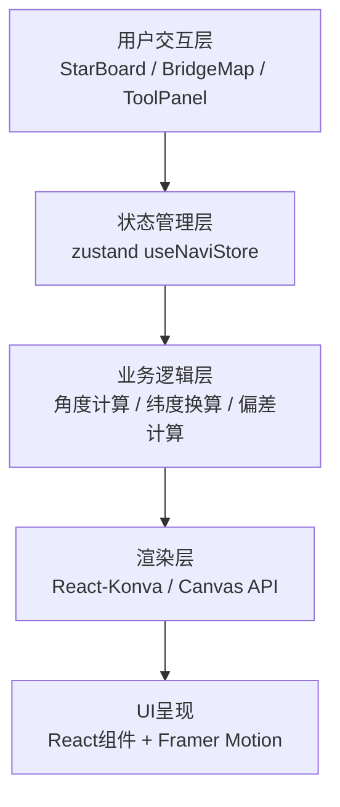

## 1. 架构设计



## 2. 技术描述

- **前端框架**：React@18 + TypeScript
- **构建工具**：Vite@5 + @vitejs/plugin-react
- **状态管理**：zustand@4 (轻量级状态管理，支持批量更新)
- **Canvas渲染**：react-konva@18 + konva@9 (高性能2D绘图)
- **动画库**：framer-motion@11 (流畅的UI动画效果)
- **样式方案**：内联样式 + CSS变量 (无Tailwind，遵循用户指定配色)

## 3. 核心数据结构与状态定义

```typescript
// 导航状态接口
interface NaviState {
  // 牵星板角度 (0-90度)
  angle: number;
  // 海平线相对位置 (0-60px)
  seaLevel: number;
  // 北极星高度角 (0-90度)
  altitude: number;
  // 地理纬度 (北纬5-30度)
  latitude: number;
  // 船位经度 (东经110-120度)
  longitude: number;
  // 目标港口信息
  target: {
    name: string;
    lat: number;
    lng: number;
  };
  // 起点信息
  origin: {
    name: string;
    lat: number;
    lng: number;
  };
  // 舵角建议
  rudderAngle: number;
  // 偏差距离 (度)
  deviation: number;
}

// Store Actions
interface NaviActions {
  setAngle: (angle: number) => void;
  setSeaLevel: (level: number) => void;
  calcLatitude: () => void;
  calcDeviation: () => void;
  reset: () => void;
  randomize: () => void;
}
```

## 4. 文件结构

```
├── package.json
├── vite.config.js
├── tsconfig.json
├── index.html
└── src/
    ├── main.tsx              # 应用入口，主题Provider包裹
    ├── App.tsx               # 主布局组件，状态分发
    ├── store/
    │   └── useNaviStore.ts   # zustand状态管理
    └── components/
        ├── StarBoard.tsx     # 牵星板交互组件 (Konva)
        ├── BridgeMap.tsx     # 南洋航图组件 (Konva)
        └── ToolPanel.tsx     # 信息面板组件
```

## 5. 核心算法

### 5.1 纬度计算
```typescript
// 北极星高度角 ≈ 观测地纬度 (北半球)
// 牵星板角度 + 海平线修正 = 高度角
// 高度角范围: 0-90度，纬度限制: 北纬5-30度
function calcLatitude(angle: number, seaLevel: number): number {
  const seaCorrection = (seaLevel / 60) * 5; // 海平线0-60px对应0-5度修正
  let latitude = angle + seaCorrection;
  // 限制在北纬5-30度范围内
  return Math.max(5, Math.min(30, Math.round(latitude * 10) / 10));
}
```

### 5.2 船位经度推算
```typescript
// 经度沿航线从泉州(118.6度)到三佛齐(104.7度)线性变化
// 纬度从北纬24.9度到南纬0.5度
function calcLongitude(latitude: number): number {
  const originLat = 24.9;  // 泉州纬度
  const originLng = 118.6; // 泉州经度
  const targetLat = 0.5;   // 三佛齐纬度(北纬)
  const targetLng = 104.7; // 三佛齐经度
  
  const progress = (originLat - latitude) / (originLat - targetLat);
  return originLng + progress * (targetLng - originLng);
}
```

### 5.3 航线偏差与舵角计算
```typescript
// 计算当前船位与目标航线的垂直偏差(度)
// 偏差每1度对应舵角0.3度
function calcRudderAngle(deviation: number): number {
  const rudder = deviation * 0.3;
  return Math.max(-30, Math.min(30, Math.round(rudder * 10) / 10));
}
```

## 6. 坐标映射

### 6.1 航图坐标映射
```typescript
// 航图尺寸: 300px宽 x 200px高
// 经度范围: 东经110-120度 (10度跨度)
// 纬度范围: 北纬5-30度 (25度跨度)
function mapToChart(lng: number, lat: number): { x: number; y: number } {
  const x = ((lng - 110) / 10) * 300;
  const y = 200 - ((lat - 5) / 25) * 200; // 纬度向上增加
  return { x, y };
}
```

### 6.2 牵星板坐标
```typescript
// Canvas尺寸: 600x400px
// 牵星板: 中心(300, 200)，长度120px，厚度6px
// 旋转原点: 牵星板下端点
function getStarBoardPoints(angle: number): number[][] {
  const rad = (angle * Math.PI) / 180;
  const centerX = 300;
  const centerY = 250; // 甲板上方
  const length = 120;
  
  const x1 = centerX;
  const y1 = centerY;
  const x2 = centerX + length * Math.sin(rad);
  const y2 = centerY - length * Math.cos(rad);
  
  return [[x1, y1], [x2, y2]];
}
```

## 7. 性能优化策略

1. **状态批量更新**：使用zustand的set函数批量更新多个状态，避免多次渲染
2. **Canvas局部重绘**：仅在交互参数变化时重绘，使用Konva的layer.batchDraw()
3. **事件节流**：拖拽事件使用requestAnimationFrame节流，确保60fps
4. **组件记忆化**：使用React.memo包裹子组件，避免不必要重渲染
5. **动画优化**：星空闪烁使用CSS动画，数值过渡使用framer-motion的animate功能
