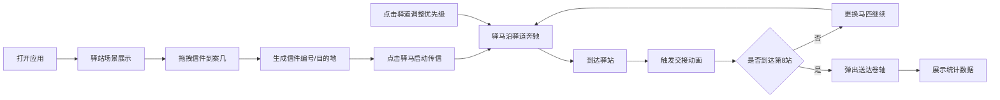

## 1. 产品概述

本项目是一个古代邮驿系统全链路追踪与管理模拟应用，模拟明代京杭大运河沿线驿站信件从分拣、传送、换马到送达的完整流程。解决传统邮驿流程中信件流转状态不透明、各驿站交接耗时难以实时呈现的问题。

- 核心目标：通过可视化动画展示古代邮驿系统的运作机制
- 目标用户：历史爱好者、教育工作者、文化传播机构
- 产品价值：以交互化、游戏化的方式呈现古代邮驿文化，兼具教育与观赏价值

## 2. 核心功能

### 2.1 用户角色

| 角色 | 注册方式 | 核心权限 |
|------|----------|----------|
| 普通用户 | 无需注册 | 体验邮驿流程、调整优先级、查看信件状态 |

### 2.2 功能模块

1. **驿站交互场景**：CSS绘制的明代驿站剖面图，包含建筑、驿马、信匣
2. **信件拖拽系统**：从信匣拖拽信件到案几，自动生成唯一编号和目的地
3. **快马传信动画**：驿马沿驿道奔驰，速度实时波动，显示当前速度
4. **驿站交接系统**：信件飞落到新驿站信匣，更换马匹，更新统计数据
5. **优先级调整系统**：点击驿道调整优先级，影响速度和体力消耗
6. **送达结算卷轴**：完成8站后弹出朱红色卷轴，展示完整送达数据
7. **传信进度看板**：右上角实时显示已过驿站数、累计耗时等信息

### 2.3 页面详情

| 页面名称 | 模块名称 | 功能描述 |
|----------|----------|----------|
| 主场景页 | 驿站剖面图 | 绘制青砖地面、木柱驿站、红木案几、朱漆信匣、枣红/雪青驿马 |
| 主场景页 | 信件拖拽交互 | 拖拽信件生成唯一编号和目的地标签，支持拖放高亮反馈 |
| 主场景页 | 驿马传信动画 | 驿马沿驿道奔驰，速度波动显示，拖尾残影效果 |
| 主场景页 | 驿站交接动画 | 信件飞起落入新信匣，马匹更换，1秒完成交接 |
| 主场景页 | 优先级调整 | 点击驿道调整优先级，显示金色羽翼/灰色龟甲标识 |
| 主场景页 | 进度看板 | 右上角显示已过驿站数、累计耗时 |
| 主场景页 | 送达卷轴 | 中间弹出卷轴动画，展示送达数据，伴随铃铛音效 |

## 3. 核心流程

用户打开应用 → 看到驿站剖面图 → 从信匣拖拽信件到案几 → 系统生成信件信息 → 点击驿马启动传信 → 驿马沿驿道奔驰 → 到达驿站触发交接 → 更换马匹继续前行 → 可点击驿道调整优先级 → 经过8个驿站后 → 弹出送达卷轴 → 显示完整统计数据。

## 4. 用户界面设计

### 4.1 设计风格

- **主色调**：中国邮政传统朱红(#c0392b)与明黄(#f1c40f)
- **中性色**：青灰(#95a5a6)
- **建筑色**：青砖(#6b7b6b)、木柱(#5d3a1a)、红木案几(#8b2500)、朱漆信匣(#b22222)
- **按钮风格**：圆角6px，悬停时向深红(#96281b)渐变，过渡0.3s
- **字体**：衬线字体模拟楷体，主标题行楷风格
- **视觉效果**：手绘风格驿道(抖动笔触)、水墨晕染驿站(blur+box-shadow)、信件拖尾残影
- **触觉反馈**：点击阴影变化、拖拽高亮虚线边框动画

### 4.2 页面设计概述

| 页面名称 | 模块名称 | UI元素 |
|----------|----------|--------|
| 主场景页 | 驿站建筑 | 剖面图布局，青砖地面，木柱支撑，水墨晕染效果 |
| 主场景页 | 案几信匣 | 红木案几居中，朱漆信匣带黄色封条纹路 |
| 主场景页 | 驿马区域 | 左侧马厩两匹驿马(枣红、雪青)，CSS渐变绘制 |
| 主场景页 | 驿道 | 褐色实线，手绘抖动效果，横向贯穿 |
| 主场景页 | 信件 | 暗黄纸色带红色火漆，拖拽时高亮边框 |
| 主场景页 | 进度看板 | 右上角浮层，白底朱红边框，实时数据 |
| 主场景页 | 送达卷轴 | 朱红色卷轴，木质轴杆，从中间展开动画 |
| 主场景页 | 优先级标识 | 金色羽翼(高优先)、灰色龟甲(低优先)，驿马头顶 |

### 4.3 响应式设计

- **桌面端**(≥768px)：完整展示，进度看板在右上角
- **移动端**(<768px)：驿道横向滚动，驿站图标缩小60%，进度看板移至底部固定栏
- **触控优化**：增大交互元素热区，调整拖拽灵敏度

## 4.4 性能要求

- 动画帧率 ≥45fps(60Hz屏幕)
- 交接动画 ≤1000ms完成
- 优先级调整响应时间 <200ms
- 铃铛音效由Web Audio生成(800Hz，0.3秒)
