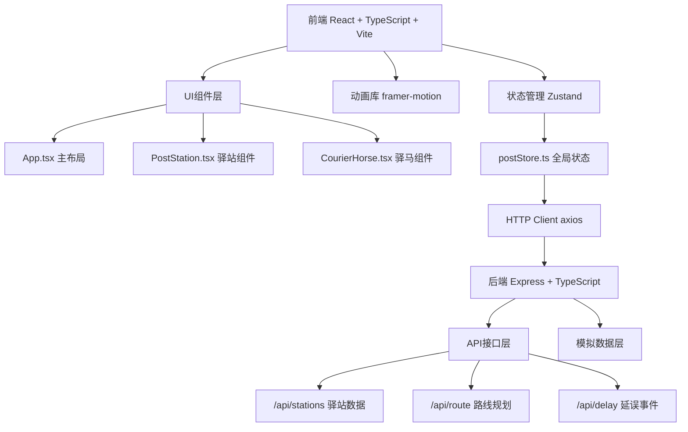
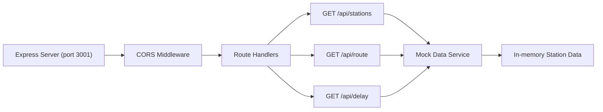
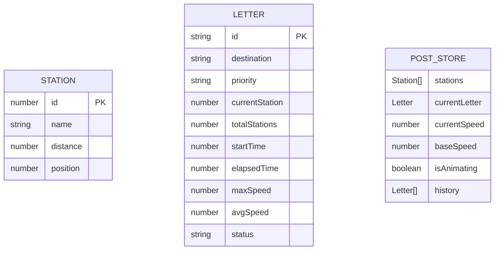

## 1. 架构设计



## 2. 技术描述

- **前端框架**: React@18 + TypeScript@5 + Vite@5
- **初始化工具**: vite-init (react-express-ts模板)
- **状态管理**: zustand@4
- **动画库**: framer-motion@11
- **HTTP客户端**: axios@1
- **后端框架**: Express@4 + TypeScript@5
- **跨域处理**: cors@2
- **构建工具**: Vite@5 + @vitejs/plugin-react@4

## 3. 路由定义

| 路由 | 用途 |
|------|------|
| / | 主场景页面，包含邮驿系统完整交互 |

## 4. API 定义

### 4.1 类型定义

```typescript
interface Station {
  id: number;
  name: string;
  distance: number; // 距离上一站的距离(里)
  position: number; // 驿道上的位置百分比
}

interface Letter {
  id: string;
  destination: string;
  priority: 'normal' | 'high' | 'low';
  currentStation: number;
  totalStations: number;
  startTime: number;
  elapsedTime: number; // 时辰
  maxSpeed: number; // 里/时辰
  avgSpeed: number;
  status: 'waiting' | 'transiting' | 'delivered';
}

interface RouteData {
  stations: Station[];
  totalDistance: number;
}

interface DelayEvent {
  stationId: number;
  delay: number; // 额外耗时(时辰)
  reason: string;
}
```

### 4.2 接口列表

| 方法 | 路径 | 请求参数 | 返回数据 | 描述 |
|------|------|----------|----------|------|
| GET | /api/stations | 无 | Station[] | 获取所有驿站列表 |
| GET | /api/route | {startId, endId} | RouteData | 获取指定路线规划 |
| GET | /api/delay | {stationId} | DelayEvent | 获取随机延误事件 |

## 5. 服务器架构图



## 6. 数据模型

### 6.1 数据模型定义



### 6.2 前端Store定义

```typescript
interface PostState {
  stations: Station[];
  currentLetter: Letter | null;
  currentSpeed: number;
  baseSpeed: number;
  isAnimating: boolean;
  isPaused: boolean;
  history: Letter[];
  horsePosition: number; // 0-100 驿道百分比位置
  currentHorseColor: string;
  priority: 'normal' | 'high' | 'low';
  
  // Actions
  fetchStations: () => Promise<void>;
  createLetter: (destination: string) => Letter;
  startDelivery: () => void;
  pauseDelivery: () => void;
  setPriority: (priority: 'normal' | 'high' | 'low') => void;
  updateSpeed: (speed: number) => void;
  reachStation: (stationId: number) => void;
  completeDelivery: () => void;
  reset: () => void;
}
```

### 6.3 文件结构

```
project/
├── package.json
├── index.html
├── vite.config.js
├── tsconfig.json
├── src/
│   ├── App.tsx
│   ├── main.tsx
│   ├── components/
│   │   ├── PostStation.tsx
│   │   └── CourierHorse.tsx
│   ├── store/
│   │   └── postStore.ts
│   ├── types/
│   │   └── index.ts
│   └── utils/
│       └── audio.ts
└── server/
    ├── index.ts
    ├── data/
    │   └── stations.ts
    └── routes/
        └── api.ts
```
