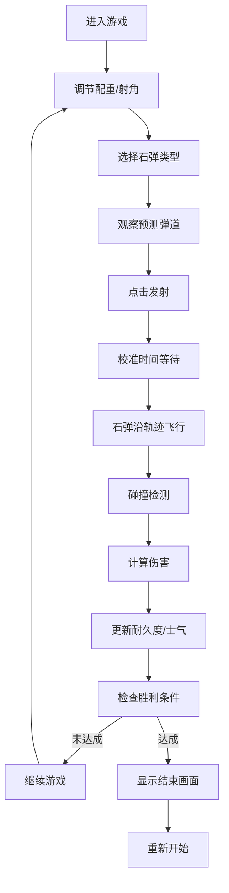

## 1. 产品概述
石车破城是一款基于浏览器的古代投石机抛射城池攻防模拟游戏，玩家操控配重式投石机攻击敌方城墙，通过调节配重、射角和选择不同石弹类型来达成战术目标。
- 核心玩法：物理模拟抛射、城墙分段摧毁、士气系统、弹药管理
- 目标用户：喜欢策略和物理模拟类游戏的休闲玩家
- 市场价值：提供沉浸式的中世纪战争体验，结合策略决策与实时物理反馈

## 2. 核心功能

### 2.1 用户角色
| 角色 | 注册方式 | 核心权限 |
|------|----------|----------|
| 进攻方玩家 | 无需注册，直接进入 | 操控投石机、选择弹种、发射石弹、查看游戏状态 |

### 2.2 功能模块
1. **游戏主界面**：城墙正面视图、投石机侧视图、控制面板
2. **物理模拟系统**：抛物线轨迹计算、碰撞检测、伤害结算
3. **城墙系统**：7段独立城墙、耐久度管理、摧毁动画
4. **石弹系统**：三种石弹类型（普通、火油、死尸）、粒子特效
5. **士气系统**：城内士气值、不同弹种士气伤害
6. **弹药管理**：弹药计数、连射惩罚、校准时间
7. **胜负判定**：胜利条件检测、得分计算、结束画面
8. **状态管理**：游戏全局状态、动画状态

### 2.3 页面详情
| 页面名称 | 模块名称 | 功能描述 |
|----------|----------|----------|
| 游戏主界面 | 城墙视图 | 7段城墙正面展示，耐久度实时显示，受击动画，摧毁效果 |
| 游戏主界面 | 投石机视图 | 侧视投石机，配重块显示，投石臂动画，弹道预测 |
| 游戏主界面 | 控制面板 | 配重滑块、射角滑块、弹种选择、发射按钮、校准进度条 |
| 游戏主界面 | 状态面板 | 总耐久度、士气值、得分显示、弹药计数 |
| 游戏主界面 | 结束画面 | 胜负判定、得分统计、重新开始 |

## 3. 核心流程
玩家进入游戏后，通过调节配重和射角参数，选择石弹类型，观察预测弹道轨迹，点击发射按钮投射石弹。石弹沿抛物线飞行，击中城墙对应段造成伤害，触发粒子特效，实时更新耐久度和士气值。游戏持续进行直到一方达成胜利条件。

## 4. 用户界面设计

### 4.1 设计风格
- **主色调**：土黄色系（城墙#4a5a6a、投石机#5d3a1a、基座#8b7a6a）与灰蓝色系（天空#7a8ba8）形成对比
- **点缀色**：火焰橙色#ff6b35、毒雾绿色#4caf50、血红色#c0392b
- **按钮样式**：弹种按钮为圆形带图标，发射按钮为大红色圆角矩形，按下时有凹陷效果
- **字体**：石碑面板使用宋体，其余使用无衬线字体，标题加粗
- **布局**：2.5D俯视加侧视布局，左侧70%城墙视图，右侧30%投石机和控制面板
- **图标风格**：使用emoji图标（灰色圆石🪨、橙色火焰🔥、绿色骷髅💀）

### 4.2 页面设计概述
| 页面名称 | 模块名称 | UI元素 |
|----------|----------|--------|
| 游戏主界面 | 城墙视图 | 7段不同类型城墙、城砖脱落动画、摧毁缺口标记、燃烧/毒雾特效、受击抖动 |
| 游戏主界面 | 投石机视图 | 木制投石机、配重块、投石臂动画、预测弹道虚线、石弹运动、爆炸粒子 |
| 游戏主界面 | 控制面板 | 配重滑块(1-5)、射角滑块(15-75°)、三个弹种切换按钮、发射按钮、校准进度条 |
| 游戏主界面 | 状态面板 | 石碑样式得分板、弹药剩余计数卡片、耐久度条、士气条 |
| 游戏主界面 | 结束画面 | 半透明遮罩、胜利/失败文字、得分明细、重新开始按钮 |

### 4.3 响应式
- 桌面端（≥768px）：左侧70%城墙视图，右侧30%控制面板纵向排列
- 移动端（<768px）：左侧60%城墙视图，右侧40%控制面板横向排列，按钮缩小80%，字体缩小10%
- 触摸优化：滑块和按钮增大触摸区域

## 5. 动画与交互
- **按钮点击**：scale 0.95→1.0，framer-motion 0.1s
- **滑块拖动**：实时更新参数数值显示
- **发射动画**：投石臂0.3秒回弹，石弹沿轨迹运动
- **受击动画**：城墙段translateX ±3px抖动0.1秒
- **粒子效果**：爆炸火花(10-20个)、烟尘(5-8个)、毒雾(6-10个)
- **摧毁动画**：城砖碎裂掉落，0.5秒后变灰色显示缺口
- **火焰动画**：橙色火焰图片每0.5秒交替闪烁，持续3秒
