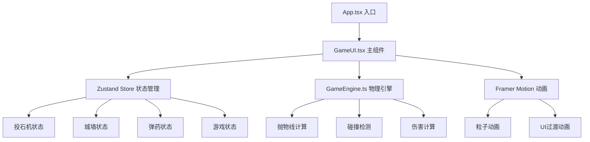

## 1. 架构设计



## 2. 技术描述
- **前端框架**：React@18 + TypeScript@5
- **构建工具**：Vite@5
- **状态管理**：zustand@4
- **动画库**：framer-motion@11
- **无需后端**：纯前端游戏，所有状态在客户端管理
- **无需数据库**：游戏状态内存存储

## 3. 技术栈详细
| 依赖 | 版本 | 用途 |
|------|------|------|
| react | ^18.2.0 | 前端框架 |
| react-dom | ^18.2.0 | DOM渲染 |
| typescript | ^5.0.0 | 类型安全 |
| vite | ^5.0.0 | 构建工具 |
| @vitejs/plugin-react | ^4.2.0 | React支持 |
| framer-motion | ^11.0.0 | 动画库 |
| zustand | ^4.5.0 | 状态管理 |

## 4. 项目结构
```
.
├── package.json          # 项目配置和依赖
├── vite.config.js        # Vite配置
├── tsconfig.json         # TypeScript配置
├── index.html            # 入口HTML
└── src/
    ├── types.ts          # 类型定义
    ├── GameEngine.ts     # 物理引擎
    ├── GameUI.tsx        # 主游戏组件
    └── App.tsx           # 应用入口
```

## 5. 核心数据模型

### 5.1 TypeScript类型定义
```typescript
// 石弹类型
type ProjectileType = 'normal' | 'fire' | 'plague';

// 城墙段类型
type WallSegmentType = 'battlement' | 'wall' | 'gate' | 'fortress';

// 投石机配置
interface CatapultConfig {
  counterweight: number;  // 1-5
  angle: number;          // 15-75度
  projectileType: ProjectileType;
}

// 轨迹点
interface TrajectoryPoint {
  x: number;
  y: number;
  velocityX: number;
  velocityY: number;
}

// 城墙段
interface WallSegment {
  id: number;
  type: WallSegmentType;
  width: number;
  durability: number;     // 0-200
  maxDurability: number;
  isDestroyed: boolean;
  isBurning: boolean;
  burnEndTime: number;
  position: { left: number; top: number };
}

// 粒子
interface Particle {
  id: number;
  x: number;
  y: number;
  vx: number;
  vy: number;
  color: string;
  size: number;
  life: number;
  maxLife: number;
  type: 'spark' | 'smoke' | 'poison' | 'debris';
}

// 弹药
interface Ammo {
  normal: number;
  fire: number;
  plague: number;
}

// 游戏状态
interface GameState {
  catapult: CatapultConfig;
  wallSegments: WallSegment[];
  totalDurability: number;
  morale: number;          // 0-100
  score: number;
  ammo: Ammo;
  isGameOver: boolean;
  winner: 'attacker' | 'defender' | null;
  isFiring: boolean;
  calibrationProgress: number;
  lastProjectileType: ProjectileType | null;
  consecutiveShots: number;
  trajectory: TrajectoryPoint[];
  activeProjectile: { position: TrajectoryPoint; type: ProjectileType } | null;
  particles: Particle[];
  lastFireTime: number;
}
```

### 6. 核心算法

#### 6.1 抛物线物理计算
```typescript
// 初始速度计算：v0 = k * sqrt(counterweight)
// k为系数，角度转换为弧度
// x(t) = v0 * cos(angle) * t
// y(t) = v0 * sin(angle) * t - 0.5 * g * t²
// g = 9.8 m/s²，按比例缩放
```

#### 6.2 碰撞检测
- 计算石弹轨迹与城墙各段边界的交点
- 判断最先碰撞的城墙段

#### 6.3 伤害计算
| 弹种 | 耐久伤害 | 士气伤害 | 特殊效果 |
|------|----------|----------|----------|
| 普通 | 80 | 5 | 烟尘粒子 |
| 火油 | 50 | 10 | 燃烧3秒，每0.5秒10点伤害 |
| 死尸 | 30 | 20 | 毒雾粒子，士气伤害3倍 |

#### 6.4 得分计算
- 进攻胜利：击毁段数×50 + 剩余士气×2
- 防守胜利：剩余耐久×1 + 剩余士气×3

### 7. 性能优化
- 游戏循环使用requestAnimationFrame，目标60fps
- 轨迹计算缓存，参数变化时重新计算
- 粒子池管理，最多30个活跃粒子，超出丢弃最早的
- 每帧CPU时间控制在5ms以内
- 动画使用transform和opacity属性，触发GPU加速
