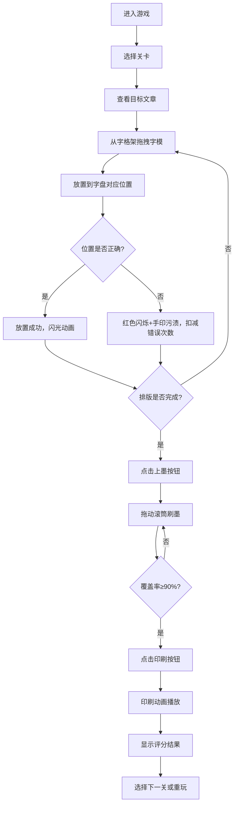

## 1. 产品概述

本产品是一款模拟中国古代毕昇泥活字印刷术的交互式Web游戏，让用户体验从选字、排版、上墨到印刷的完整流程。解决传统活字印刷中工匠需凭记忆在数千字模中查找、易出错的问题，通过游戏化方式传承中华传统文化。

- **核心价值**：寓教于乐，让用户在互动中体验古代印刷智慧
- **目标用户**：文化爱好者、学生、对传统工艺感兴趣的大众
- **市场定位**：文化科普类互动教育应用

## 2. 核心功能

### 2.1 用户角色
| 角色 | 注册方式 | 核心权限 |
|------|----------|----------|
| 玩家 | 无需注册，直接进入 | 体验所有关卡，查看评分 |

### 2.2 功能模块
1. **主界面**：关卡选择、游戏说明、开始游戏
2. **字格架模块**：按韵部排列的泥活字展示、悬停拼音提示、拖拽选字
3. **排版字盘模块**：接收拖入字模、位置校验、错误提示、实时进度
4. **上墨印刷模块**：滚筒刷墨交互、印刷动画、评分展示
5. **关卡系统**：3个难度递增关卡，每关不同文章和干扰字

### 2.3 页面详情
| 页面名称 | 模块名称 | 功能描述 |
|----------|----------|----------|
| 主界面 | 关卡选择 | 展示3个关卡，显示解锁状态和最佳成绩 |
| 游戏界面 | 文章展示区 | 左侧显示目标文章片段，提示当前需排字 |
| 游戏界面 | 字格架 | 展示可拖拽的泥活字，按韵部分组排列 |
| 游戏界面 | 排版字盘 | 10行×15字网格，接收拖入字模并校验位置 |
| 游戏界面 | 操作控制区 | 上墨按钮、印刷按钮、重置按钮、错误次数显示 |
| 结果界面 | 评分展示 | 显示错误次数、刷墨覆盖率、综合评分和等级 |

## 3. 核心流程

用户进入游戏 → 选择关卡 → 查看目标文章 → 从字格架拖拽字模到字盘 → 系统校验位置（正确则放置成功，错误则闪烁提示并扣减错误次数）→ 完成排版 → 点击上墨按钮 → 鼠标拖动滚筒刷墨 → 覆盖率达90%以上 → 点击印刷 → 观看印刷动画 → 显示评分结果 → 选择下一关或重玩

## 4. 用户界面设计

### 4.1 设计风格
- **主色调**：赭石色#8b5a2a、米色#f5e6cc、朱红色#b22222
- **字格架**：浅木色#c8a46e，每格30px×30px，深褐色#5a3e1a边框
- **泥活字**：字面朱红色#b22222，陶土色背景#a08060
- **排版字盘**：底色#d2b48c，灰色虚线#8b7355边框
- **字体**：楷体，营造宋代书坊氛围
- **整体风格**：宋代书坊风格，古朴典雅，纹理质感丰富

### 4.2 页面设计概述
| 页面名称 | 模块名称 | UI元素 |
|----------|----------|--------|
| 主界面 | 关卡卡片 | 仿古卷轴设计，关卡名称、难度星级、最佳成绩 |
| 游戏界面 | 文章展示区 | 仿古宣纸背景，竖排文字，当前字高亮提示 |
| 游戏界面 | 字格架 | CSS Grid布局，木质纹理背景，字模悬停放大 |
| 游戏界面 | 排版字盘 | CSS Grid布局，10×15网格，虚线占位符 |
| 游戏界面 | 进度条 | 底部渐变色进度条（#c8a46e→#8b5a2a） |
| 结果界面 | 评分展示 | 仿古奖状样式，印章动画，星级评价 |

### 4.3 动画效果
- **字格触摸**：transform: scale(1.05) 0.2s ease
- **放置成功**：box-shadow 0到#ffd700 0.5s循环闪光
- **错误提示**：边框闪烁红色#ff4444，手印污渍动画（#cc3333径向渐变）
- **刷墨效果**：滚筒#3a5a3a深绿色，留下黑色#1a1a1a油墨痕迹，渐变过渡
- **印刷动画**：白纸从上方缓缓下降，轻微颤抖，文字从淡灰#aaaaaa渐变为浓黑#1a1a1a（0.8秒）

### 4.4 响应式设计
- **桌面端**：字格架占左侧60%，字盘占右侧40%，左右布局
- **移动端（<768px）**：字格架在上，字盘在下，上下布局
- **触摸优化**：拖拽区域放大，触摸反馈明显

### 4.5 性能要求
- 整体帧率60FPS
- 拖拽和动画帧率不低于55FPS
- 刷墨轨迹流畅无卡顿
