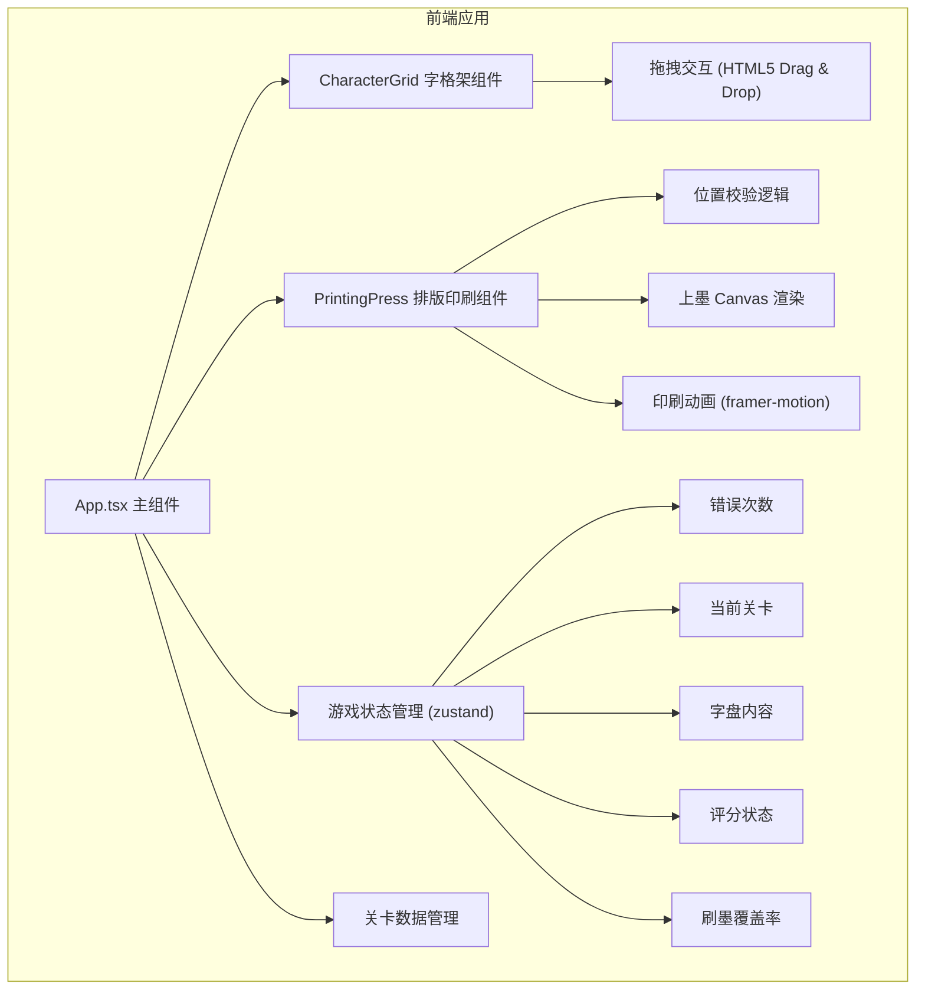
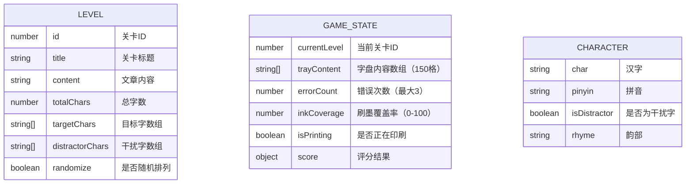

## 1. 架构设计



## 2. 技术描述

- **前端框架**：React@18 + TypeScript@5
- **构建工具**：Vite@5
- **动画库**：framer-motion@11
- **状态管理**：zustand@4
- **初始化方式**：Vite React TypeScript 模板
- **后端**：无（纯前端应用）
- **数据库**：无（使用localStorage存储最佳成绩）

### 核心技术选型理由
1. **framer-motion**：处理复杂的印刷动画、字模闪光、错误提示等动画效果，性能优异
2. **zustand**：轻量级状态管理，适合游戏状态（错误次数、字盘内容、刷墨进度等）的集中管理
3. **HTML5 Drag & Drop**：原生拖拽API，实现字模从字格架到字盘的拖拽交互
4. **Canvas API**：实现刷墨效果，记录油墨覆盖率
5. **CSS Grid**：实现字格架和字盘的网格布局，响应式适配

## 3. 项目文件结构

```
d:\Solocoder\VersionFast\tasks\auto51\
├── package.json
├── vite.config.js
├── tsconfig.json
├── index.html
└── src\
    ├── App.tsx
    ├── main.tsx
    ├── index.css
    ├── components\
    │   ├── CharacterGrid.tsx
    │   └── PrintingPress.tsx
    ├── store\
    │   └── gameStore.ts
    ├── data\
    │   └── levels.ts
    └── types\
        └── index.ts
```

## 4. 路由定义

| 路由 | 用途 |
|------|------|
| / | 主界面（关卡选择） |
| /game/:levelId | 游戏界面（指定关卡） |

*注：单页应用，使用React Router或简单状态切换实现页面导航*

## 5. 数据模型

### 5.1 数据模型定义



### 5.2 TypeScript 类型定义

```typescript
// 字模数据
interface CharacterData {
  char: string;
  pinyin: string;
  rhyme: string;
  isDistractor: boolean;
}

// 关卡数据
interface Level {
  id: number;
  title: string;
  content: string;
  targetChars: string[];
  distractorChars: string[];
  randomize: boolean;
}

// 字盘格子状态
interface TrayCell {
  char: string | null;
  isError: boolean;
  isCorrect: boolean;
}

// 游戏状态
interface GameState {
  currentLevel: number;
  trayContent: TrayCell[];
  errorCount: number;
  maxErrors: number;
  inkCoverage: number;
  isInking: boolean;
  isPrinting: boolean;
  score: Score | null;
  gamePhase: 'selecting' | 'typesetting' | 'inking' | 'printing' | 'result';
}

// 评分结果
interface Score {
  errors: number;
  inkCoverage: number;
  totalScore: number;
  grade: '甲' | '乙' | '丙' | '丁';
}
```

## 6. 状态管理（zustand store）

```typescript
// src/store/gameStore.ts
import { create } from 'zustand';

interface GameStore {
  // 状态
  currentLevel: number;
  trayContent: TrayCell[];
  errorCount: number;
  maxErrors: number;
  inkCoverage: number;
  isInking: boolean;
  isPrinting: boolean;
  gamePhase: GamePhase;
  score: Score | null;
  
  // Actions
  setLevel: (level: number) => void;
  placeCharacter: (index: number, char: string) => boolean;
  incrementError: () => void;
  setInkCoverage: (coverage: number) => void;
  setIsInking: (inking: boolean) => void;
  startPrinting: () => void;
  finishPrinting: (score: Score) => void;
  resetTray: () => void;
  resetGame: () => void;
}

export const useGameStore = create<GameStore>((set, get) => ({
  // 初始状态...
  // 方法实现...
}));
```

## 7. 核心模块说明

### 7.1 CharacterGrid 组件
- 渲染按韵部分组的字格架
- 处理字模悬停显示拼音
- 实现拖拽开始逻辑
- 根据干扰字状态设置样式

### 7.2 PrintingPress 组件
- 渲染10×15字盘网格
- 处理拖放事件和位置校验
- 渲染错误提示动画（红色闪烁、手印污渍）
- 处理上墨交互（Canvas绘制油墨轨迹）
- 渲染印刷动画（framer-motion）
- 计算评分并展示结果

### 7.3 游戏流程控制
- 关卡数据加载与校验
- 字模放置正确性校验
- 错误次数管理与失败判定
- 刷墨覆盖率计算
- 综合评分算法（错误次数×权重 + 覆盖率×权重）

## 8. 性能优化策略

1. **使用 React.memo**：对字格和字盘格子组件进行记忆化，避免不必要重渲染
2. **Canvas 分层渲染**：上墨效果使用独立Canvas，避免频繁重绘整个界面
3. **requestAnimationFrame**：刷墨动画使用RAF确保60FPS
4. **事件委托**：字格架使用事件委托处理拖拽，减少事件监听器数量
5. **CSS transforms**：动画使用transform和opacity，触发GPU加速
6. **懒加载关卡数据**：按需加载关卡，减少初始加载时间
