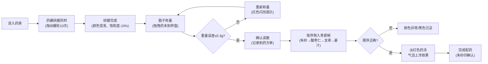

## 1. 产品概述

清代太医院中药炮制交互模拟应用，让用户体验古代御医研磨、称量、混合药材的完整流程。通过精确的物理交互模拟和视觉反馈，还原传统中药炮制的严谨与匠心。

- 核心价值：沉浸式体验传统中医药文化，学习药材配比与混合反应原理
- 目标用户：中医药爱好者、文化体验者、教育场景用户

## 2. 核心功能

### 2.1 功能模块

1. **药碾研磨模块**：铜质碾轮沿圆弧碾槽拖动，实时反馈研磨进度与粉末变化
2. **戥子称量模块**：拖拽药材至秤盘，阻尼动画显示重量，支持归零与读数确认
3. **药材混合模块**：按序倒入药材与药引，实时颜色混合计算与气泡反应
4. **药方单管理**：仿古药方单实时记录操作步骤，朱砂印标记完成状态
5. **撤销重做系统**：支持5步操作回溯，平滑过渡动画

### 2.2 页面详情

| 页面名称 | 模块名称 | 功能描述 |
|-----------|-------------|---------------------|
| 主界面 | 药碾区 | 铜碾轮拖拽研磨、360度圆弧运动检测、粉末细度渐变 |
| 主界面 | 戥子称量区 | 药材拖拽称量、刻度偏移动画、重量精度校验 |
| 主界面 | 混合碗区 | 药材倒入动画、颜色混合算法、气泡生成系统 |
| 主界面 | 药方单区域 | 实时步骤更新、朱砂印章、历史记录展示 |
| 主界面 | 操作控制区 | 撤销/重做按钮、音效反馈、错误提示 |

## 3. 核心流程

用户进入药房 → 研磨朱砂（10次完整圆弧）→ 研磨酸枣仁 → 用戥子称取每味药材（精确到0.5g）→ 按顺序倒入青瓷碗（朱砂→酸枣仁→龙骨牡蛎→姜汁）→ 观察药汤颜色与气泡 → 完成配药

## 4. 用户界面设计

### 4.1 设计风格
- **主色调**：原木色#d2b48c（背景）、米黄色#f5e6d3（药方单）、深棕#6b3a1a（分区边框）
- **辅色调**：石板灰#708090（药碾区）、宣纸色#f5f0e0（戥子区）、暖黄#faf0d6（混合区）
- **金属质感**：黄铜色#c8a44e、铜色渐变#d4a574至#8b6f47、青瓷色#5a9aaa至#3a7a8a
- **强调色**：朱砂红#b22222（印章、错误提示）
- **字体**：仿古手写体（药方单标题）、衬线字体（正文）
- **交互反馈**：悬停放大1.05倍、0.2s过渡、点击音效、错误时红色边框闪烁

### 4.2 页面设计概览

| 页面名称 | 模块名称 | UI元素 |
|-----------|-------------|-------------|
| 主界面 | 药碾区 | 圆弧碾槽（深灰#5a5a5a）、铜质碾轮（径向渐变）、研磨进度条、细度提示 |
| 主界面 | 戥子称量区 | 戥杆（黄铜#c8a44e）、秤盘、刻度线（黑褐#3a2a1a）、药材包、归零/确认按钮 |
| 主界面 | 混合碗区 | 青瓷碗（釉下青花渐变）、药汤颜色渐变、气泡动画、状态文本 |
| 主界面 | 药方单 | 米黄背景、手写字体、朱砂圆形印章、实时步骤更新 |
| 主界面 | 操作栏 | 撤销/重做按钮、操作历史提示 |

### 4.3 响应式设计
- **桌面端**（≥768px）：三栏横向布局，碾轮直径40px
- **移动端**（<768px）：垂直堆叠布局，碾轮直径30px，所有元素同比缩放
- 触控优化：拖拽区域扩大、按钮最小尺寸44px

## 5. 性能约束
- 帧率≥50fps，使用requestAnimationFrame驱动
- 空闲时暂停渲染降低CPU使用率
- 首屏渲染时间≤1.5秒
- 气泡同时存在数量≤30个
- 动画使用CSS transform和opacity优化
