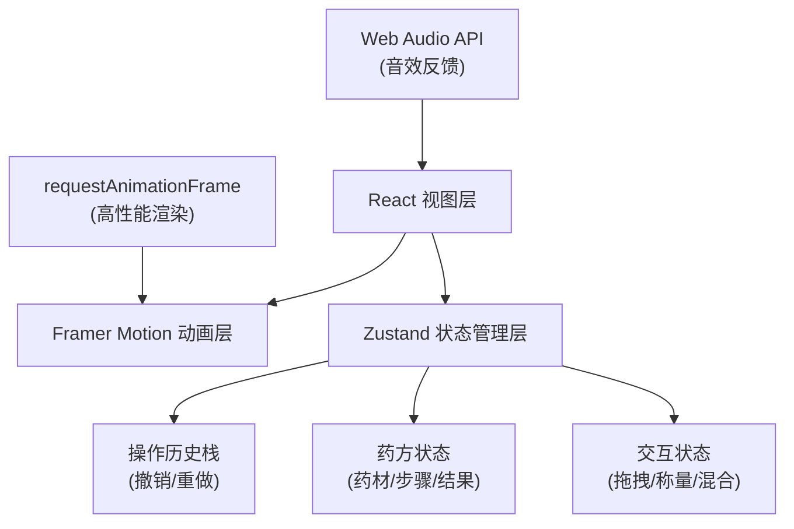

## 1. 架构设计



## 2. 技术描述

- **前端框架**：React 18 + TypeScript 5
- **构建工具**：Vite 5 + @vitejs/plugin-react
- **状态管理**：Zustand 4
- **动画库**：Framer Motion 11
- **音效**：Web Audio API（原生实现，无需额外依赖）
- **样式方案**：CSS Modules + CSS Variables
- **初始化工具**：npm create vite@latest

## 3. 目录结构

```
d:\Solocoder\VersionFast\tasks\auto52
├── package.json
├── vite.config.js
├── tsconfig.json
├── index.html
├── src/
│   ├── types.ts          # 类型定义
│   ├── store.ts          # Zustand状态管理
│   ├── App.tsx           # 主应用组件
│   ├── main.tsx          # 入口文件
│   ├── index.css         # 全局样式
│   └── components/
│       ├── DrugMill.tsx      # 药碾组件
│       ├── Scale.tsx         # 戥子称量组件
│       ├── MixingBowl.tsx    # 混合碗组件
│       └── Prescription.tsx  # 药方单组件
```

## 4. 核心数据模型

### 4.1 TypeScript 类型定义

```typescript
// 药材类型
enum HerbType {
  Cinnabar = 'cinnabar',      // 朱砂
  JujubeSeed = 'jujubeSeed',  // 酸枣仁
  DragonBone = 'dragonBone',  // 龙骨牡蛎
  GingerJuice = 'gingerJuice',// 姜汁
  Honey = 'honey'             // 蜂蜜
}

// 药材信息
interface Herb {
  type: HerbType;
  name: string;
  color: string;
  targetWeight: number;
  grindCount: number;
  currentGrind: number;
  isGround: boolean;
}

// 称量记录
interface WeighingRecord {
  herbType: HerbType;
  weight: number;
  timestamp: number;
  isAccurate: boolean;
}

// 混合步骤
interface MixStep {
  herbType: HerbType;
  order: number;
  completed: boolean;
  timestamp: number;
}

// 药方状态
interface PrescriptionState {
  herbs: Herb[];
  weighings: WeighingRecord[];
  mixSteps: MixStep[];
  currentStep: 'grinding' | 'weighing' | 'mixing' | 'done';
  currentHerbIndex: number;
  bowlColor: string;
  hasPrecipitate: boolean;
  completedStamps: string[];
}

// 操作历史
interface HistoryState {
  past: PrescriptionState[];
  future: PrescriptionState[];
}
```

## 5. 状态管理设计（Zustand Store）

```typescript
interface StoreState extends PrescriptionState, HistoryState {
  // 研磨操作
  grindHerb: (herbType: HerbType, progress: number) => void;
  completeGrinding: (herbType: HerbType) => void;
  
  // 称量操作
  weighHerb: (herbType: HerbType, weight: number) => boolean;
  confirmWeight: (herbType: HerbType, weight: number) => void;
  tareScale: () => void;
  
  // 混合操作
  addToBowl: (herbType: HerbType) => void;
  calculateMixture: () => void;
  
  // 撤销重做
  undo: () => void;
  redo: () => void;
  canUndo: () => boolean;
  canRedo: () => boolean;
}
```

## 6. 关键算法

### 6.1 颜色混合算法
```typescript
// 基于权重的RGB颜色混合
function mixColors(colors: {color: string, weight: number}[]): string {
  let totalR = 0, totalG = 0, totalB = 0, totalWeight = 0;
  for (const {color, weight} of colors) {
    const [r, g, b] = hexToRgb(color);
    totalR += r * weight;
    totalG += g * weight;
    totalB += b * weight;
    totalWeight += weight;
  }
  return rgbToHex(
    Math.round(totalR / totalWeight),
    Math.round(totalG / totalWeight),
    Math.round(totalB / totalWeight)
  );
}
```

### 6.2 研磨圆弧检测
```typescript
// 检测碾轮是否完成360度旋转
function detectFullRotation(angleHistory: number[]): boolean {
  const totalDelta = angleHistory.reduce((sum, angle, i) => {
    if (i === 0) return 0;
    return sum + Math.abs(angle - angleHistory[i - 1]);
  }, 0);
  return totalDelta >= Math.PI * 2; // 2π弧度 = 360度
}
```

### 6.3 气泡池管理
```typescript
// 对象池模式管理气泡，避免频繁GC
class BubblePool {
  private pool: Bubble[] = [];
  private maxSize = 30;
  
  acquire(): Bubble {
    return this.pool.pop() || new Bubble();
  }
  
  release(bubble: Bubble): void {
    if (this.pool.length < this.maxSize) {
      this.pool.push(bubble.reset());
    }
  }
}
```

## 7. 性能优化策略

1. **动画优化**：使用transform和opacity属性，避免触发重排重绘
2. **渲染调度**：使用requestAnimationFrame，仅在用户交互活跃时渲染
3. **内存管理**：气泡对象池复用，历史记录限制5步
4. **事件节流**：拖拽事件使用节流（16ms间隔）
5. **懒加载**：组件按需挂载，动画资源延迟初始化
6. **CSS优化**：使用CSS变量减少重复计算，will-change提示浏览器优化
