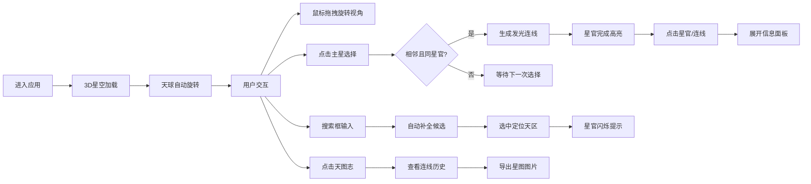

## 1. 产品概述

本应用是一个基于浏览器的唐代星官图3D可视化交互平台，让用户以唐代司天台灵台郎的视角，在虚拟浑天仪穹顶下探索三垣二十八宿星空。应用融合了中国古代天文学知识与现代WebGL技术，提供沉浸式的星空观测、星官连线、星宿分野查询等功能。

- **核心价值**：传承中国古代天文文化，以交互式3D可视化方式让用户直观理解三垣二十八宿星官系统
- **目标用户**：天文爱好者、历史文化研究者、学生、普通大众

## 2. 核心特性

### 2.1 用户角色

| 角色 | 注册方式 | 核心权限 |
|------|----------|----------|
| 访客用户 | 无需注册 | 星空漫游、星官连线、信息查询、搜索定位、图片导出 |

### 2.2 功能模块

1. **星空场景模块**：3D天球渲染、恒星分布、星官连线、视角控制
2. **星官交互模块**：主辅星选择、智能连线、连线动画、已完成星官高亮
3. **信息展示模块**：星官详情卡片、星宿分野说明、星占释义
4. **搜索定位模块**：模糊搜索、自动补全、天区定位、闪烁提示
5. **天图志模块**：连线历史记录、缩略图展示、图片导出分享

### 2.3 页面详情

| 页面名称 | 模块名称 | 功能描述 |
|----------|----------|----------|
| 主场景页 | 3D星空穹顶 | 球体半径200，约500颗恒星，背景深蓝黑色#0a0a1a，缓慢自转 |
| 主场景页 | 视角控制 | 鼠标拖拽旋转（Y轴水平，X轴±30度），右键平移，滚轮缩放（0.5-5倍） |
| 主场景页 | 自转控制 | 暂停/恢复按钮控制天球自转（角速度0.005弧度/秒） |
| 主场景页 | 星官连线 | 点击相邻主星自动生成发光Bézier曲线，按星垣类别着色 |
| 右侧面板 | 星官信息卡片 | 羊皮纸风格卡片，展示名称、星数、分野、赤经/赤纬、星占释义 |
| 顶部栏 | 搜索栏 | 拼音首字母/中文/分野地名模糊匹配，自动补全，定位动画 |
| 右侧面板 | 天图志 | 已连线星官列表，支持删除和导出512px宽截图（含"唐司天台制"水印） |

## 3. 核心流程

## 4. 用户界面设计

### 4.1 设计风格

- **主色调**：深蓝黑#0a0a1a（星空背景）
- **星垣标识色**：紫微垣紫#6a0dad、太微垣青#4169e1、天市垣赤#dc143c
- **辅助色**：星点白#ffffff、淡黄#fffce0、暗银#d0d0d0、连线发光#aaaaff
- **UI面板**：半透明深灰rgba(30,30,50,0.7)，圆角12px，边框发光#4a4a8a
- **信息卡片**：羊皮纸色#f5e6c8，仿古菱花纹装饰
- **字体**：标题使用楷体，正文使用清晰易读的字体
- **按钮风格**：半透明圆角按钮，点击下沉（scale 0.95，0.1s）
- **整体风格**：唐代古风与现代科技感融合，庄重典雅

### 4.2 页面设计概览

| 页面名称 | 模块名称 | UI元素 |
|----------|----------|--------|
| 主场景页 | 3D星空 | 500颗恒星按星等缩放，Bézier曲线连线，天球缓慢自转 |
| 主场景页 | 交互反馈 | 星点选中高亮（淡黄#ffd700渐变至亮白，0.3s），光晕扩散（1.2倍，0.2s） |
| 右侧面板 | 信息卡片 | 向上滑入动画（translateY 20px→0，0.3s），内容淡入（0.2s） |
| 顶部栏 | 搜索栏 | 聚焦时底部发光（box-shadow 0 2px 10px #6a0dad），下拉候选列表 |
| 右侧面板 | 天图志 | 模态对话框，缩略图网格，导出按钮 |

### 4.3 响应式设计

- **桌面端（≥768px）**：以1600x900为基准，右侧面板可拖拽调整宽度（280px-420px）
- **移动端（<768px）**：面板变为底部弹出式抽屉（高度40vh），星空场景占满全屏，触控优化
- **交互适配**：触屏支持双指缩放、单指拖拽旋转

### 4.4 3D场景指导

- **环境**：纯深蓝黑背景，无HDRI，模拟夜空纯净感
- **光照**：星点自发光，无外部光源，连线使用发光材质模拟光晕
- **相机**：透视相机，初始位置(0, 0, 250)，视角75度
- **相机运动**：OrbitControls控制，水平360度旋转，垂直±30度限制
- **构图**：天球居中，UI面板浮于上层，信息卡片右对齐
- **交互**：Raycaster检测星点点击，支持点选和框选
- **后处理**：轻微Bloom效果增强星点发光感，FXAA抗锯齿
- **性能预算**：顶点数≤10000，连线≤200条，帧率稳定60fps

## 5. 数据定义

### 5.1 星官数据结构

应用预置三垣二十八宿主要星官数据，包含：
- 星官名称、所属星垣（紫微垣/太微垣/天市垣/二十八宿）
- 主星列表（含赤经/赤纬、星等、颜色）
- 辅星列表
- 分野对应（地上州郡，如"角宿→郑地：今河南新郑"）
- 星占释义（随机选择预设条目）

### 5.2 拼音索引

为支持拼音首字母搜索，预置星官名、分野地名的拼音映射表。
