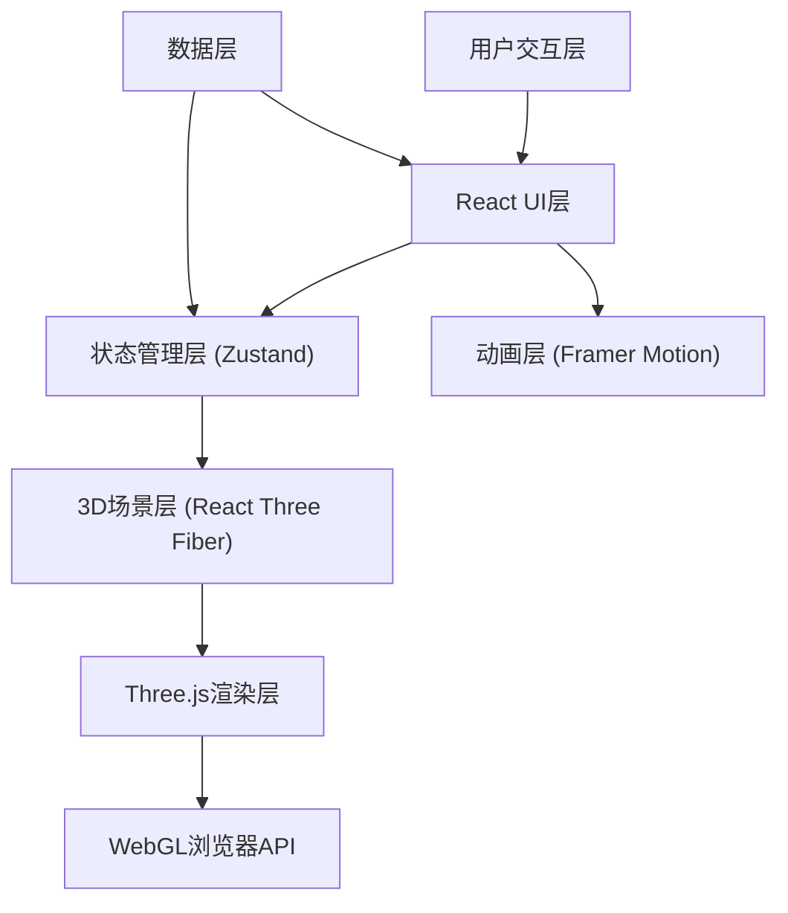

## 1. 架构设计



## 2. 技术栈说明

- **前端框架**: React@18 + TypeScript@5 + Vite@5
- **3D引擎**: three@0.160 + @react-three/fiber@8.15 + @react-three/drei@9.92
- **状态管理**: zustand@4.4
- **动画库**: framer-motion@10.16
- **构建工具**: Vite@5 + @vitejs/plugin-react@4.2
- **样式方案**: 原生CSS + CSS变量

## 3. 项目目录结构

```
├── index.html                    # 入口HTML
├── package.json                  # 依赖配置
├── vite.config.js                # Vite配置
├── tsconfig.json                 # TypeScript配置
└── src/
    ├── App.tsx                   # 根组件
    ├── main.tsx                  # 应用入口
    ├── index.css                 # 全局样式
    ├── scene/
    │   └── StarField.tsx         # 3D星空场景组件
    ├── ui/
    │   ├── StarInfoPanel.tsx     # 星官信息面板
    │   ├── SearchBar.tsx         # 搜索栏组件
    │   ├── StarAtlas.tsx         # 天图志对话框
    │   └── ControlPanel.tsx      # 控制按钮面板
    ├── store/
    │   └── useStarStore.ts       # Zustand状态管理
    ├── data/
    │   ├── starOfficials.ts      # 星官数据
    │   └── pinyinIndex.ts        # 拼音索引
    ├── types/
    │   └── index.ts              # TypeScript类型定义
    └── utils/
        ├── astronomy.ts          # 天文计算工具
        └── search.ts             # 搜索算法工具
```

## 4. 状态管理设计

### 4.1 Zustand Store 状态定义

```typescript
interface StarState {
  // 视角控制
  cameraPosition: [number, number, number];
  isAutoRotating: boolean;
  
  // 星官选择与连线
  selectedStars: StarData[];
  completedConstellations: CompletedConstellation[];
  connections: Connection[];
  
  // 搜索与定位
  searchQuery: string;
  searchResults: StarOfficial[];
  focusedConstellation: string | null;
  
  // 信息面板
  activeStarOfficial: StarOfficial | null;
  isPanelOpen: boolean;
  
  // 天图志
  isAtlasOpen: boolean;
  connectionHistory: HistoryRecord[];
  
  // Actions
  toggleAutoRotation: () => void;
  selectStar: (star: StarData) => void;
  clearSelection: () => void;
  setActiveOfficial: (official: StarOfficial | null) => void;
  searchStarOfficial: (query: string) => void;
  focusOnConstellation: (id: string) => void;
  addConnection: (conn: Connection) => void;
  completeConstellation: (id: string) => void;
  addHistoryRecord: (record: HistoryRecord) => void;
  deleteHistoryRecord: (id: string) => void;
  toggleAtlas: () => void;
  exportScreenshot: (id: string) => void;
}
```

## 5. 核心数据模型

### 5.1 星官数据模型

```typescript
interface StarData {
  id: string;
  ra: number;           // 赤经（度）
  dec: number;          // 赤纬（度）
  magnitude: number;    // 星等
  color: string;        // 颜色
  isMain: boolean;      // 是否主星
  officialId: string;   // 所属星官ID
  position: [number, number, number];  // 3D位置
}

interface StarOfficial {
  id: string;
  name: string;
  pinyin: string;
  enclosure: 'ziwei' | 'taiwei' | 'tianshi' | 'ershiba';
  mainStars: StarData[];
  auxiliaryStars: StarData[];
  totalStars: number;
  fenye: {
    ancient: string;    // 古代分野（如"郑地"）
    modern: string;     // 现代对应（如"今河南新郑"）
  };
  magnitudeRange: [number, number];
  astrology: string[];  // 星占释义列表
}

interface Connection {
  id: string;
  fromStar: string;
  toStar: string;
  officialId: string;
  progress: number;     // 动画进度 0-1
  completed: boolean;
}

interface CompletedConstellation {
  officialId: string;
  completedAt: number;
}

interface HistoryRecord {
  id: string;
  officialId: string;
  officialName: string;
  thumbnail: string;    // 缩略图dataURL
  connectedAt: number;
}
```

## 6. 关键算法与实现

### 6.1 天球坐标转换

```typescript
// 赤经赤纬转3D笛卡尔坐标
function raDecToPosition(ra: number, dec: number, radius: number): [number, number, number] {
  const raRad = (ra * Math.PI) / 180;
  const decRad = (dec * Math.PI) / 180;
  const x = radius * Math.cos(decRad) * Math.cos(raRad);
  const y = radius * Math.sin(decRad);
  const z = radius * Math.cos(decRad) * Math.sin(raRad);
  return [x, y, z];
}
```

### 6.2 星等亮度映射

```typescript
function magnitudeToScale(magnitude: number): number {
  // 星等越小越亮，范围-1到5映射到0.8到2.0
  const normalized = Math.max(-1, Math.min(5, magnitude));
  return 2.0 - ((normalized + 1) / 6) * 1.2;
}

function magnitudeToOpacity(magnitude: number): number {
  const normalized = Math.max(-1, Math.min(5, magnitude));
  return 1.0 - ((normalized + 1) / 6) * 0.6;
}
```

### 6.3 相邻星判断算法

```typescript
function isAdjacentInViewport(
  star1: StarData,
  star2: StarData,
  camera: THREE.Camera,
  viewportSize: { width: number; height: number }
): boolean {
  // 投影到屏幕空间
  const p1 = new THREE.Vector3(...star1.position).project(camera);
  const p2 = new THREE.Vector3(...star2.position).project(camera);
  
  // 转换为像素坐标
  const x1 = (p1.x * 0.5 + 0.5) * viewportSize.width;
  const y1 = (-p1.y * 0.5 + 0.5) * viewportSize.height;
  const x2 = (p2.x * 0.5 + 0.5) * viewportSize.width;
  const y2 = (-p2.y * 0.5 + 0.5) * viewportSize.height;
  
  // 计算屏幕距离
  const distance = Math.sqrt((x2 - x1) ** 2 + (y2 - y1) ** 2);
  return distance < 80;
}
```

### 6.4 Bézier曲线生成

```typescript
function createBezierCurve(
  start: [number, number, number],
  end: [number, number, number],
  radius: number
): THREE.CatmullRomCurve3 {
  const mid = [
    (start[0] + end[0]) / 2,
    (start[1] + end[1]) / 2,
    (start[2] + end[2]) / 2,
  ] as [number, number, number];
  
  // 向外推一点形成弧度
  const midLength = Math.sqrt(mid[0] ** 2 + mid[1] ** 2 + mid[2] ** 2);
  const pushFactor = (radius + 5) / midLength;
  const control: [number, number, number] = [
    mid[0] * pushFactor,
    mid[1] * pushFactor,
    mid[2] * pushFactor,
  ];
  
  return new THREE.CatmullRomCurve3([
    new THREE.Vector3(...start),
    new THREE.Vector3(...control),
    new THREE.Vector3(...end),
  ]);
}
```

### 6.5 搜索模糊匹配算法

```typescript
function fuzzySearch(query: string, officials: StarOfficial[]): StarOfficial[] {
  const lowerQuery = query.toLowerCase().trim();
  if (!lowerQuery) return [];
  
  return officials.filter(official => {
    const matchesName = official.name.includes(lowerQuery);
    const matchesPinyin = official.pinyin.toLowerCase().includes(lowerQuery);
    const matchesInitial = official.pinyin
      .split(' ')
      .map(w => w[0])
      .join('')
      .toLowerCase()
      .includes(lowerQuery);
    const matchesFenye = official.fenye.ancient.includes(lowerQuery) ||
                         official.fenye.modern.includes(lowerQuery);
    
    return matchesName || matchesPinyin || matchesInitial || matchesFenye;
  });
}
```

## 7. 性能优化策略

1. **星点渲染优化**: 使用BufferGeometry批量渲染500颗恒星，避免单独Mesh
2. **连线优化**: 使用LineSegments批量渲染，动态更新Geometry而非重建
3. **对象池**: 复用连线Mesh和星点高亮效果，避免频繁GC
4. **距离剔除**: 相机视锥剔除不可见星点
5. **LOD策略**: 远距离星点降级为Points渲染
6. **节流防抖**: 搜索输入防抖100ms，鼠标移动节流16ms
7. **WebGL优化**: 启用设备像素比适配，限制最大像素比为2
8. **动画优化**: 使用requestAnimationFrame驱动，避免不必要的重绘

## 8. 响应式实现

- **CSS媒体查询**: 检测视口宽度，切换桌面/移动端布局
- **ResizeObserver**: 监听容器尺寸变化，动态调整相机和渲染尺寸
- **触控事件**: 支持touchstart/touchmove/touchend实现移动端交互
- **Pointer Events**: 统一处理鼠标和触控输入
