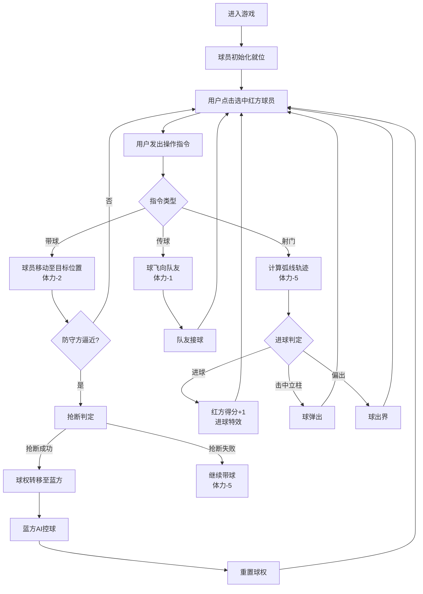

## 1. 产品概述

本产品是一款模拟中国古代蹴鞠比赛的交互式网页游戏，玩家通过鼠标操作控制己方球员进行带球、传球和射门，体验古代足球的乐趣。游戏采用宋代宫廷鞠场风格，还原了弧线球和落叶球等物理轨迹。

- 核心目标：通过操控蹴鞠球员，利用战术配合和精准射门击败对手，获得比赛胜利
- 目标用户：对中国传统文化和体育游戏感兴趣的网页游戏玩家
- 市场价值：传承中华传统文化，将古代体育运动以现代化游戏形式呈现

## 2. 核心功能

### 2.1 用户角色
| 角色 | 注册方式 | 核心权限 |
|------|----------|----------|
| 游戏玩家 | 无需注册，直接进入 | 操控红方球员，进行带球、传球、射门操作 |

### 2.2 功能模块
1. **游戏主界面**：蹴鞠场渲染、球员展示、球轨迹绘制
2. **球员控制系统**：球员选中、带球移动、传球、射门
3. **AI防守系统**：防守球员自动追踪、抢断判定
4. **物理引擎**：球的弧线轨迹计算、碰撞检测、射门判定
5. **状态管理**：体力系统、计分系统、球权管理

### 2.3 页面详情
| 页面名称 | 模块名称 | 功能描述 |
|----------|----------|----------|
| 游戏主页面 | 计分板 | 实时显示红方与蓝方得分，采用serif字体 |
| 游戏主页面 | 体力条区域 | 显示每位球员剩余体力，颜色随体力变化 |
| 游戏主页面 | 蹴鞠场地 | 600x400px方形场地，含草地纹理、边线、球门 |
| 游戏主页面 | 球员渲染 | 4名球员（2红2蓝），带阴影和选中光环效果 |
| 游戏主页面 | 球轨迹渲染 | 贝塞尔曲线绘制弧线球和落叶球轨迹 |
| 游戏主页面 | 进球特效 | 金光闪烁、"进球！"浮动文字动画 |

## 3. 核心流程

用户进入游戏后，首先看到宋代宫廷风格的蹴鞠场，4名球员已就位。用户点击红方球员选中（出现金色光环），然后通过点击场地或其他球员发出指令：点击空位带球、点击队友传球、右键球门射门。蓝方AI自动防守，接近时触发抢断判定。进球后红方得分+1，球门红绸飘动，全场金光闪烁。

## 4. 用户界面设计

### 4.1 设计风格
- 主色调：草地绿#4a7a3a、木色#8b7355、红绸#cc3333、浅灰背景#d6cba8
- 强调色：金色#ffd700（选中光环、进球闪光）、橙色#ff4500（进球文字）
- 字体：标题使用serif字体（模拟古代牌匾风格），数字清晰易读
- 布局：顶部计分板和体力条，中央蹴鞠场，宋代宫廷圆形鞠场风格
- 视觉元素：草地重复线性渐变纹理、木色围栏、红绸球门、球员阴影投射

### 4.2 页面设计概述
| 页面名称 | 模块名称 | UI元素 |
|----------|----------|--------|
| 游戏主页面 | 计分板 | 居中显示"红方得分 : 蓝方得分"，24px serif字体，木色边框 |
| 游戏主页面 | 体力条区域 | 4个体力条并排，宽80px高10px，灰底，填充色绿/黄/红渐变 |
| 游戏主页面 | 外围背景 | 浅灰色#d6cba8，木色#8b7355围栏边框 |
| 游戏主页面 | 蹴鞠场地 | 草地#4a7a3a，白色边线，中央开球圆，两侧鞠城球门 |
| 游戏主页面 | 球门 | 木杆绑红绸#cc3333，宽80px高60px |
| 游戏主页面 | 球员 | 圆形，半径15px，红#cc3333/蓝#3366cc，内部显示编号，box-shadow阴影 |
| 游戏主页面 | 选中光环 | 金色#ffd700圆环，动画呼吸效果 |
| 游戏主页面 | 球轨迹 | 贝塞尔曲线，半透明，随球移动逐渐消失 |
| 游戏主页面 | 进球特效 | 全场金光闪烁0.3秒，"进球！"48px橙色文字向上飘动淡出1秒 |
| 游戏主页面 | 球门飘动 | 进球时红绸剧烈飘动动画1秒 |

### 4.3 响应式设计
- 采用桌面优先设计，球场尺寸随窗口大小等比缩放
- 最小尺寸：400x300px，最大尺寸：800x500px
- 球员、球门、体力条等元素随球场等比缩放
- 触控设备支持：点击选中、双击射门

### 4.4 动画与交互
- 球员移动：framer-motion平滑动画，速度与体力关联
- 球飞行：贝塞尔曲线轨迹，弧线球带侧旋，落叶球下坠
- 选中效果：金色光环呼吸动画（scale 1.0-1.2循环）
- 进球特效：金光闪烁（opacity 0-1-0），文字上浮（y 0→-50，opacity 1→0）
- 球门飘动：keyframes左右摆动+缩放
- 抢断判定：快速闪烁提示
